# 面向对象的特征

**封装**：隐藏对象的内部状态和实现细节，只通过公开的方法暴露必要的访问方式

**继承**：子类继承父类的属性和方法，实现代码复用和层次化分类

**多态**：同一个接口，可以用不同的实现来执行不同的行为

**抽象** **（通常作为补充特征）**：剥离出事物的共性，忽略无关细节，定义接口或抽象类

# 设计模式

## 设计原则

**单一职责原则**

一个类只负责做好一件事。如果把太多职责塞到一个类里，任何一个职责的变化都可能影响其他职责，导致代码脆弱难改

**开闭原则**

类对扩展进行开放，对修改进行关闭

应该能在不修改已有代码的前提下，通过添加新代码来扩展系统的行为。这主要靠抽象和多态实现

**里氏替换原则**

所有用基类的地方都必须能透明地使用它子类的对象，即子类必须能够替换它的基类，替换之后不能破坏程序的正确性

拓展一个类最安全的方法就是引入新的成员变量和方法

**接口隔离原则**

客户端不应被迫依赖于其不使用的方法，接口应该拆分成更小、功能更专注的接口

**依赖倒置原则**

依赖倒置就是让代码依赖于抽象的接口或抽象类，而不是具体的实现类。让高层和低层都依赖同一个抽象，这样低层的具体实现可以灵活替换

**❌ 传统方式（违背 DIP）：**
高层模块直接依赖低层模块。例如，一个高层开关 `Button` 直接控制低层 `Lamp`：

```java
class Lamp {
    public void turnOn() { /* 开灯 */ }
    public void turnOff() { /* 关灯 */ }
}

class Button {
    private Lamp lamp;
    public Button(Lamp lamp) { this.lamp = lamp; }
    public void press() {
        if (/* 判断状态 */) lamp.turnOn();
        else lamp.turnOff();
    }
}
```

此时 `Button` 与 `Lamp` 紧耦合。如果未来想控制 `TV`、`Fan`，必须修改 `Button` 类的代码，违反开闭原则。

**✅ 依赖倒置方式（符合 DIP）：**
引入一个抽象接口 `Switchable`，让 `Lamp` 和 `TV` 都实现它，`Button` 只依赖这个抽象：

```java
interface Switchable {
    void turnOn();
    void turnOff();
}

class Lamp implements Switchable {
    public void turnOn() { /* 开灯 */ }
    public void turnOff() { /* 关灯 */ }
}

class TV implements Switchable {
    public void turnOn() { /* 开电视 */ }
    public void turnOff() { /* 关电视 */ }
}

class Button {
    private Switchable device;
    public Button(Switchable device) { this.device = device; }
    public void press() {
        // 依赖抽象，不关心具体是什么设备
        if (/* 状态 */) device.turnOn();
        else device.turnOff();
    }
}
```

现在 `Button`（高层模块）不再依赖 `Lamp` 或 `TV`（低层模块），它们都共同依赖 `Switchable`（抽象）。控制关系发生了倒置：原本高层决定低层，现在抽象定义了契约，低层反过来遵循高层定下的抽象。

**迪米特法则**（最少知识法则）

一个对象应该对其他对象有最少的了解，减少链式调用，降低耦合度

**优秀设计的特征：**代码复用、可扩展性

**通用设计原则**：封装变化的内容（方法层面的封装、类层面的封装）、面向接口开发、组合优于继承

## 23种设计模式

### 创建型设计模式

#### 工厂模式

它提供了在父类中创建对象的接口，但允许子类改变将要创建的对象的类型，**工厂模式的核心目标是解耦对象创建与使用逻辑**

**简单工厂：**用一个工厂类根据传入参数返回不同类型的对象

```java
interface Fruit { void eat(); }
class Apple implements Fruit { public void eat() { System.out.println("吃苹果"); } }
class Banana implements Fruit { public void eat() { System.out.println("吃香蕉"); } }

class FruitFactory {
    public static Fruit create(String type) {
        if ("apple".equals(type)) return new Apple();
        else if ("banana".equals(type)) return new Banana();
        else throw new IllegalArgumentException("未知水果");
    }
}

Fruit fruit = FruitFactory.create("apple");
fruit.eat();
```

**工厂方法模式：**定义一个用于创建对象的接口，让子类决定实例化哪一个类。工厂方法使得一个类的实例化延迟到其子类

```java
// 产品接口
interface Logger { void log(String msg); }
class FileLogger implements Logger { public void log(String msg) { /*写文件*/ } }
class ConsoleLogger implements Logger { public void log(String msg) { System.out.println(msg); } }

// 工厂接口
interface LoggerFactory {
    Logger createLogger();
}
// 具体工厂
class FileLoggerFactory implements LoggerFactory {
    public Logger createLogger() { return new FileLogger(); }
}
class ConsoleLoggerFactory implements LoggerFactory {
    public Logger createLogger() { return new ConsoleLogger(); }
}

// 客户端依赖抽象工厂和抽象产品
LoggerFactory factory = new FileLoggerFactory();
Logger logger = factory.createLogger();
logger.log("记录信息");
```

#### 抽象工厂模式

提供一个接口，用于创建**一系列相关或相互依赖的对象**，而不指定它们的具体类；当系统需要产品族（如不同操作系统的UI组件：按钮、文本框）时使用，确保一族对象协调一致

```java
// 抽象产品
interface Button { void click(); }
interface TextBox { void input(); }

// 具体产品：Windows风格
class WinButton implements Button { public void click() { System.out.println("Win按钮"); } }
class WinTextBox implements TextBox { public void input() { System.out.println("Win文本框"); } }
// Mac风格
class MacButton implements Button { public void click() { System.out.println("Mac按钮"); } }
class MacTextBox implements TextBox { public void input() { System.out.println("Mac文本框"); } }

// 抽象工厂
interface GUIFactory {
    Button createButton();
    TextBox createTextBox();
}
// 具体工厂
class WinFactory implements GUIFactory {
    public Button createButton() { return new WinButton(); }
    public TextBox createTextBox() { return new WinTextBox(); }
}
class MacFactory implements GUIFactory {
    public Button createButton() { return new MacButton(); }
    public TextBox createTextBox() { return new MacTextBox(); }
}

// 客户端
GUIFactory factory = new MacFactory();
Button btn = factory.createButton();
TextBox tb = factory.createTextBox();
btn.click();
tb.input();
```

#### 建造者模式

它专门用来**分步骤构建一个复杂对象**，并将对象的**构建过程**与**最终表示**相分离

```java
// 产品：一台电脑
class Computer {
    private String CPU;
    private String RAM;
    private String hardDisk;
    private boolean hasGraphicsCard;
    private boolean hasBluetooth;
    // getter 和 toString 省略...
    
    // 构造器通常是私有的，只让 Builder 调用
    private Computer(Builder builder) {
        this.CPU = builder.CPU;
        this.RAM = builder.RAM;
        this.hardDisk = builder.hardDisk;
        this.hasGraphicsCard = builder.hasGraphicsCard;
        this.hasBluetooth = builder.hasBluetooth;
    }

    // 静态内部 Builder 类（链式调用写法，非常流行）
    public static class Builder {
        private String CPU;
        private String RAM;
        private String hardDisk;
        private boolean hasGraphicsCard = false; // 默认值
        private boolean hasBluetooth = false;

        public Builder setCPU(String CPU) { this.CPU = CPU; return this; }
        public Builder setRAM(String RAM) { this.RAM = RAM; return this; }
        public Builder setHardDisk(String hardDisk) { this.hardDisk = hardDisk; return this; }
        public Builder setGraphicsCard(boolean has) { this.hasGraphicsCard = has; return this; }
        public Builder setBluetooth(boolean has) { this.hasBluetooth = has; return this; }
        
        public Computer build() {
            // 可在此添加校验逻辑
            if (CPU == null || RAM == null) throw new IllegalStateException("CPU和内存必填");
            return new Computer(this);
        }
    }
}

// 客户端使用（无需 Director，链式调用自行指挥）
Computer pc = new Computer.Builder()
    .setCPU("Intel i9")
    .setRAM("32GB")
    .setHardDisk("1TB SSD")
    .setGraphicsCard(true)
    .setBluetooth(true)
    .build();
```

或者

```java
// 抽象建造者：定义造车的步骤
interface CarBuilder {
    void buildEngine();
    void buildWheels();
    void buildBody();
    Car getResult();
}

// 具体建造者：造真车
class RealCarBuilder implements CarBuilder { ... }
// 具体建造者：造汽车模型（用于碰撞测试）
class ModelCarBuilder implements CarBuilder { ... }

// 指挥者：编排步骤顺序，它只知道步骤，不知道最终产品
class Director {
    public void constructSportsCar(CarBuilder builder) {
        builder.buildEngine();
        builder.buildWheels();
        builder.buildBody();
    }
}

class Client {
    public void createCar() {
        Director director = new Director();
        CarBuilder builder = new RealCarBuilder();
        director.constructSportsCar(builder);
        Car realCar = builder.getResult();
    }
}
```

#### 原型模式

它不通过 `new` 关键字来创建对象，而是通过复制（克隆）一个已有的原型实例来生成新对象

```java
// 抽象原型接口，要求所有图形都能克隆自己
interface Shape extends Cloneable {
    Shape clone();  // 克隆方法
    void draw();    // 绘制
}

// 坐标点类，作为长方形的内部引用对象
class Point implements Cloneable {
    int x, y;
    public Point(int x, int y) { this.x = x; this.y = y; }
    
    @Override
    protected Point clone() {
        try {
            return (Point) super.clone();
        } catch (CloneNotSupportedException e) {
            throw new AssertionError();
        }
    }
}

// 具体原型：长方形
class Rectangle implements Shape {
    private int width;
    private int height;
    private String color;
    private Point position;  // 引用类型属性

    public Rectangle(int width, int height, String color, Point position) {
        this.width = width;
        this.height = height;
        this.color = color;
        this.position = position;
    }

    // 浅克隆：只复制基本类型和引用地址
    @Override
    public Rectangle clone() {
        try {
            return (Rectangle) super.clone();
        } catch (CloneNotSupportedException e) {
            throw new AssertionError();
        }
    }

    // 深克隆：连引用的 Point 对象也复制一份
    public Rectangle deepClone() {
        Rectangle clone = this.clone();
        clone.position = this.position.clone();  // 关键：手动克隆 Point
        return clone;
    }

    // 便于演示的 getter 和 draw
    public void draw() {
        System.out.println("绘制长方形[宽:" + width + ",高:" + height 
            + ",颜色:" + color + ",位置:(" + position.x + "," + position.y + ")]");
    }
    
    // 颜色和位置的简单 setter 用于修改克隆后的对象
    public void setColor(String color) { this.color = color; }
    public void setPosition(Point p) { this.position = p; }
}
```

#### 单例模式

它保证一个类**只有一个实例**，并提供一个访问该实例的全局点

```java
// 饿汉（线程安全，非延迟加载）
public class EagerSingleton {
    private static final EagerSingleton INSTANCE = new EagerSingleton();
    private EagerSingleton() {}
    public static EagerSingleton getInstance() {
        return INSTANCE;
    }
}

// 懒汉（双检锁，延迟加载，线程安全）
public class LazySingleton {
    // volatile关键字：1.保持instance的可见性 2.禁止指令重排序
    private static volatile LazySingleton instance;
    private LazySingleton() {}
    
    public static LazySingleton getInstance() {
        if (instance == null) {                // 第一重检查
            synchronized (LazySingleton.class) {
                if (instance == null) {        // 第二重检查
                    instance = new LazySingleton();
                }
            }
        }
        return instance;
    }
}
```

### 结构型设计模式

#### 适配器模式

将一个类的接口，转换成客户期望的另一个接口，让原本因接口不匹配而无法一起工作的两个类能够协同工作

```java
// 1. 目标接口（Target）：客户端期望的接口
public interface NewLogger {
    void log(String message);
}

// 2. 被适配者（Adaptee）：老旧的第三方库，只能输出XML
public class LegacyLogger {
    public void logXml(String xml) {
        System.out.println("Logging XML: " + xml);
    }
}

// 3. 适配器（Adapter）：核心魔术在这里
public class LoggerAdapter implements NewLogger {
    private LegacyLogger legacyLogger; // 持有被适配者

    public LoggerAdapter(LegacyLogger legacyLogger) {
        this.legacyLogger = legacyLogger;
    }

    @Override
    public void log(String message) {
        // 接口转换：将JSON风格的文本，组装成XML再调用老旧方法
        String xml = "<log><msg>" + message + "</msg></log>";
        legacyLogger.logXml(xml); // 委托给被适配者
    }
}

// 4. 客户端调用（只依赖目标接口）
public class Client {
    public static void main(String[] args) {
        NewLogger logger = new LoggerAdapter(new LegacyLogger());
        logger.log("系统启动"); // 完全无感知底层是XML还是JSON
    }
}
```

#### 桥接器模式

将抽象部分（Abstraction）与它的实现部分（Implementation）解耦，使它们都可以独立地变化

```java
// 1. 实现维度（Implementor）
public interface Sender {
    void send(String message);
}

public class WeChatSender implements Sender {
    @Override
    public void send(String message) {
        System.out.println("通过微信发送：" + message);
    }
}

public class EmailSender implements Sender {
    @Override
    public void send(String message) {
        System.out.println("通过邮件发送：" + message);
    }
}

// 2. 抽象维度（Abstraction）
public abstract class Message {
    protected Sender sender; // 通过组合持有实现

    public Message(Sender sender) {
        this.sender = sender;
    }
    public abstract void deliver(String content);
}

// 3. 扩展抽象（RefinedAbstraction）
public class UrgentMessage extends Message {
    public UrgentMessage(Sender sender) {
        super(sender);
    }
    @Override
    public void deliver(String content) {
        // 加急逻辑：加个【急】前缀
        sender.send("【急】" + content); 
    }
}

public class NormalMessage extends Message {
    public NormalMessage(Sender sender) {
        super(sender);
    }
    @Override
    public void deliver(String content) {
        sender.send(content);
    }
}

// 4. 客户端使用：自由组装！
public class Client {
    public static void main(String[] args) {
        // 发送普通微信
        Message msg1 = new NormalMessage(new WeChatSender());
        msg1.deliver("今晚一起吃饭吗？");

        // 发送加急邮件
        Message msg2 = new UrgentMessage(new EmailSender());
        msg2.deliver("服务器宕机了！");
    }
}
```

#### 组合模式

将对象组合成树形结构以表示“部分-整体”的层次结构，使得用户对单个对象和组合对象的使用具有一致性

```java
// 1. 抽象构件（Component）
public abstract class FileSystemNode {
    protected String name;
    public FileSystemNode(String name) { this.name = name; }
    // 公共业务方法
    public abstract void ls(int depth);
    // 树形操作方法（叶子节点没有子节点，抛异常或空实现）
    public abstract void add(FileSystemNode node);
    public abstract void remove(FileSystemNode node);
}

// 2. 叶子节点（Leaf）—— 文件
public class File extends FileSystemNode {
    public File(String name) { super(name); }
    @Override
    public void ls(int depth) {
        System.out.println("  ".repeat(depth) + "📄 " + name);
    }
    @Override
    public void add(FileSystemNode node) {
        throw new UnsupportedOperationException("文件不能添加子元素");
    }
    @Override
    public void remove(FileSystemNode node) {
        throw new UnsupportedOperationException("文件没有子元素");
    }
}

// 3. 容器节点（Composite）—— 文件夹
public class Directory extends FileSystemNode {
    private List<FileSystemNode> children = new ArrayList<>();
    public Directory(String name) { super(name); }
    @Override
    public void ls(int depth) {
        System.out.println("  ".repeat(depth) + "📁 " + name);
        for (FileSystemNode node : children) {
            node.ls(depth + 1); // 核心递归：让子节点去执行 ls
        }
    }
    @Override
    public void add(FileSystemNode node) { children.add(node); }
    @Override
    public void remove(FileSystemNode node) { children.remove(node); }
}

// 4. 客户端调用：根本分不清是文件还是文件夹！
public class Client {
    public static void main(String[] args) {
        Directory root = new Directory("根目录");
        
        File file1 = new File("简历.doc");
        Directory subDir = new Directory("项目资料");
        File file2 = new File("需求文档.pdf");
        
        root.add(file1);
        root.add(subDir);
        subDir.add(file2);
        
        // 统一调用！root 和 subDir 都是 FileSystemNode，行为一致
        root.ls(0); 
        // 输出：
        // 📁 根目录
        //   📄 简历.doc
        //   📁 项目资料
        //     📄 需求文档.pdf
    }
}
```

#### 装饰者模式

允许你将对象放入包含行为的特殊封装对象中来为原对象绑定新的行为，动态地给一个对象添加一些额外的职责

```java
// 1. 抽象构件（Component）
public interface Drink {
    double cost();
    String description();
}

// 2. 具体构件（ConcreteComponent）—— 被装饰的底料
public class Espresso implements Drink {
    @Override
    public double cost() { return 15.0; }
    @Override
    public String description() { return "浓缩咖啡"; }
}

public class BlackTea implements Drink {
    @Override
    public double cost() { return 10.0; }
    @Override
    public String description() { return "红茶"; }
}

// 3. 抽象装饰者（Decorator）—— 关键：持有 Drink 引用
public abstract class CondimentDecorator implements Drink {
    protected Drink drink; // 包装着上一层（可能是底料，也可能是更内层的调料）
    public CondimentDecorator(Drink drink) { this.drink = drink; }
}

// 4. 具体装饰者（ConcreteDecorator）—— 调料
public class Milk extends CondimentDecorator {
    public Milk(Drink drink) { super(drink); }
    @Override
    public double cost() { return drink.cost() + 5.0; } // 加价5元
    @Override
    public String description() { return drink.description() + " + 牛奶"; }
}

public class Sugar extends CondimentDecorator {
    public Sugar(Drink drink) { super(drink); }
    @Override
    public double cost() { return drink.cost() + 2.0; }
    @Override
    public String description() { return drink.description() + " + 糖"; }
}

// 5. 客户端调用：像套娃一样层层包装！
public class Client {
    public static void main(String[] args) {
        // 点一杯：浓缩咖啡 + 牛奶 + 糖
        Drink order = new Espresso();                      // 15元
        order = new Milk(order);                           // 15 + 5 = 20元
        order = new Sugar(order);                          // 20 + 2 = 22元
        
        System.out.println(order.description()); // 输出：浓缩咖啡 + 牛奶 + 糖
        System.out.println(order.cost());        // 输出：22.0
    }
}
```

#### 外观模式

为子系统中的一组接口，提供一个统一的、更高级的入口（门面），从而让子系统更容易使用

```java
// 1. 复杂的子系统（Subsystems）—— 各自有复杂的参数
class InventoryService {
    public boolean deductStock(String skuId, int qty) { 
        System.out.println("扣减库存：" + skuId); 
        return true; 
    }
}
class PaymentService {
    public String createTransaction(double amount) { 
        System.out.println("创建支付单：" + amount); 
        return "pay_123"; 
    }
}
class ShippingService {
    public void createDelivery(String address) { 
        System.out.println("创建物流：" + address); 
    }
}
class NotificationService {
    public void sendSms(String phone, String msg) { 
        System.out.println("发送短信给：" + phone); 
    }
}

// 2. 外观（Facade）—— 核心：把复杂的调用链藏起来
class OrderServiceFacade {
    private InventoryService inventory;
    private PaymentService payment;
    private ShippingService shipping;
    private NotificationService notification;

    public OrderServiceFacade() {
        this.inventory = new InventoryService();
        this.payment = new PaymentService();
        this.shipping = new ShippingService();
        this.notification = new NotificationService();
    }

    // 对外暴露的极简方法
    public void createOrder(String skuId, int qty, double amount, String address, String phone) {
        // 1. 扣库存
        if (!inventory.deductStock(skuId, qty)) {
            throw new RuntimeException("库存不足");
        }
        // 2. 支付
        String payId = payment.createTransaction(amount);
        // 3. 物流
        shipping.createDelivery(address);
        // 4. 通知
        notification.sendSms(phone, "您的订单已生成，支付ID：" + payId);
        
        System.out.println("=== 订单创建成功 ===");
    }
}

// 3. 客户端（Client）—— 只需要认识服务员
public class Client {
    public static void main(String[] args) {
        // 客户端完全不关心 InventoryService、PaymentService 的存在
        OrderServiceFacade facade = new OrderServiceFacade();
        facade.createOrder("SKU_001", 2, 99.9, "北京朝阳区", "13800001111");
    }
}
```

#### 享元模式

摒弃在每个对象中保存所有数据的方式，通过共享多个对象所共有的相同状态，让你能在有限的内存容量中载入更多对象

```java
// 1. 抽象享元（Flyweight）
interface ChessPiece {
    void display(int x, int y); // 外部状态：坐标
}

// 2. 具体享元（ConcreteFlyweight）—— 内部状态不可变
class ConcreteChess implements ChessPiece {
    private final String color; // 内部状态：颜色（不变，可共享）

    public ConcreteChess(String color) {
        this.color = color;
    }

    @Override
    public void display(int x, int y) {
        System.out.println("在 (" + x + ", " + y + ") 处下了一颗 " + color + " 棋");
    }
}

// 3. 享元工厂（FlyweightFactory）—— 核心：缓存池
class ChessFactory {
    private static final Map<String, ChessPiece> pool = new HashMap<>();

    public static ChessPiece getChess(String color) {
        // 如果池子里有，直接返回共享对象
        if (!pool.containsKey(color)) {
            pool.put(color, new ConcreteChess(color));
            System.out.println("创建新棋子类型：" + color);
        }
        return pool.get(color);
    }
}

// 4. 客户端调用
public class Client {
    public static void main(String[] args) {
        // 下第1步黑棋
        ChessPiece black1 = ChessFactory.getChess("黑色");
        black1.display(0, 0);
        
        // 下第2步黑棋（在另一个位置）
        ChessPiece black2 = ChessFactory.getChess("黑色");
        black2.display(1, 1);
        
        System.out.println(black1 == black2); // 输出 true！内存中只存在一个"黑色"对象
    }
}
```

#### 代理模式

为其他对象提供一种代理，以控制对这个对象的访问

```java
// 1. 抽象主题（Subject）
interface Image {
    void display();
}

// 2. 真实主题（RealSubject）—— 重量级、耗资源的对象
class HighResImage implements Image {
    private String filename;

    public HighResImage(String filename) {
        this.filename = filename;
        loadFromDisk(); // 非常耗时
    }

    private void loadFromDisk() {
        System.out.println("正在从硬盘加载 100MB 高清图：" + filename);
    }

    @Override
    public void display() {
        System.out.println("显示图片：" + filename);
    }
}

// 3. 代理（Proxy）—— 虚拟代理，延迟加载
class ImageProxy implements Image {
    private HighResImage realImage; // 持有真实对象的引用
    private String filename;

    public ImageProxy(String filename) {
        this.filename = filename;
    }

    @Override
    public void display() {
        // 控制逻辑：只有在真正需要显示时，才去加载重量级对象
        if (realImage == null) {
            realImage = new HighResImage(filename);
        }
        realImage.display();
    }
}

// 4. 客户端
public class Client {
    public static void main(String[] args) {
        // 启动时只创建代理，图片并没有真正加载到内存（省内存！）
        Image img1 = new ImageProxy("photo1.jpg");
        Image img2 = new ImageProxy("photo2.jpg");
        
        // 直到用户点击了图片，才触发真正的加载
        img1.display(); // 此时才 new HighResImage，加载硬盘
    }
}
```

### 行为型模式

#### 责任链模式

为请求创建一个接收者对象的链，将请求沿着这条链传递，直到有一个对象能够处理它为止

```java
// 1. 抽象处理器（Handler）
public abstract class Approver {
    protected Approver next; // 下一个审批人

    public void setNext(Approver next) {
        this.next = next;
    }

    // 核心方法：处理请求，或转发给下一个
    public abstract void handleRequest(int days);
}

// 2. 具体处理器（ConcreteHandler）
class TeamLeader extends Approver {
    @Override
    public void handleRequest(int days) {
        if (days <= 1) {
            System.out.println("组长批准了 " + days + " 天请假");
        } else if (next != null) {
            next.handleRequest(days); // 自己搞不定，推给上级
        }
    }
}

class Manager extends Approver {
    @Override
    public void handleRequest(int days) {
        if (days <= 3) {
            System.out.println("经理批准了 " + days + " 天请假");
        } else if (next != null) {
            next.handleRequest(days);
        }
    }
}

class CEO extends Approver {
    @Override
    public void handleRequest(int days) {
        if (days <= 10) {
            System.out.println("CEO 批准了 " + days + " 天请假");
        } else {
            System.out.println("超过 10 天，不予批准！");
        }
    }
}

// 3. 客户端组装链条
public class Client {
    public static void main(String[] args) {
        // 建链：组长 -> 经理 -> CEO
        Approver leader = new TeamLeader();
        Approver manager = new Manager();
        Approver ceo = new CEO();
        leader.setNext(manager);
        manager.setNext(ceo);

        // 发起 5 天请假（自动走到 CEO）
        leader.handleRequest(5); // 输出：CEO 批准了 5 天请假
    }
}
```

#### 命令模式

将一个请求（方法调用）封装为一个对象，从而让你可以用不同的请求对客户进行参数化，支持请求排队、日志记录以及可撤销操作

```java
// 1. 接收者（Receiver）—— 真正的干活的类
class Light {
    public void on() { System.out.println("💡 灯打开了"); }
    public void off() { System.out.println("💡 灯关闭了"); }
}

class Fan {
    public void start() { System.out.println("🌀 风扇启动了"); }
    public void stop() { System.out.println("🌀 风扇停止了"); }
}

// 2. 抽象命令（Command）
interface Command {
    void execute();
    void undo(); // 支持撤销，这才是命令模式的精髓！
}

// 3. 具体命令（ConcreteCommand）
class LightOnCommand implements Command {
    private Light light;
    public LightOnCommand(Light light) { this.light = light; }
    @Override
    public void execute() { light.on(); }
    @Override
    public void undo() { light.off(); } // 撤销就是反着干
}

class FanStartCommand implements Command {
    private Fan fan;
    public FanStartCommand(Fan fan) { this.fan = fan; }
    @Override
    public void execute() { fan.start(); }
    @Override
    public void undo() { fan.stop(); }
}

// 4. 调用者（Invoker）—— 遥控器
class RemoteControl {
    private Command slot; // 只负责记住当前绑定的命令
    private Command lastCommand; // 记录上一次执行的命令，用于撤销

    public void setCommand(Command cmd) {
        this.slot = cmd;
    }
    public void pressButton() {
        if (slot != null) {
            lastCommand = slot;
            slot.execute();
        }
    }
    public void pressUndo() {
        if (lastCommand != null) {
            lastCommand.undo();
        }
    }
}

// 5. 客户端（Client）—— 组装
public class Client {
    public static void main(String[] args) {
        Light livingRoomLight = new Light();
        Fan livingRoomFan = new Fan();

        Command lightOn = new LightOnCommand(livingRoomLight);
        Command fanOn = new FanStartCommand(livingRoomFan);

        RemoteControl remote = new RemoteControl();

        // 绑定开灯命令
        remote.setCommand(lightOn);
        remote.pressButton(); // 输出：💡 灯打开了
        remote.pressUndo();   // 输出：💡 灯关闭了（撤销成功！）

        // 绑定开风扇命令（同一个按键，不同的行为！）
        remote.setCommand(fanOn);
        remote.pressButton(); // 输出：🌀 风扇启动了
    }
}
```

#### 迭代器模式

提供一种方法顺序访问一个聚合对象中的各个元素，而又不暴露该对象的内部表示

```java
// 1. 聚合类（Aggregate）—— 书架
class BookShelf implements Iterable<Book> {
    private Book[] books;
    private int size = 0;

    public BookShelf(int capacity) {
        this.books = new Book[capacity];
    }
    public void add(Book book) { books[size++] = book; }
    public Book get(int index) { return books[index]; }
    public int size() { return size; }

    @Override
    public Iterator<Book> iterator() {
        // 返回内部迭代器，把数组隐藏起来
        return new BookShelfIterator(this);
    }
}

// 2. 迭代器（Iterator）—— 负责遍历
class BookShelfIterator implements Iterator<Book> {
    private BookShelf shelf;
    private int cursor = 0;

    public BookShelfIterator(BookShelf shelf) { this.shelf = shelf; }

    @Override
    public boolean hasNext() {
        return cursor < shelf.size();
    }

    @Override
    public Book next() {
        if (!hasNext()) throw new NoSuchElementException();
        return shelf.get(cursor++); // 这里是数组，如果是链表，逻辑就变了，但客户端无感
    }
}

// 3. 实体类
class Book {
    private String name;
    public Book(String name) { this.name = name; }
    @Override
    public String toString() { return name; }
}

// 4. 客户端 —— 优雅遍历
public class Client {
    public static void main(String[] args) {
        BookShelf shelf = new BookShelf(3);
        shelf.add(new Book("《设计模式》"));
        shelf.add(new Book("《Java核心卷》"));
        shelf.add(new Book("《算法导论》"));

        // 方式1：增强 for 循环（语法糖，底层依赖 Iterator）
        for (Book book : shelf) {
            System.out.println(book);
        }

        // 方式2：手动获取 Iterator（可控制遍历过程）
        Iterator<Book> it = shelf.iterator();
        while (it.hasNext()) {
            Book b = it.next();
            if (b.toString().contains("Java")) {
                System.out.println("找到：" + b);
            }
        }
    }
}
```

#### 中介者模式

用一个中介对象来封装一系列的对象交互，使各对象不需要显式地相互引用，从而使其耦合松散，而且可以独立地改变它们之间的交互

```java
// 1. 抽象中介者
interface SmartHomeMediator {
    void notify(Device sender, String event); // 同事通过这个方法通知中介
}

// 2. 抽象同事类
abstract class Device {
    protected SmartHomeMediator mediator;
    protected String name;

    public Device(String name, SmartHomeMediator mediator) {
        this.name = name;
        this.mediator = mediator;
    }

    // 设备自身的行为（由中介触发调用）
    public abstract void doAction(String action);
    
    // 设备发生事件（比如门锁被锁了），主动通知中介
    public void sendEvent(String event) {
        System.out.println(name + " 触发了事件: " + event);
        mediator.notify(this, event); // 我只告诉中介，不告诉别人！
    }
}

// 3. 具体同事类（同事之间完全不认识）
class DoorLock extends Device {
    private boolean locked = false;
    public DoorLock(SmartHomeMediator mediator) { super("智能门锁", mediator); }

    public void lock() {
        this.locked = true;
        System.out.println("🔒 门锁已锁上");
        sendEvent("locked"); // 门锁不care谁管，直接甩给中介
    }

    @Override
    public void doAction(String action) {
        if (action.equals("unlock")) {
            this.locked = false;
            System.out.println("🔓 门锁已解锁");
        }
    }
}

class Light extends Device {
    public Light(SmartHomeMediator mediator) { super("客厅灯", mediator); }
    public void turnOff() { System.out.println("💡 灯已关闭"); }
    public void turnOn() { System.out.println("💡 灯已打开"); }

    @Override
    public void doAction(String action) {
        if (action.equals("off")) turnOff();
        else if (action.equals("on")) turnOn();
    }
}

class AirConditioner extends Device {
    public AirConditioner(SmartHomeMediator mediator) { super("空调", mediator); }
    public void turnOff() { System.out.println("❄️ 空调已关闭"); }
    @Override
    public void doAction(String action) {
        if (action.equals("off")) turnOff();
    }
}

// 4. 具体中介者（核心！集中所有交互逻辑）
class SmartHomeController implements SmartHomeMediator {
    private DoorLock doorLock;
    private Light light;
    private AirConditioner ac;

    public void setDoorLock(DoorLock doorLock) { this.doorLock = doorLock; }
    public void setLight(Light light) { this.light = light; }
    public void setAc(AirConditioner ac) { this.ac = ac; }

    @Override
    public void notify(Device sender, String event) {
        // 核心业务逻辑：当门锁被锁上，关灯关空调
        if (sender instanceof DoorLock && event.equals("locked")) {
            System.out.println("🏠 离家模式启动，执行全屋关闭...");
            light.doAction("off");
            ac.doAction("off");
        }
        // 未来新增场景：如果夜里12点，自动关灯？只需在这里加逻辑，同事类完全不用改！
    }
}

// 5. 客户端（Client）
public class Client {
    public static void main(String[] args) {
        SmartHomeController controller = new SmartHomeController();

        DoorLock lock = new DoorLock(controller);
        Light light = new Light(controller);
        AirConditioner ac = new AirConditioner(controller);

        // 将所有设备注册到中介者
        controller.setDoorLock(lock);
        controller.setLight(light);
        controller.setAc(ac);

        // 用户锁门 —— 触发连锁反应
        lock.lock(); 
        // 输出：
        // 🔒 门锁已锁上
        // 智能门锁 触发了事件: locked
        // 🏠 离家模式启动，执行全屋关闭...
        // 💡 灯已关闭
        // ❄️ 空调已关闭
    }
}
```

#### 备忘录模式

在不破坏封装性的前提下，捕获一个对象的内部状态，并在该对象之外保存这个状态，以便以后可以将该对象恢复到原先保存的状态

```java
// 1. 发起人（Originator）—— 真正的业务对象
class TextEditor {
    private String content = "";

    public void write(String words) {
        this.content += words;
    }

    public String getContent() {
        return content;
    }

    // 核心1：创建快照（将当前状态打包成备忘录）
    public TextMemento save() {
        return new TextMemento(content);
    }

    // 核心2：从快照恢复（将备忘录里的数据重新设回来）
    public void restore(TextMemento memento) {
        this.content = memento.getSavedContent();
    }
}

// 2. 备忘录（Memento）—— 纯数据载体，对外不可变
class TextMemento {
    private final String content; // 关键：用 final 修饰，保证一旦创建就不可修改

    public TextMemento(String content) {
        this.content = content;
    }

    // 注意：这个方法只有 Originator（同一个包内或内部类）能调用！
    // 对外部（Caretaker）完全不可见。这里为了演示简单，用默认访问权限。
    String getSavedContent() {
        return content;
    }
}

// 3. 管理者（Caretaker）—— 只管“存”和“取”，绝不修改内容
class History {
    private final Stack<TextMemento> stack = new Stack<>();

    public void push(TextMemento memento) {
        stack.push(memento);
    }

    public TextMemento pop() {
        if (!stack.isEmpty()) {
            return stack.pop();
        }
        return null;
    }
}

// 4. 客户端 —— 美妙的撤销体验
public class Client {
    public static void main(String[] args) {
        TextEditor editor = new TextEditor();
        History history = new History();

        // 输入第一行 -> 保存快照
        editor.write("第一行文字");
        history.push(editor.save()); // 存档点1

        // 输入第二行 -> 保存快照
        editor.write("，追加第二行");
        history.push(editor.save()); // 存档点2

        // 输入第三行（未保存，模拟误操作或后续修改）
        editor.write("，再来第三行");
        System.out.println("当前内容：" + editor.getContent()); 
        // 输出：第一行文字，追加第二行，再来第三行

        // 撤销：恢复到上一次保存的状态（存档点2）
        editor.restore(history.pop());
        System.out.println("撤销一次后：" + editor.getContent()); 
        // 输出：第一行文字，追加第二行

        // 再撤销：恢复到存档点1
        editor.restore(history.pop());
        System.out.println("再撤销一次：" + editor.getContent()); 
        // 输出：第一行文字
    }
}
```

#### 观察者模式

定义对象间的一种一对多依赖关系，当一个对象的状态发生改变时，所有依赖于它的对象都得到通知并被自动更新

```java
// 1. 抽象观察者
interface Observer {
    void update(float temperature, float humidity); // 推模型：主题把数据直接推过来
}

// 2. 抽象主题
interface Subject {
    void registerObserver(Observer o);
    void removeObserver(Observer o);
    void notifyObservers();
}

// 3. 具体主题（气象站）
class WeatherData implements Subject {
    private List<Observer> observers = new ArrayList<>();
    private float temperature;
    private float humidity;

    @Override
    public void registerObserver(Observer o) { observers.add(o); }
    @Override
    public void removeObserver(Observer o) { observers.remove(o); }
    @Override
    public void notifyObservers() {
        // 遍历所有注册的观察者，推数据
        for (Observer observer : observers) {
            observer.update(temperature, humidity);
        }
    }

    // 当气象站测量到新数据时触发
    public void setMeasurements(float temp, float humidity) {
        this.temperature = temp;
        this.humidity = humidity;
        System.out.println("🌤️ 气象站新数据：" + temp + "°C, " + humidity + "%");
        notifyObservers(); // 核心！一变就喊
    }
}

// 4. 具体观察者（实时显示屏）
class CurrentDisplay implements Observer {
    @Override
    public void update(float temp, float humidity) {
        System.out.println("  📺 实时屏显示：当前温度 " + temp + "，湿度 " + humidity);
    }
}

// 5. 另一个具体观察者（手机App推送）
class PhoneApp implements Observer {
    @Override
    public void update(float temp, float humidity) {
        if (temp > 35) {
            System.out.println("  📱 App警告：高温预警！请开启空调！");
        } else {
            System.out.println("  📱 App推送：当前天气舒适。");
        }
    }
}

// 6. 客户端
public class Client {
    public static void main(String[] args) {
        WeatherData weather = new WeatherData();
        
        weather.registerObserver(new CurrentDisplay());
        weather.registerObserver(new PhoneApp());
        
        weather.setMeasurements(36.5f, 60f); 
        // 输出：
        // 🌤️ 气象站新数据：36.5°C, 60.0%
        //   📺 实时屏显示：当前温度 36.5，湿度 60.0
        //   📱 App警告：高温预警！请开启空调！

        // 新增模块？只需加一个 Observer 实现，WeatherData 完全不用改！
    }
}
```

#### 状态模式

允许一个对象在其内部状态改变时改变它的行为，对象看起来似乎修改了它的类

```java
// 1. 上下文（Context）—— 订单
class OrderContext {
    private OrderState currentState;

    public OrderContext() {
        // 初始状态：待支付
        this.currentState = new PendingState();
    }

    // 核心：切换状态的公开方法（供状态内部调用）
    public void setState(OrderState state) {
        this.currentState = state;
    }

    // 委托给当前状态执行（客户端完全不知道内部状态怎么变）
    public void pay() { currentState.pay(this); }
    public void refund() { currentState.refund(this); }
    public void deliver() { currentState.deliver(this); }
    public void confirm() { currentState.confirm(this); }
}

// 2. 抽象状态（State）
interface OrderState {
    void pay(OrderContext context);
    void refund(OrderContext context);
    void deliver(OrderContext context);
    void confirm(OrderContext context);
}

// 3. 具体状态1：待支付（Pending）
class PendingState implements OrderState {
    @Override
    public void pay(OrderContext context) {
        System.out.println("✅ 支付成功，状态变为：已支付");
        context.setState(new PaidState()); // 状态自己决定切换到下一个状态！
    }
    @Override
    public void refund(OrderContext context) {
        System.out.println("❌ 未支付订单，不能退款");
    }
    @Override
    public void deliver(OrderContext context) {
        System.out.println("❌ 未支付，不能发货");
    }
    @Override
    public void confirm(OrderContext context) {
        System.out.println("❌ 未支付，无法确认收货");
    }
}

// 4. 具体状态2：已支付（Paid）
class PaidState implements OrderState {
    @Override
    public void pay(OrderContext context) {
        System.out.println("⚠️ 已经支付过了，请勿重复支付");
    }
    @Override
    public void refund(OrderContext context) {
        System.out.println("💰 退款成功，状态回到：待支付");
        context.setState(new PendingState());
    }
    @Override
    public void deliver(OrderContext context) {
        System.out.println("📦 发货成功，状态变为：已发货");
        context.setState(new ShippedState());
    }
    @Override
    public void confirm(OrderContext context) {
        System.out.println("❌ 未发货，无法确认");
    }
}

// 5. 具体状态3：已发货（Shipped）
class ShippedState implements OrderState {
    @Override
    public void pay(OrderContext context) { System.out.println("⚠️ 已发货，无需支付"); }
    @Override
    public void refund(OrderContext context) { System.out.println("❌ 已发货，需联系客服退款"); }
    @Override
    public void deliver(OrderContext context) { System.out.println("⚠️ 已经发货了"); }
    @Override
    public void confirm(OrderContext context) {
        System.out.println("🎉 确认收货，订单完成！");
        context.setState(new CompletedState());
    }
}

// 6. 客户端（Client）—— 只管按正常逻辑调用
public class Client {
    public static void main(String[] args) {
        OrderContext order = new OrderContext();

        order.pay();     // 输出：✅ 支付成功，状态变为：已支付
        order.deliver(); // 输出：📦 发货成功，状态变为：已发货
        order.confirm(); // 输出：🎉 确认收货，订单完成！
        order.refund();  // 输出：❌ 已发货，需联系客服退款（逻辑自动挡在门外）
    }
}
```

#### 策略模式

定义一系列算法，将每一个算法封装起来，并让它们可以相互替换。策略模式让算法独立于使用它的客户而变化

```java
// 1. 抽象策略接口
interface PromotionStrategy {
    double calculate(double originalPrice);
}

// 2. 具体策略（算法族）
class VipDiscount implements PromotionStrategy {
    @Override
    public double calculate(double price) {
        System.out.println("🔥 VIP用户打8折");
        return price * 0.8;
    }
}

class StudentDiscount implements PromotionStrategy {
    @Override
    public double calculate(double price) {
        System.out.println("🎓 学生用户立减10元");
        return Math.max(0, price - 10);
    }
}

class NoneDiscount implements PromotionStrategy {
    @Override
    public double calculate(double price) {
        System.out.println("💰 无优惠，原价");
        return price;
    }
}

// 3. 上下文（Context）
class PriceCalculator {
    private PromotionStrategy strategy;

    // 关键：策略由客户端通过构造器传入（外部注入）
    public PriceCalculator(PromotionStrategy strategy) {
        this.strategy = strategy;
    }

    // 运行时也可以动态换策略（客户端再次注入）
    public void setStrategy(PromotionStrategy strategy) {
        this.strategy = strategy;
    }

    public double calculatePrice(double originalPrice) {
        // 自己完全不关心怎么算，全权委托给策略
        return strategy.calculate(originalPrice);
    }
}

// 4. 客户端（Client）—— 主动决策者
public class Client {
    public static void main(String[] args) {
        double price = 100.0;

        // 今天用户是VIP，客户端主动选VIP策略
        PriceCalculator calc = new PriceCalculator(new VipDiscount());
        System.out.println("最终价格：" + calc.calculatePrice(price));
        // 输出：🔥 VIP用户打8折 \n 最终价格：80.0

        // 换个场景，突然换成学生策略（手动切算法）
        calc.setStrategy(new StudentDiscount());
        System.out.println("最终价格：" + calc.calculatePrice(price));
        // 输出：🎓 学生用户立减10元 \n 最终价格：90.0
    }
}
```

#### 模板方法

在一个父类中定义一个操作中的算法骨架（模板），而将一些步骤延迟到子类中实现。子类可以不改变算法结构，即可重新定义算法的某些特定步骤

```java
// 1. 抽象父类（AbstractClass）—— 固定算法骨架
abstract class DataMigration {
    
    // 【核心】模板方法：用 final 修饰，防止子类篡改流程顺序！
    public final void migrate() {
        openSource();
        readData();
        if (needValidate()) { // 钩子方法，子类可以决定是否执行校验
            validateData();
        }
        parseData();   // 抽象方法，子类必须实现
        saveData();
        closeSource();
        System.out.println("✅ 迁移流程结束\n");
    }

    // 具体方法（固定逻辑，子类无需改）
    private void openSource() { System.out.println("📂 1. 打开数据源..."); }
    private void readData() { System.out.println("📖 2. 读取原始数据..."); }
    private void saveData() { System.out.println("💾 4. 保存到目标库..."); }
    private void closeSource() { System.out.println("🔒 5. 关闭资源..."); }

    // 【抽象方法】子类必须自己填坑
    protected abstract void parseData();

    // 【钩子方法】默认不校验，子类可以重写为 true
    protected boolean needValidate() {
        return false;
    }
    // 钩子对应的校验方法（默认空实现）
    protected void validateData() { /* 默认啥也不干 */ }
}

// 2. 具体子类（ConcreteClass）—— CSV 迁移
class CsvMigration extends DataMigration {
    @Override
    protected void parseData() {
        System.out.println("📝 3. 解析 CSV 文件：按逗号分割字段...");
    }
    // 不重写 needValidate，沿用默认 false，不校验
}

// 3. 具体子类（ConcreteClass）—— Excel 迁移（需要校验）
class ExcelMigration extends DataMigration {
    @Override
    protected void parseData() {
        System.out.println("📝 3. 解析 Excel 文件：读取 Sheet 页...");
    }
    @Override
    protected boolean needValidate() {
        return true; // 钩子生效！Excel数据需要校验
    }
    @Override
    protected void validateData() {
        System.out.println("🔍 3.5 校验 Excel 数据格式...");
    }
}

// 4. 客户端（Client）—— 只管触发，不管细节
public class Client {
    public static void main(String[] args) {
        DataMigration csv = new CsvMigration();
        csv.migrate();
        // 输出：1->2->3(CSV)->4->5

        DataMigration excel = new ExcelMigration();
        excel.migrate();
        // 输出：1->2->3(Excel)->3.5(校验)->4->5
    }
}
```

#### 访问者模式

表示一个作用于某对象结构中的各元素的操作。它让你可以在不改变各元素的类的前提下，定义作用于这些元素的新操作

```java
import java.util.ArrayList;
import java.util.List;

// ========== 1. 稳定的数据结构（元素） ==========
// 抽象元素
interface Element {
    void accept(Visitor visitor);
}

// 叶子节点：文件
class FileElement implements Element {
    private String name;
    private int size;

    public FileElement(String name, int size) { this.name = name; this.size = size; }
    public String getName() { return name; }
    public int getSize() { return size; }

    @Override
    public void accept(Visitor visitor) {
        // 【关键】将自己（this）交给访问者
        visitor.visit(this); 
    }
}

// 容器节点：文件夹
class DirectoryElement implements Element {
    private String name;
    private List<Element> children = new ArrayList<>();

    public DirectoryElement(String name) { this.name = name; }
    public String getName() { return name; }
    public void add(Element e) { children.add(e); }
    public List<Element> getChildren() { return children; }

    @Override
    public void accept(Visitor visitor) {
        // 【关键】先让自己被访问，再遍历子节点（递归遍历）
        visitor.visit(this);
        for (Element child : children) {
            child.accept(visitor);
        }
    }
}

// ========== 2. 抽象访问者（定义针对不同元素的操作） ==========
interface Visitor {
    void visit(FileElement file);
    void visit(DirectoryElement dir);
}

// ========== 3. 具体访问者1：导出 JSON ==========
class JsonExportVisitor implements Visitor {
    private String result = "";
    private int indent = 0;

    private void print(String s) { result += "  ".repeat(indent) + s + "\n"; }

    @Override
    public void visit(FileElement file) {
        print("{ \"type\": \"file\", \"name\": \"" + file.getName() + "\", \"size\": " + file.getSize() + " }");
    }

    @Override
    public void visit(DirectoryElement dir) {
        print("{ \"type\": \"dir\", \"name\": \"" + dir.getName() + "\", \"children\": [");
        indent++;
        // 注意：子节点的遍历是在 DirectoryElement 的 accept 里触发的，这里只负责做“包裹”
        // 但因为我们是在 accept 里遍历，所以这里只需要关掉括号。
        // 调整写法：为了完美 JSON 格式，通常将遍历控制权留在访问者内部更可控。
        // 但为了展示标准访问者逻辑，此处采用“接受遍历”模式。
        // 为了完美输出，我们把遍历逻辑移到访问者自身，如下所示（重构为更可控的写法）。
    }
}

// ========== 3. 具体访问者2：计算总大小（纯逻辑，更清晰） ==========
class SizeCalculatorVisitor implements Visitor {
    private int totalSize = 0;

    @Override
    public void visit(FileElement file) {
        totalSize += file.getSize();
    }

    @Override
    public void visit(DirectoryElement dir) {
        // 文件夹本身不占大小（我们只计算文件大小），但子节点已经由 DirectoryElement 的 accept 递归调用了。
        // 注意：这里如果遍历权在 Element 内部，访问者只需要处理 File 的累加。
    }
    public int getTotalSize() { return totalSize; }
}

// ========== 4. 客户端调用 ==========
public class Client {
    public static void main(String[] args) {
        DirectoryElement root = new DirectoryElement("根目录");
        FileElement f1 = new FileElement("a.txt", 10);
        FileElement f2 = new FileElement("b.log", 20);
        DirectoryElement sub = new DirectoryElement("sub");
        sub.add(new FileElement("c.jpg", 30));
        root.add(f1);
        root.add(f2);
        root.add(sub);

        // 操作1：计算总大小
        SizeCalculatorVisitor sizeVisitor = new SizeCalculatorVisitor();
        root.accept(sizeVisitor);
        System.out.println("总大小: " + sizeVisitor.getTotalSize() + " KB"); // 输出 60

        // 操作2：新增一个“导出 XML”的操作？只需要新增一个类，完全不用改 File/Directory！
        // XmlExportVisitor xmlVisitor = new XmlExportVisitor();
        // root.accept(xmlVisitor);
    }
}
```

#### 解释器模式

给定一门语言，定义它的文法的一种表示，并定义一个解释器，这个解释器使用该表示来解释语言中的句子

```java
import java.util.HashMap;
import java.util.Map;
import java.util.Stack;

// ========== 1. 上下文（存储变量值） ==========
class Context {
    private Map<String, Integer> map = new HashMap<>();
    public void assign(String var, int value) { map.put(var, value); }
    public int get(String var) { return map.get(var); }
}

// ========== 2. 抽象表达式（接口） ==========
interface Expression {
    int interpret(Context context); // 核心解释方法
}

// ========== 3. 终结符表达式（叶子节点） ==========
// 数字常量
class NumberExpression implements Expression {
    private int number;
    public NumberExpression(int number) { this.number = number; }
    @Override
    public int interpret(Context context) { return number; }
}

// 变量（如 a, b）
class VariableExpression implements Expression {
    private String name;
    public VariableExpression(String name) { this.name = name; }
    @Override
    public int interpret(Context context) { return context.get(name); }
}

// ========== 4. 非终结符表达式（容器节点——组合模式！） ==========
// 加法
class AddExpression implements Expression {
    private Expression left, right;
    public AddExpression(Expression left, Expression right) { this.left = left; this.right = right; }
    @Override
    public int interpret(Context context) {
        // 递归解释左右子树，相加
        return left.interpret(context) + right.interpret(context);
    }
}

// 减法
class SubExpression implements Expression {
    private Expression left, right;
    public SubExpression(Expression left, Expression right) { this.left = left; this.right = right; }
    @Override
    public int interpret(Context context) {
        return left.interpret(context) - right.interpret(context);
    }
}

// ========== 5. 客户端：构建 AST（抽象语法树）并执行 ==========
public class Client {
    public static void main(String[] args) {
        // 语法： (a + b) - 2
        // 构建 AST（注意这里没用解析器，手动构建展示结构）
        Expression a = new VariableExpression("a");
        Expression b = new VariableExpression("b");
        Expression two = new NumberExpression(2);
        
        Expression add = new AddExpression(a, b);      // a + b
        Expression root = new SubExpression(add, two); // (a+b) - 2

        // 设置上下文（赋值）
        Context ctx = new Context();
        ctx.assign("a", 10);
        ctx.assign("b", 5);

        // 解释执行！
        int result = root.interpret(ctx);
        System.out.println("计算结果: " + result); // 输出 13
    }
}
```

# 反射

## 类加载过程

1.**加载**

JVM将类的字节码（.class）文件加载到内存，创建class对象

2.**链接**

验证：确保字节码符合规范

准备：为静态变量分配内存并赋予默认值（如int初始化为0）

解析：将符号引用转换为直接引用

3.**初始化**

执行类的静态代码块（static{}）和静态变量显式赋值

## **创建对象**

### 1.通过new创建对象

new关键字会直接触发类的完整加载、链接和初始化过程：

a.若类未加载：立即执行加载、链接，完成后强制触发类的初始化（执行static代码块和初始化静态变量）

b.初始化完成后：调用构造函数创建对象

### 2.通过反射创建对象

通过反射（Class.newInstance()或Constructor.newInstance()）创建对象时，允许分阶段控制类的加载过程：

#### 2.1触发加载但不初始化

使用ClassLoader.loadClass()可加载类但不初始化：

```java
ClassLoader loader = MyClass.class.getClassLoader();
Class<?> clazz = loader.loadClass("MyClass");  // 仅加载和链接，不初始化
```

#### 2.2按需触发初始化

在首次需要初始化时才触发（如反射调用newInstance()）：

```java
Object obj = clazz.newInstance(); // 触发初始化 -> 执行static代码块
```

#### 2.3选择性初始化控制

通过Class.forName可指定是否初始化： Main.java

```java
Class.forName("MyClass", false, loader); // 加载类但是不初始化
Class.forName("MyClass"); // 加载类同时触发初始化
```

## 反射的用法

反射允许程序在运行时动态获取类的信息并操作类或对象，包括：

动态创建对象newInstance()、调用方法method.invoke()、访问/修改字段(field.get()/set())

**1.通过无参构造函数创建实例对象**

```java
// 获取Class对象注意使用全限定类名）
Class<?> clazz = Class.forName("MyClass");
// 获取无参构造方法
Constructor<?> constructor = clazz.getDeclaredConstructor();
// 如果是私有的构造函数使用setAccessible解除访问限制
constructor.setAccessible(true);
// 调用newInstance()创建实例（无参）
Object instance = constructor.newInstance();
```

**2.通过有参的构造函数创建实例**

```java
// 获取Class对象（注意使用全限定类名）
Class<?> clazz = Class.forName("MyClass");
// 指定参数类型列表，获取有参构造方法
Class<?>[] paramType = {String.class, int.class}; // 	参数类型顺序严格匹配
Constructor<?> constructor = clazz.getDeclaredConstructor(paramType);
Object[] initArgs = {"张三", 25};
// 调用newInstance()创建实例（无参）
Object instance = constructor.newInstance(initArgs);
System.out.println("实例创建成功：" + instance.getClass());
```

**3.破坏设计模式，比如通过私有构造函数创建对象，破坏单例模式**

**4.通过反射获得类的public属性值**

getClass().getField("field")只能获取当前类以及继承链中声明为public的属性

**5.通过反射获得类的private、protected和默认访问修饰符的属性值**

getClass().getDeclaredField("field")能获取类中声明的所有属性（private/protected/public），无法获取父类中声明的属性，访问非public属性需要通过filed.setAccessible(true)

**6.通过反射获取类的private方法**

getClass().getDeclaredMethod("name", Type.class)，使用method.setAccessible(true)解除访问限制

用method.invoke(object, params...)调用对象内部的方法

**7.通过反射实现一个工具BeanUtils，可以将一个对象属性相同的值赋值给另一个对象**


# 泛型

是编程语言中一种支持参数化类型的特性，允许在定义类、接口、方法时使用类型参数，而在使用时指定具体的类型。泛型的核心目标是提高代码的**类型安全性、可重用性**和**可读性**

**类型安全和编译时检查**

编译器可以检查参数类型是否正确，并在编译时而不是运行时捕获类型错误，比如ArrayList，HashMap使用Object类型存储元素，如果对元素进行强制转换会出现类型转换异常

**可重用性**

在没有泛型时，如果要支持不同类型，需要为每种类型编写相似的代码，例如实现IntegerBox、StringBox

**可读性**

泛型让代码的意图更明确，例如Map<String,Integer>清楚地表示“键是String，值是Integer”

## 用法

**泛型类**

泛型类就是把泛型定义在类上，用户使用该类的时候，才把类型明确下来

**泛型方法**

除了在类上使用泛型，我们可能就仅仅在某个方法上需要使用泛型，外界仅仅是关心该方法，不关心类其他的属性。

**泛型类派生子类**

1.子类固定父类泛型类型

```
class Box<T>
class StringBox extends Box<String>
```

2.子类保留父类泛型类型

```
class Box<T>
class AdvancedBox<T> extends Box<T>
```

3.子类添加自己的泛型参数

```
class Box<T>
class KeyValuePair<K, V> extends Box <T>
```

4.子类约束父类类型边界

```
class NumberCalculator<T extends Number>
class IntCalculator extends NumberCalculator<Integer>
```

## **类型通配符**

泛型提供了类型安全，但也导致了“泛型类型不变性”——`List<String>` 不是 `List<Object>` 的子类型。通配符就是为了打破这种僵硬，在编译时安全地让泛型获得类似协变与逆变的能力

1.无界通配符<?>，用于处理未知类型的集合，适合只读取集合内容的场景

2.上界通配符<? extends Number>，限制类型为Number或其子类（如Integer、Double），适合读取场景

```java
public static void test(List<? extends Number> list) {
    for (Number number : list) {
        System.out.println(number);
    }
}
```

3.下界通配符<? super Integer>，限制类型为Integer或其父类（如Number、Object），适合写入场景

```java
public static void test1(List<? super Integer> list, List<Integer> list1) {
    // 只能添加Integer类型相关的数据，因为编译器要求元素的类型必须是list可能指向的所有具体类型都能接受的类型
    list.addAll(list1);
}
```

## **泛型擦除**

泛型类型参数（如 `<T>`）只在编译期可见，编译后的字节码中会被“擦除”，替换为它们的上界类型（没有明确上界的默认用 `Object`）

例如：

无界类型参数：`<T>` 擦除后变成 `Object`

有界类型参数：`<T extends Number>` 擦除后变成 `Number`（取第一个边界）

方法中的类型参数：同样规则擦除，若方法返回值是 T，会插入强制类型转换

**为什么需要泛型擦除？**

是java为向后兼容性设计的关键机制，例如：

1.兼容旧版本代码，让新代码和旧代码共享同一个类文件结构

```
// 泛型代码（Java 5+）
List<String> list = new ArrayList<>();
// 非泛型代码（Java 1.4-）
List rawList = new ArrayList();
```

2.避免JVM修改，无需修改JVM的底层机制，JVM仍使用同样的字节码指令处理泛型和非泛型集合，极大降低了实现复杂度

3.减少代码冗余，如果不擦除，List<String>和List<Integer>会分别生成不同的类文件，导致代码膨胀

**泛型擦除带来的限制**

1.无法使用原始类型参数

```java
// 编译错误：不能使用基本类型作为泛型参数
List<int> list = new ArrayList();
```

2.运行时无法获取泛型类型信息

```java
public void printType(List<String> list) {
    // 尝试通过反射获取泛型类型参数（无效）
    Type type = list.getClass().getComponentType();
    System.out.println(type); // type: null（实际类型已被擦除）
}
```

3.无法创建泛型数组

```java
// 编译错误：不能创建泛型数组
T[] array = new T[10];
```

**桥接方法**

是 Java 编译器在类型擦除后，为了维持多态和类型安全而自动生成的一种合成方法。它的本质是：**在子类中“架设一座桥”，将擦除后签名不匹配的子类方法与父类泛型方法连接起来，确保通过父类引用调用能正确派发到子类的覆写实现**

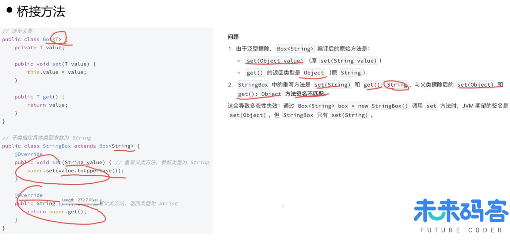

编译器会自动生成一个桥接方法（反编译可见）

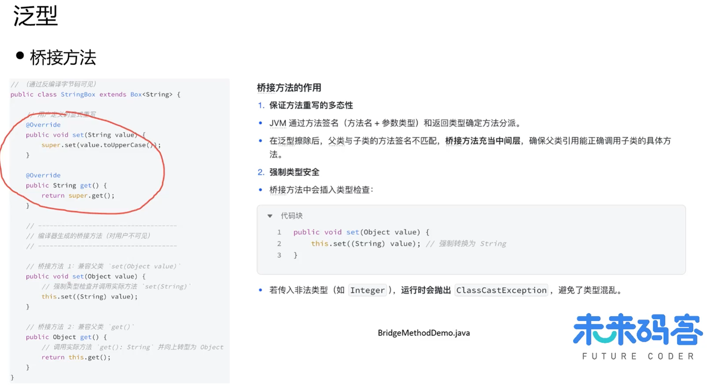

method中有判断是否桥接方法的方法

```java
for (Method method : StringBox.class.getDeclaredMethods()) {
    if (method.isBridge()) {
        System.out.println("桥接方法：" + method);
    }
}
```

# 集合与容器

## ArrayList

### 核心数据结构

是集合框架中最核心的动态数组实现，也是高频使用的容器之一。

基于数组实现，维护elementData数组存储元素

```java
transient Object[] elementData; // 实际存储元素的数组
private int size; // 当前元素数量
```

transient修饰的elementData不会被默认序列化（通过自定义序列化逻辑优化存储）

### 动态扩容机制

当添加元素时发现容量不足，触发grow(int minCapacity)扩容

1.扩容倍率：新容量 = 旧容量 * 1.5（位运算 oldCapacity >> 1代替除法优化性能）

2.数组拷贝：Arrays.copyOf() 底层使用System.arraycopy()，为本地方法（效率高）

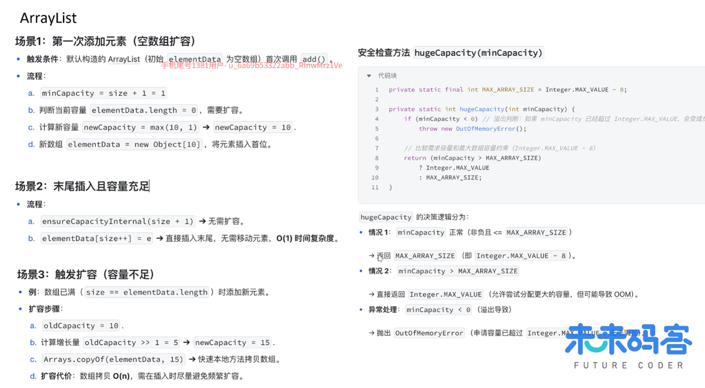

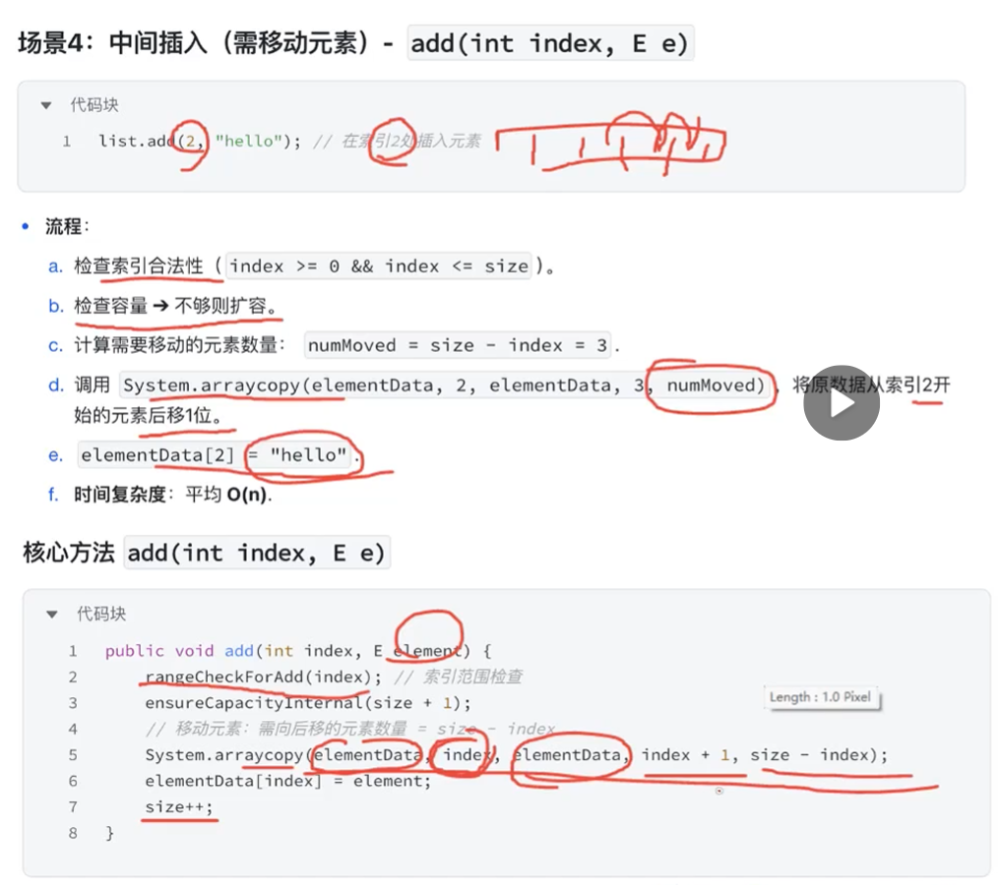

Modcount记录创建迭代器时的修改次数，checkForComodification()会检查是否发生结构型修改，继而判断modCount是否改变，如果改变就会抛出异常

非线程安全：ArrayList不保证多线程环境下的安全

**性能优化技巧**

1.初始化时指定容量：避免频繁扩容

2.批量操作优先：避免循环内多次扩容

3.谨慎使用contains/remove(Object)，时间复杂度O(n)，高频操作可改用HashSet

## LinkedList

是一个基于双向链表实现的集合类，经常被拿来和ArrayList做比较

LinkedList不能说作为链表就最适合元素增删的场景，因为它仅在头尾插入和删除元素的时候时间复杂度近似于O(1)，其他情况下的增删元素的平均时间复杂度都是O(n)

ArrayList适合读多写少，频繁随机访问的场景，LindedList适用于顺序访问，或者头尾插入和删除元素的场景。

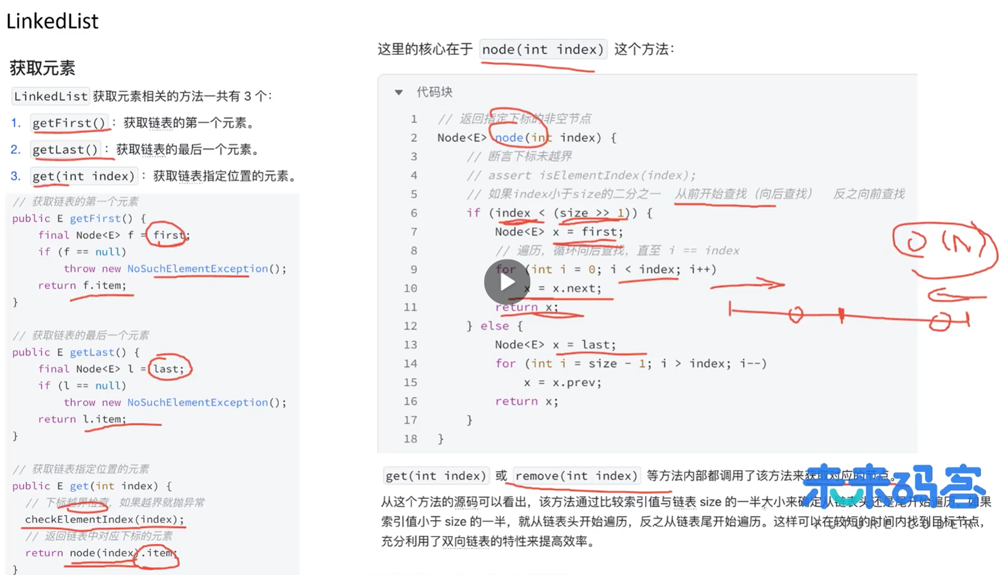

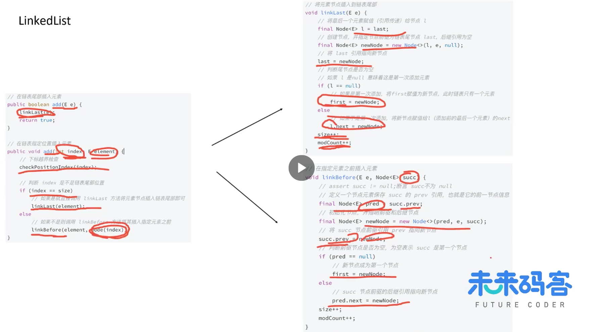

## HashMap

### 二叉搜索树

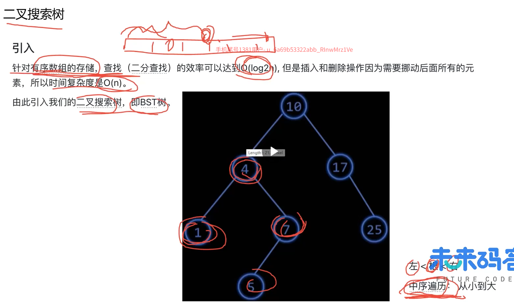

### AVL树（平衡二叉树）

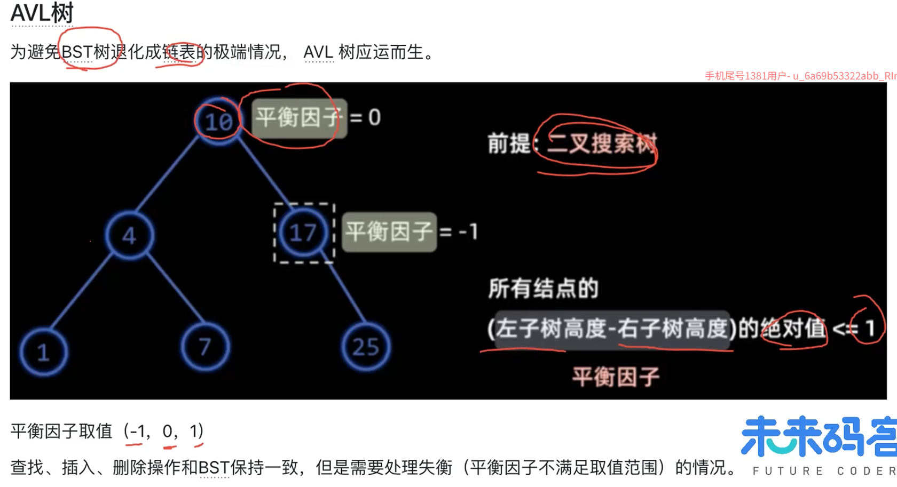

平衡因子为负数，左边低于右边，左旋“冲突左孩变右孩”

平衡因子为正数，左边高于右边，右旋“冲突右孩变左孩”

LL，RR，LR，RL

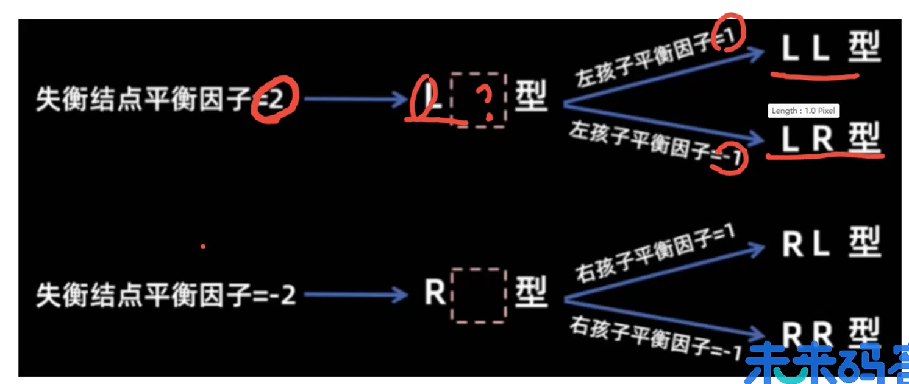

### 红黑树

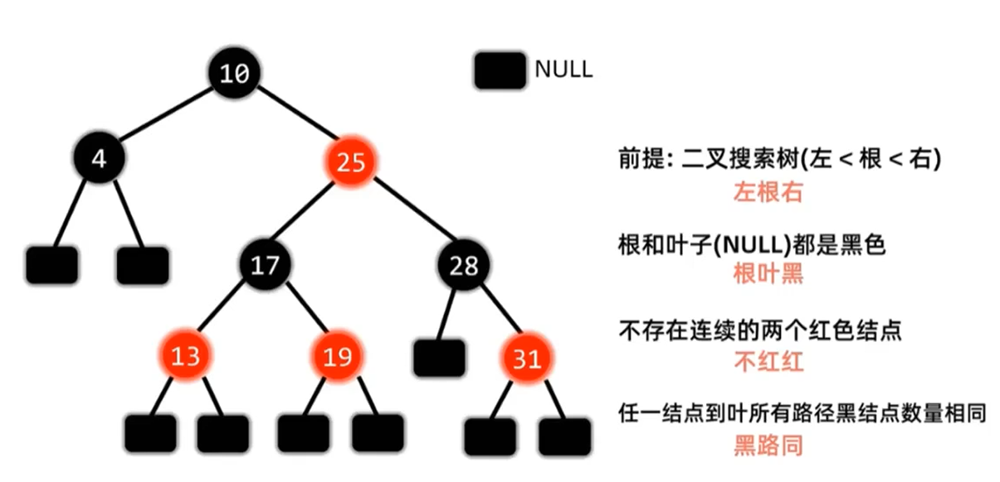

任意节点左右子树的高度相差不超过两倍

### HashMap

是Map接口的实现，是非线程安全的；key和value可以为null，但是key只能有一个null，value可以有多个。

在jdk1.8之前，采用数组加链表的形式存储元素，通过计算元素的key的hash值，获取数组下标位置，如果多个元素算出的下标位置相同，就会将元素以链表形式连接；在jdk1.8之后则是采用红黑树，当链表的长度大于等于阈值（默认是8），并且当数组容量大于64时，才会将链表转化为红黑树，否则hashmap优先采取扩容。

当元素个数大于初始容量*负载因子时，就会发生扩容，新数组的容量是原数组的2倍，新下标无需重新计算hash值，而是通过hash&(cap-1)随机确定数组的下标。

# JVM

## java内存区域

### 线程私有区域（随线程生灭，线程结束即释放）

#### 程序计数器

程序计数器是一块较小的内存空间，可以看作是当前线程所执行的字节码的行号指示器。

字节码解释器通过改变程序计数器来一次读取指令，从而实现代码的流程控制，如：顺序执行、选择、循环、异常处理。

在多线程的情况下，程序计数器用于记录当前线程执行的位置，从而当线程被切换回来的时候能够知道该线程上次运行的位置，唯一一个不会有OOM异常的区域。

#### Java虚拟机栈

描述java方法执行的内存模型，每个方法在执行时都会创建一个栈帧，随着方法的结束弹出，不管方法是正常完成还是出现异常。

栈帧存储内容：局部变量表（基本数据类型、对象引用）、操作数栈、动态链接（将字节码中的“符号引用”转换为方法实际调用时的“直接引用”）、方法出口（返回地址）等。

StackOverflowError：当线程请求的栈深度超过虚拟机允许的最大深度时抛出，一般出现在递归调用的层数太深；-xss设置栈的容量

OOM：创建大量线程，导致为每个线程分配栈内存时，总内存不足

#### 本地方法栈

与虚拟机栈类似，只不过它是为虚拟机执行 **Native（本地）方法**（如C/C++编写的底层方法）服务的

### 线程共享区域（随jvm启动而创建，gc主要发生地）

#### 堆

JVM中最大的一块内存，几乎所有**对象实例**以及**数组**都在这里分配内存，在虚拟机启动时创建

被细分为新生代和老年代，新生代又分为eden区和两个survivor区

无法再扩展内存时抛出OOM（最常见的内存溢出区域）

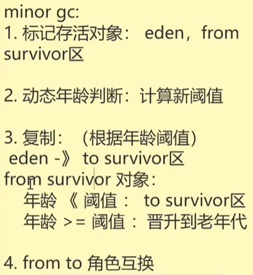

#### 方法区

用于存储已被jvm加载的类信息（版本、字段、方法、接口等）、常量池、静态变量（jdk1.7后移至堆）、即时编译器（JIT）编译后的代码缓存等。

jdk1.7之前是**永久代**，使用jvm内存，容易OOM；1.8之后移除永久代，改用**元空间**，使用本地内存，受物理内存大小限制，默认自动扩容，解决了因类加载过多导致永久代溢出的问题。

**运行时常量池**：是方法区的一部分，用于存放编译期生成的各种字面量和符号引用，**字符串常量池在jdk1.7后移到了堆中**。

```
// 1.8以前
-XX:PermSize=N //方法区（永久代）初始大小
-XX:MaxPermSize=N //方法区（永久代）最大大小，超过这个值将会抛出OOM异常：java.lang.OutOfMemeryError:PermGen
// 1.8之后
-XX:MetaspaceSize=N //设置Metaspace的初始（和最小大小）
-XX:MaxMetaspaceSize=N //设置Metaspace的最大大小
```

**字符串常量池**：为了提升性能和减少内存消耗针对字符串（String类）专门开辟的一块区域，主要目的是为了避免字符串的重复创建

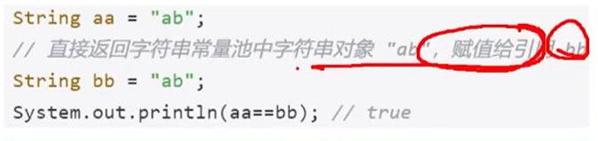

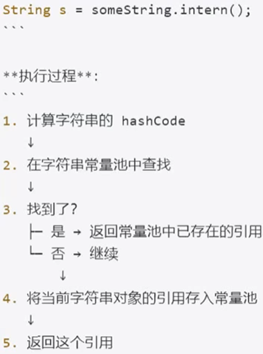

new String("xx")：首先会去常量池中找有没有xx的引用，没有的话，就去堆里创建xx对象，并用常量池中的引用指向xx对象；然后无视上面创建的xx对象，强制在内存里开辟一块空间，把xx对象拷贝一份，创建出第二个字符串对象，返回第二个字符串对象的引用。

字面量赋值：首先会去常量池中找有没有xx的引用，如果没有，就去堆里创建xx对象，并用常量池中的引用指向xx对象，返回xx对象的引用；如果有，就直接返回xx对象的引用

**创建对象**

类加载检查

分配内存：内存分配方式：指针碰撞，空闲列表；内存分配并发问题：CAS+失败重试，TLAB

初始化零值：将这块内存区域（**不包括对象头**）里的所有实例字段（成员变量）全部初始化为**默认零值**

设置对象头（hash值、GC年龄、锁状态、类元数据类型指针）

执行<init>方法：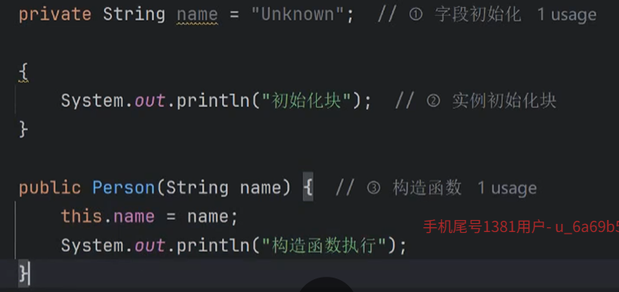

**对象内存布局与访问定位**

内存布局：对象头（标记字段[存储对象自身的运行时数据]、类型指针[指向对应类元数据的指针]）、实例数据、对齐填充（保证内存起始是8字节的整数倍）

访问定位：句柄、直接指针（基本用这个）

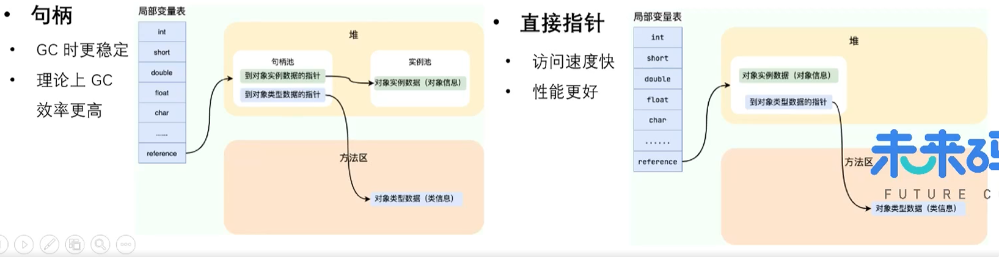

#### 垃圾回收

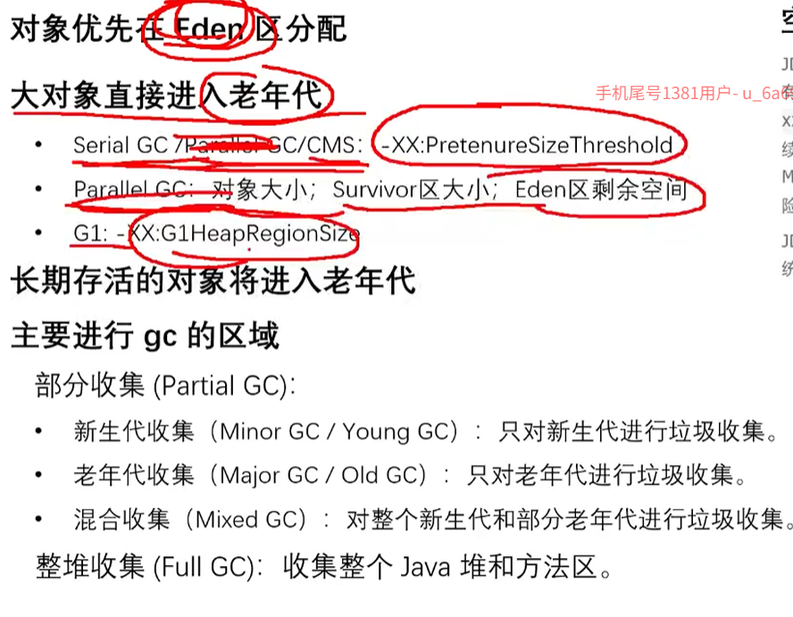

**如何判断对象是否死亡？**

引用计数法：通过计算对象的引用次数判断，但是容易出现循环引用，导致内存泄漏

可达性分析算法：

JVM 会选定一组固定的对象作为 **GC Roots（根集合）**，然后以这些 Roots 为起点，像**射线扫描**一样向下搜索，走过的路径称为 **引用链（Reference Chain）**。

- **可达对象（存活）**：如果某个对象能从某个 GC Root 出发，通过引用链找到它，说明它正在被程序使用（比如局部变量正在指向它），标记为存活，**本轮不回收**。
- **不可达对象（死亡）**：如果某个对象没有任何一条引用链与 GC Roots 相连（即“孤岛”），说明程序再也无法使用到它了，判定为可回收的垃圾。

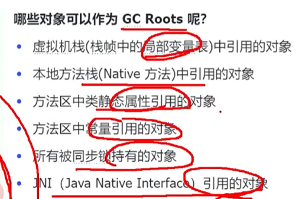


对象被判断为“不可达”后，并不是立即处决，至少要经历**两次标记**：

第一次：发现对象没有与 GC Roots 相连的引用链，进行第一次标记

第二次：检查该对象是否有必要执行 `finalize()` 方法，如果对象没有覆盖 `finalize()` 或 `finalize()` 已被调用过，则视为“确定死亡”

**强引用、软引用、弱引用、虚引用？**

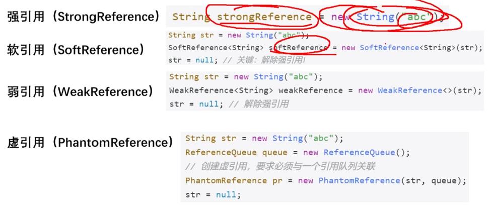

强引用：只有这个对象沿着GC Roots可达（有强引用链连着），无论内存多么紧张，甚至抛出OOM，jvm也绝对不会回收它

软引用：jvm内存充足时，跟强引用一样，不会被回收，只有当堆内存即将耗尽（在OOM之前），垃圾回收器才会批量清理所有软引用指向的对象（内存敏感的高速缓存，如图片缓存、大文件数据缓存，既可以利用缓存提升性能，又能在内存紧张时自动释放缓存，避免崩溃）

弱引用：只要发生任何一次垃圾回收（无论Minor GC还是Full GC），弱引用指向的对象就会被立即回收。（解决经典的内存泄露问题，例如ThreadLocal中的ThreadLocalMap，key虽然被回收了，但是value依然是强引用，需要手动remove()，否则还会泄露）

虚引用：pr.get()永远返回null，无法通过虚引用获取到对象实例，对象被对象被回收时，系统会将该虚引用放入与之关联的 `ReferenceQueue`（引用队列）中。它的作用完全不关心对象是否存活，而是监控对象被回收的那一刻，用途：比如堆外内存的释放

除了强引用，其余三种引用都可以关联一个 `ReferenceQueue`，当对象被回收后，引用对象就会被jvm追加到队列末尾。可以通过轮询这个队列，知道哪些对象已被回收，从而在程序层面清理掉那些回收对象的“缓存钥匙”或执行善后工作（比如虚引用的堆外内存清理）

**垃圾收集有哪些算法，各自的特点？**

标记-清除算法：从GC Roots遍历可达对象，打上“存活”标记，遍历整个堆，把没有存活的对象回收

优点：不需要额外移动对象，缺点：清除后的内存空间不连续，产生内存碎片，没有足够的连续空间支持大对象分配；随着堆中存活对象增多，标记和清除阶段的耗时都会显著增加

复制算法：将可用内存按容量划分为大小相等的两块，每次只使用其中一块，A区快满时，触发GC，把A区对象拷贝到B区，然后清空A区

优点：实现简单，运行高效，不用考虑内存碎片；缺点：浪费一半内存空间

标记-整理算法：和标记-清除算法相同，先标记存活对象，将存活的对象向内存的一端移动，然后清理掉边界以外的所有内存

优点：没有内存碎片，内存利用率高；缺点：移动/复制存活动向开销极大

分代收集算法：将堆拆成多个区域，在不同区域根据对象的存活特点，使用不同的垃圾收集策略；例如G1（Garbage First），在新生代使用复制算法，老年代中，优先回收垃圾最多的区域，用“标记-复制”（把存活对象从垃圾多的区域复制到空闲的区域，然后清空旧区域），本质上，G1是用复制算法来变相实现标记-整理的逻辑（消灭碎片）。

**HotSpot为什么要分新生代和老年代？**

主要是为了提升垃圾回收的效率，给不同代的对象分配不同的收集算法

**常见的垃圾回收器有哪些？**

Serial、Serial Old、ParNew、Parallel Scavenge、Parallel Old、CMS、G1

**介绍一下CMS,G1收集器?**

CMS：是一种以获取最短回收停顿时间为目标的收集器，第一款真正意义上的并发收集器，第一次实现了让垃圾收集线程与用户线程（基本上）同时工作。

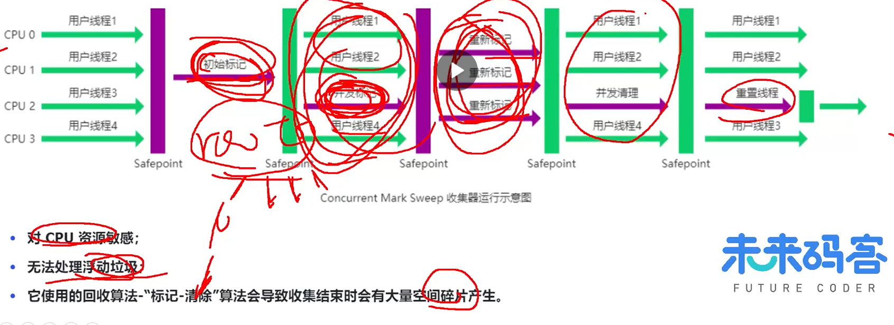

G1：是一款面向服务器的垃圾收集器，主要针对配备多颗处理器及大容量内存的机器，以极高概率满足GC停顿时间要求的同时，还具备高吞吐量性能特征

整体上：标记-整理    局部：标记-复制

G1有一个停顿预测模型，在后台记录之前的GC的耗时和回收的内存，下次回收会根据历史数据估算，控制每次回收的区域数量来精准控制耗时

**Minor GC和Full GC有什么不同？**

Minor GC 是新生代的“高频轻量清理”，采用复制算法，速度快；Full GC 是堆和元空间的“低频重量整理”，采用标记-整理算法，会导致长时间的停顿，应尽量避免

触发条件：对于MinorGC，Eden空间不足，无法分配新对象时；

对于FullGC，老年代空间不足、元空间/永久代空间不足、大对象直接进入老年代、System.gc()主动调用

## 类加载

### 类的生命周期

加载、链接（验证、准备、解析）、初始化、使用、卸载

#### 加载

1.通过全类名获取定义此类的二进制字节流

2.将字节流所代表的静态存储结构转换为方法区的运行时数据结构

3.在内存中生成一个代表该类的Class对象，作为方法区这些数据的访问入口

**类加载器（ClassLoader）**

类加载器是一个加载类的对象，每个java类都有一个引用指向加载它的ClassLoader；数组类不是通过ClassLoader创建的（数组类没有对应的二进制字节流），是由jvm直接生成的

双亲委派机制：

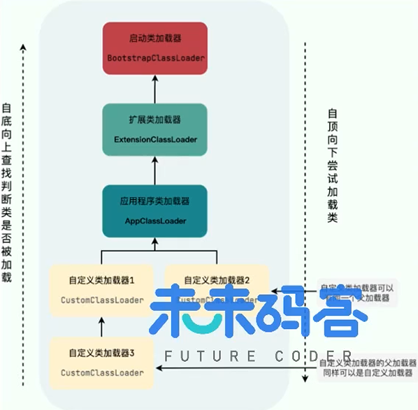

findClass可以做定制化操作，loadClass会有检查是否被加载过和加载操作


保证核心类库的安全；

避免类的重复加载，父加载器加载过的类，子加载器不会重复加载，保证jvm内存中同一份字节码只有一个实例；

只有类全名和类加载器相同才能确定一个类，保证类的唯一性。

#### 验证

文件格式验证（操作字节流，后面三个都是方法区的数据验证）、元数据验证、字节码验证、符号引用验证

#### 准备

准备阶段是正式为类变量分配内存并设置类变量初始值的阶段

仅包括类变量（静态变量），不包括实例变量

在方法区中进行分配

初始值是数据类型默认的零值（如0、0L、null、false等）

#### 解析

虚拟机将常量池中的符号引用替换为直接引用的过程（静态绑定）

#### 初始化

执行初始化方法<clinit>()方法的过程

new、getstatic、putstatic或invokestatic都会触发初始化

Class.forName(""), newInstance()

如果父类还未初始化，则先触发父类的初始化

先初始化主类（包含main方法）

#### 类卸载

满足3个要求：

类的所有实例对象都已被GC；类没有在其他任何地方被引用；类加载器的实例已被GC。

## 工具

**超时问题（规律性，毛刺）**：

1.代码逻辑：arthas

```
thread
thread 2
// 查看线程池的阻塞情况
thread -all | grep pool
thread -n 10
// 查看发生死锁的信息
thread -b
// 反编译
jad 类全限定名 thread（可以指定方法）
// 查看字段信息
sc -d -f 类全限定名
// 类的方法信息
sm 类全限定名
// 操作类的信息（下图）
```

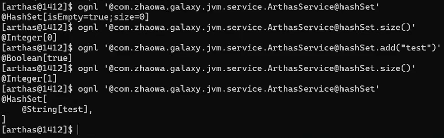

```
// 追踪耗时
trace 类全限定名 方法名
// 统计方法调用情况
monitor -c 5 类全限定名 方法名
```

2.GC：GC日志的GC时间是否吻合

3.机器状态：tsar

**内存泄漏(OOM)**

```
// 出现OOM时会导出文件
-xx:+HeapDumpOnOutOfMemoryError
-xx:HeapDumpPath=./

jps查看进程号，jmap手动导出
jmap -dump:format=b,file=heap.hprof 进程号
```


