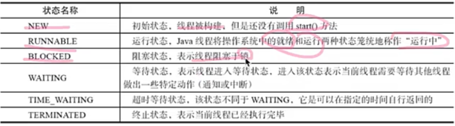
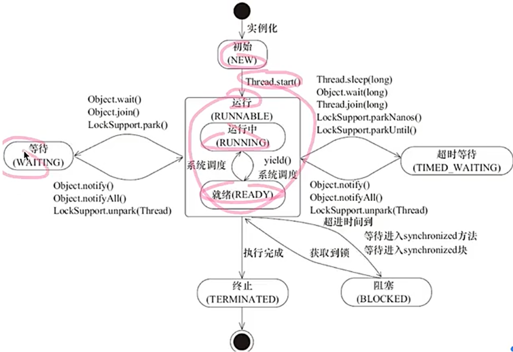
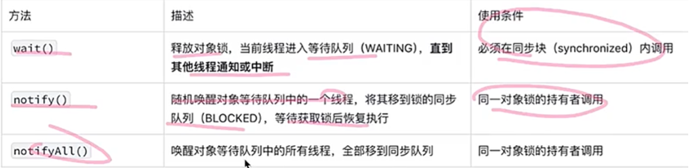

# 线程状态





Thread.Sleep()不释放锁资源

obj.wait()/obj.wait(long timeout)当前对象调用，释放锁，在synchronized里使用

t.join()/t.join(long millis)不释放对象锁

Thread.yield()在运行态内部的调整

JVM只有daemon线程，会直接退出；无论daemon线程是否执行完成。

**线程中断**

interrupt()/isInterrupted()/Thread.interrupted()

循环中用wait、sleep、join，用Thread.currentThread().interrupt()复位标记位

**线程终止**

中断标志位、自定义boolean标记


# 线程通信

多个线程通过共享内存实现信息交换，但需解决以下问题：

1.可见性：线程修改变量后其他线程能否立即感知

2.原子性：操作是否不可分割，避免数据不一致

3.有序性：代码执行顺序是否符合预期

**volatile关键字**

1.核心特性

可见性保证：所有线程直接访问共享内存中的变量值，而非本地缓存

写操作：强制将修改后的值刷新到主内存

读操作：强制从主内存读取最新值

禁止指令重排序：通过内存屏障限制编译器和处理器的重排序

2.使用限制

不保证原子性：仅适用于单次读/写操作，无法处理复合操作（如 i++）

典型场景：

状态标识（如 volatile boolean on = true）

配合CAS操作实现无锁并发（如 AtomicInteger 内部实现）

**synchronized关键字**

1.核心特性

原子性&排他性：同一时刻只允许一个线程进入同步代码

隐式锁机制：通过锁对象实现同步（锁粒度可以是实例对象、Class对象或自定义对象）

可见性保证：线程退出同步代码时，修改的变量值强制刷新到主内存

**等待/通知机制**

通过Object类的wait()、notify()和notifyAll()方法实现的多线程协作模式

核心作用：解决线程之间的条件依赖问题（如生产者-消费者模型），避免无效轮询（Busy Waiting）消耗资源

本质：基于共享对象的状态协调，一个线程通过释放锁进入等待状态，另一线程通过锁通知唤醒等待线程



```java
public class WaitNotifyDemo {
    // 共享资源及状态标记
    private static String data = null;
    private static final Object lock = new Object();

    public static void main(String[] args) {
        // 生产者线程
        Thread producer = new Thread(() -> {
            for (int i = 1; i <= 5; i++) {
                synchronized (lock) {
                    // 1. 必须用while循环检查条件（防止虚假唤醒）
                    while (data != null) {
                        try {
                            System.out.println("生产者: 容器已满，等待消费...");
                            lock.wait(); // 释放锁，进入等待
                        } catch (InterruptedException e) {
                            Thread.currentThread().interrupt();
                        }
                    }
                    // 2. 生产数据
                    data = "数据-" + i;
                    System.out.println("生产者: 生产了 " + data);
                    // 3. 唤醒消费者（注意：此时锁还未释放，消费者要等本同步块结束才真正被唤醒）
                    lock.notify();
                }
                // 模拟生产耗时
                try { Thread.sleep(500); } catch (InterruptedException e) {}
            }
        });

        // 消费者线程
        Thread consumer = new Thread(() -> {
            for (int i = 1; i <= 5; i++) {
                synchronized (lock) {
                    while (data == null) {
                        try {
                            System.out.println("消费者: 容器为空，等待生产...");
                            lock.wait();
                        } catch (InterruptedException e) {
                            Thread.currentThread().interrupt();
                        }
                    }
                    // 消费数据
                    System.out.println("消费者: 消费了 " + data);
                    data = null;
                    // 唤醒生产者
                    lock.notify();
                }
                try { Thread.sleep(500); } catch (InterruptedException e) {}
            }
        });

        producer.start();
        consumer.start();
    }
}
```

