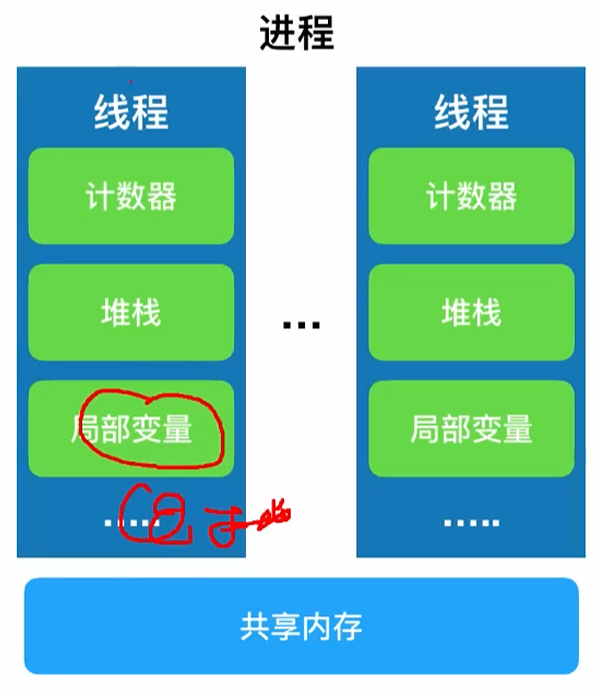
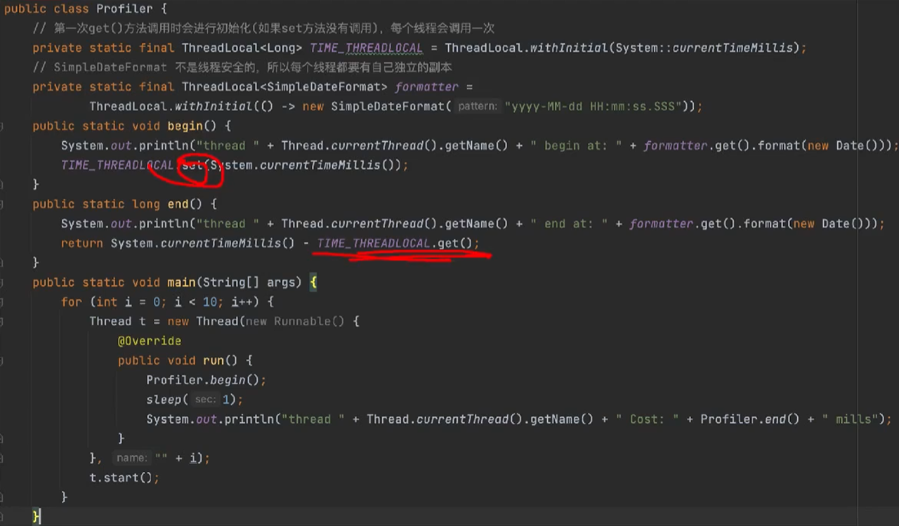
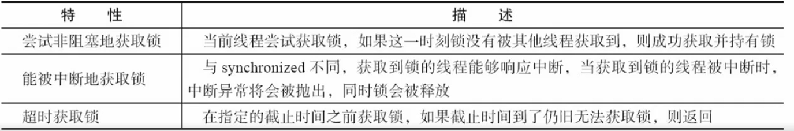
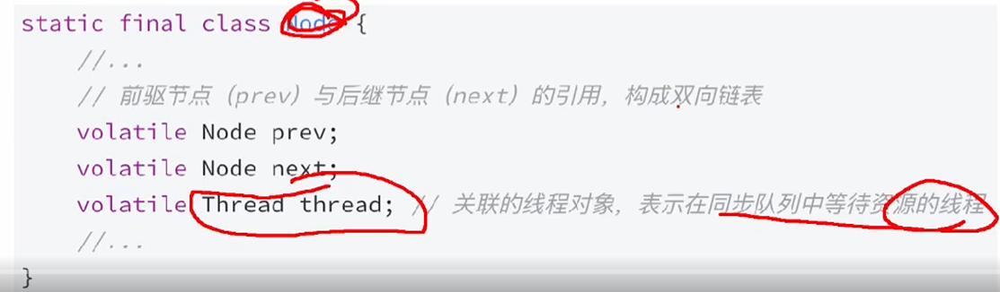
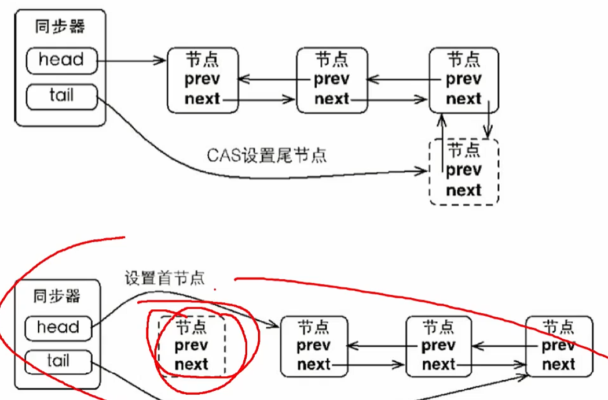
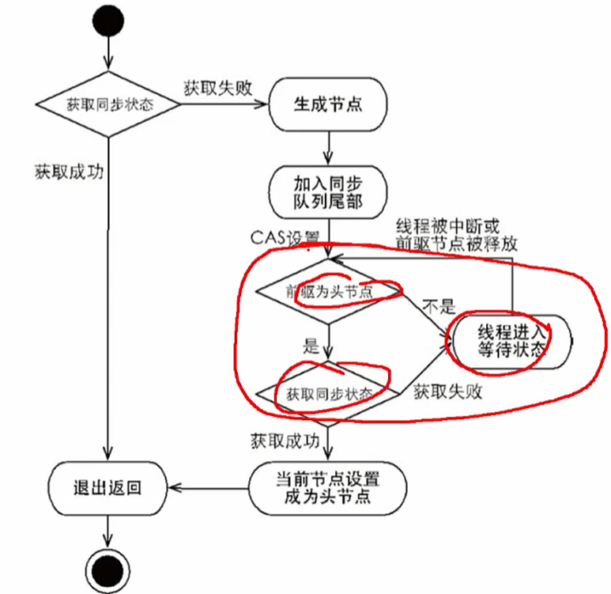
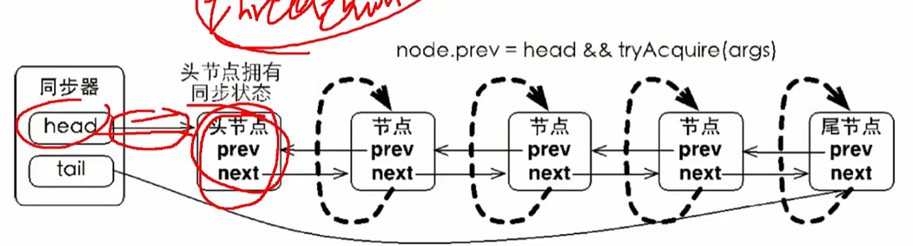
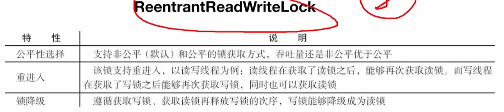
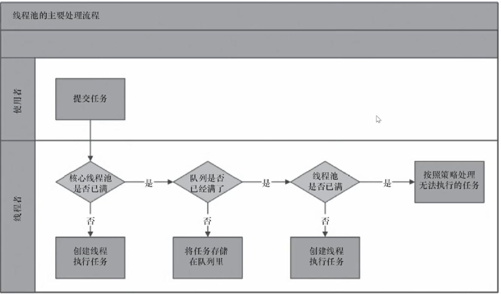
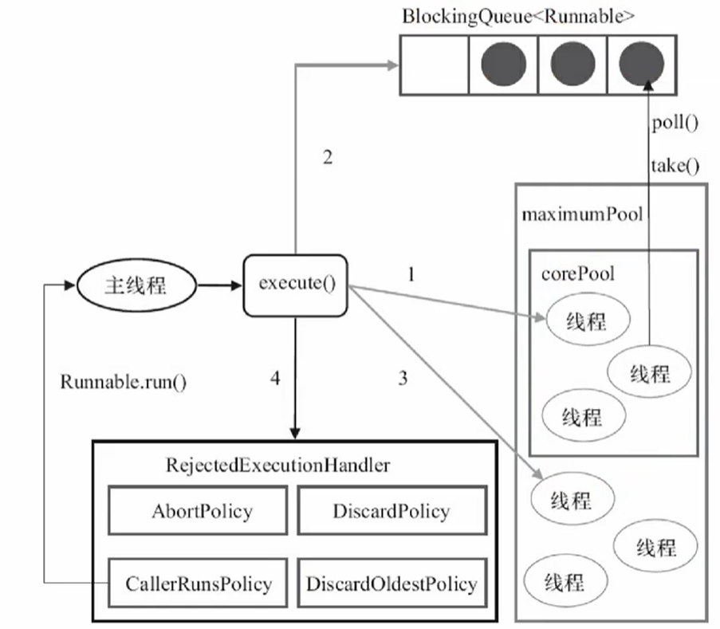

# 线程



# 线程状态


Thread.Sleep()不释放锁资源

obj.wait()/obj.wait(long timeout)当前对象调用，释放锁，在synchronized里使用

t.join()/t.join(long millis)不释放对象锁

Thread.yield()在运行态内部的调整

JVM只有daemon线程，会直接退出；无论daemon线程是否执行完成。

**线程中断**

interrupt()/isInterrupted()/Thread.interrupted()

循环中用wait、sleep、join，用Thread.currentThread().interrupt()复位标记位

**线程终止**

中断标志位、自定义boolean标记


# 线程通信

多个线程通过共享内存实现信息交换，但需解决以下问题：

1.可见性：线程修改变量后其他线程能否立即感知

2.原子性：操作是否不可分割，避免数据不一致

3.有序性：代码执行顺序是否符合预期

## **volatile关键字**

1.核心特性

可见性保证：所有线程直接访问共享内存中的变量值，而非本地缓存

写操作：强制将修改后的值刷新到主内存

读操作：强制从主内存读取最新值

禁止指令重排序：通过内存屏障限制编译器和处理器的重排序

2.使用限制

不保证原子性：仅适用于单次读/写操作，无法处理复合操作（如 i++）

典型场景：

状态标识（如 volatile boolean on = true）

配合CAS操作实现无锁并发（如 AtomicInteger 内部实现）

## **synchronized关键字**

1.核心特性

原子性&排他性：同一时刻只允许一个线程进入同步代码

隐式锁机制：通过锁对象实现同步（锁粒度可以是实例对象、Class对象或自定义对象）

可见性保证：线程退出同步代码时，修改的变量值强制刷新到主内存

## **等待/通知机制**(wait/notify)

通过Object类的wait()、notify()和notifyAll()方法实现的多线程协作模式

核心作用：解决线程之间的条件依赖问题（如生产者-消费者模型），避免无效轮询（Busy Waiting）消耗资源

本质：基于共享对象的状态协调，一个线程通过释放锁进入等待状态，另一线程通过锁通知唤醒等待线程


wait()会释放锁：线程进入等待状态时，会完全释放当前对象的锁（包括所有嵌套的同步锁），让其他线程能进入同步块操作。

notify()不释放锁：唤醒等待线程后，被唤醒的线程不会立即执行，必须等当前线程退出synchronized块释放锁后，等待线程才能重新竞争锁并恢复执行。

```java
public class WaitNotifyDemo {
    // 共享资源及状态标记
    private static String data = null;
    private static final Object lock = new Object();

    public static void main(String[] args) {
        // 生产者线程
        Thread producer = new Thread(() -> {
            for (int i = 1; i <= 5; i++) {
                synchronized (lock) {
                    // 1. 必须用while循环检查条件（防止虚假唤醒）
                    while (data != null) {
                        try {
                            System.out.println("生产者: 容器已满，等待消费...");
                            lock.wait(); // 释放锁，进入等待
                        } catch (InterruptedException e) {
                            Thread.currentThread().interrupt();
                        }
                    }
                    // 2. 生产数据
                    data = "数据-" + i;
                    System.out.println("生产者: 生产了 " + data);
                    // 3. 唤醒消费者（注意：此时锁还未释放，消费者要等本同步块结束才真正被唤醒）
                    lock.notify();
                }
                // 模拟生产耗时
                try { Thread.sleep(500); } catch (InterruptedException e) {}
            }
        });

        // 消费者线程
        Thread consumer = new Thread(() -> {
            for (int i = 1; i <= 5; i++) {
                synchronized (lock) {
                    while (data == null) {
                        try {
                            System.out.println("消费者: 容器为空，等待生产...");
                            lock.wait();
                        } catch (InterruptedException e) {
                            Thread.currentThread().interrupt();
                        }
                    }
                    // 消费数据
                    System.out.println("消费者: 消费了 " + data);
                    data = null;
                    // 唤醒生产者
                    lock.notify();
                }
                try { Thread.sleep(500); } catch (InterruptedException e) {}
            }
        });

        producer.start();
        consumer.start();
    }
}
```

## join()

让当前线程阻塞等待，直到调用 `join()` 的那个线程执行完毕再继续

本质是通过对象的等待/通知机制和锁的同步控制实现的

```java
public class Join {

    public static void main(String[] args) throws InterruptedException {
        Thread previous = Thread.currentThread();
        for (int i = 0; i < 10; i++) {
            Thread thread = new Thread(new MyThread(previous), "name " + i);
            thread.start();
            previous = thread;
        }
        TimeUnit.SECONDS.sleep(1);
        System.out.println(Thread.currentThread().getName() + " terminate");
    }

    static class MyThread implements Runnable {
        private Thread thread;
        public MyThread(Thread thread) {
            this.thread = thread;
        }
        @Override
        public void run() {
            try {
                thread.join();
            } catch (InterruptedException e) {
                throw new RuntimeException(e);
            }
            System.out.println(Thread.currentThread().getName() + " terminate");
        }
    }

}
```

`join()` 是 `synchronized` 方法，锁的是**目标线程对象**

当前线程调用 `wait()` 后释放该锁并进入等待

当目标线程终止时，JVM 会自动调用该线程对象的 `notifyAll()`，唤醒所有等待它的线程。

被唤醒的线程重新竞争锁，然后再次检查 `isAlive()`，直到目标线程真正结束

# ThreadLocal

以ThreadLocal对象为键、任意对象为值的存储结构



**wait、sleep、yield的区别？**

wait属于Object，锁是对象级别的；必须在synchronized中调用，否则抛异常；调用后释放当前对象锁，线程进入等待队列；被notify/notifyAll唤醒后，不会立即执行，需要重新竞争锁；必须用while循环包裹，防止虚假唤醒

sleep属于Thread，让当前线程休眠指定时间；不释放锁，如果当前线程持有锁，其他线程依然进不来；时间到自动苏醒，或者被interrupt中断

yield属于Thread，提示调度器“我愿意让出CPU”；不保证一定让出，也可能立刻又被调度执行；不释放锁，不阻塞，不抛异常

# 锁

会使用锁，知道怎么去实现一个锁

锁的实现：实现Lock接口、自定义AQS子类：state+同步队列、Condition的使用和原理：等待队列

synchronized隐式获取释放锁，便捷

Lock：可操作性、可中断的获取锁、超时获取锁



# AQS

AbstractQueuedSynchronized是用来构建锁或者其他同步组件的基础框架，它使用了一个int成员变量（state）表示同步状态，通过内置的FIFO队列来完成资源获取线程的排队工作。

同步器面向锁的实现者；锁面向使用者

| 组件          | 作用                                                         |
| :------------ | :----------------------------------------------------------- |
| `state`       | `volatile int`，表示资源状态。0 表示空闲，>0 表示被占用（具体含义由子类定义） |
| CLH 队列      | 一个 FIFO 双向队列，存放等待获取资源的线程（包装成 `Node`）  |
| `Node`        | 队列节点，包含线程引用、等待状态 `waitStatus`、前后指针      |
| CAS           | 通过 `compareAndSetState` 原子修改 state                     |
| 模板方法      | `tryAcquire` / `tryRelease` / `tryAcquireShared` / `tryReleaseShared` 由子类实现 |
| `LockSupport` | 底层用 `park()` / `unpark()` 阻塞和唤醒线程                  |



AQS 是 JUC 的“并发基石”：用 `state` 表示资源，用 CLH 队列排队，用 CAS 保证原子性，用 `park/unpark` 阻塞唤醒。开发者只需实现 `tryAcquire/tryRelease` 等几个方法，就能造出自己的锁。




**独占式、共享式**：同一时刻，独占模式只允许一个线程持有同步状态，共享模式允许多个线程同时持有。

**对中断敏感**：线程阻塞在某个方法上时，如果被 `interrupt()`，该方法会**立即结束阻塞**，通常抛出 `InterruptedException`，并**清除中断标志**。

**对中断不敏感**：线程阻塞在某个方法上时，即使被 `interrupt()`，它也**不会提前返回**，而是继续等待，直到条件满足或超时。中断标志只是被设置，方法本身不处理。



独占式获取节点



# ReentrantLock

可重入：线程再次获取锁，锁的最终释放

公平性获取锁

可重入指的是任意线程在获取到锁之后能够再次获取该锁而不会被锁所阻塞，这个特性的实现需要解决两个问题：

1. 线程再次获取锁，锁需要去识别获取锁的线程是否为当前占据锁的线程，如果是，则再次成功获取

2. 锁的最终释放，线程重复n次获取了锁，随后在第n次释放锁之后，其他线程能够获取到锁，这就要求锁对于获取进行计数自增，计数表示当前锁被重复获取的次数，而锁被释放时，计数自减，当计数等于0时表示锁已经成功释放。

# 读写锁

写操作对读操作的可见性

读写锁分离提升并发性

简化读写交互场景的编程方式



# 锁升级

在 **`synchronized`** 里，锁升级指 JVM 的锁优化：无锁 → 偏向锁 → 轻量级锁 → 重量级锁，**只有升级，没有降级**

**偏向锁**：单线程反复进入同步块，JVM 把锁“偏向”给该线程，后续进入几乎零开销。

**轻量级锁**：少量线程交替执行，用 CAS 抢锁，抢不到先自旋。

**重量级锁**：竞争激烈，线程进入 Monitor 等待队列，由操作系统挂起。

# 锁降级

在 **`ReentrantReadWriteLock`** 里，锁降级指：持有写锁 → 获取读锁 → 释放写锁，**写锁降为读锁；读锁升级为写锁则不支持**

**为什么需要锁降级？**

保证在释放写锁后，当前线程仍能读到自己刚修改的数据，且中间不会被其他写线程插入修改，如果先释放写锁再获取读锁，中间可能被其他写线程抢占并修改数据，导致读到的不是自己刚写的结果


“锁升级”和“锁降级”这两个词，在**不同语境下含义完全不同**

| 维度             | 锁升级（synchronized）               | 锁降级(ReadWriteLock)                  |
| ---------------- | ------------------------------------ | -------------------------------------- |
| **触发方式**     | JVM自动控制                          | 手动编码控制                           |
| **目的**         | 减少无竞争时的开销，适应线程竞争变化 | 确保数据一致性，减少写锁独占时间       |
| **典型应用场景** | synchronized同步块或方法             | 读写锁（如数据更新后仍需线程安全读取） |

# Condition接口

用来替代Object的wait/notify/notifyAll，配合ReentrantLock使用，核心优势是：一个锁可以创建多个Condition，实现精准唤醒，避免notifyAll的惊群效应。等待队列从“一个”变成“多个”

**核心方法**：

```java
public interface Condition {
    void await() throws InterruptedException;                    // 等待，可中断
    void awaitUninterruptibly();                                 // 等待，不可中断
    long awaitNanos(long nanosTimeout) throws InterruptedException; // 纳秒超时
    boolean await(long time, TimeUnit unit) throws InterruptedException; // 指定单位超时
    boolean awaitUntil(Date deadline) throws InterruptedException;       // 等到某个时刻

    void signal();      // 唤醒该 Condition 上的一个等待线程
    void signalAll();   // 唤醒该 Condition 上的所有等待线程
}
```

和wait/notify一样，调用await/signal之前必须持有对应的锁

```markdown
调用 await()：
1. 把当前线程包装成 Node，加入 Condition 的条件队列
2. 完全释放锁（state 归 0，唤醒 AQS 同步队列中的后继节点）
3. 阻塞当前线程（LockSupport.park）
4. 被 signal 唤醒后，从条件队列移到 AQS 同步队列
5. 重新竞争锁，拿到后从 await 返回

调用 signal()：
1. 把条件队列中的第一个节点移到 AQS 同步队列
2. 等待该节点被唤醒后重新竞争锁
```

一个锁有一个 AQS 同步队列（等待锁），但可以有**多个 Condition 条件队列**（等待条件）。

`await()` 释放锁后，线程在条件队列中等待；`signal()` 把它转移到同步队列，等待重新获取锁。

`signal()` 不会立即释放锁，必须等当前线程退出同步块后，被唤醒的线程才能真正去抢锁。

# ConcurrentHashMap

`Hashtable` 和 `synchronizedMap` 的问题是：**任何操作都锁整张表**，一个线程 put 时，其他线程连 get 都要等。`ConcurrentHashMap` 把锁粒度降到桶级别，不同桶可以并行操作。

JDK7用分段锁，JDK8改成CAS + synchronized锁单个桶，并发度大幅提升

高并发下保证线程安全，同时尽量少加锁、少阻塞，**读无锁、写锁桶、扩容多线程协助、size 用 LongAdder 思想估算，锁粒度尽量小，能无锁就无锁，能并行就并行**。


和hashtable一样，key和value都不能为null，因为并发情况下，null 导致的歧义**无法在不加锁的情况下消除**

## 扩容机制

多线程并发迁移，元素个数超过阈值时触发扩容

扩容时创建新数组 `nextTable`，长度是原来的 2 倍。

把旧数组的每个桶迁移到新数组。

**多个线程可以同时迁移不同的桶**，每个线程负责一段区间。

迁移完成的桶，在旧数组中放置 `ForwardingNode`，标记“已迁移”。

# 阻塞队列

是JUC包下的阻塞队列接口，核心特点是：队列空时取元素会阻塞，队列满时放元素会阻塞，是生产者-消费者模式的标准工具。

```java
import java.util.concurrent.ArrayBlockingQueue;
import java.util.concurrent.BlockingQueue;

public class BlockingQueueDemo {
    public static void main(String[] args) {
        BlockingQueue<Integer> queue = new ArrayBlockingQueue<>(5);

        // 生产者
        new Thread(() -> {
            for (int i = 1; i <= 10; i++) {
                try {
                    queue.put(i);
                    System.out.println("生产：" + i + "，队列大小：" + queue.size());
                    Thread.sleep(200);
                } catch (InterruptedException e) {
                    Thread.currentThread().interrupt();
                }
            }
        }).start();

        // 消费者
        new Thread(() -> {
            for (int i = 1; i <= 10; i++) {
                try {
                    Integer v = queue.take();
                    System.out.println("消费：" + v + "，队列大小：" + queue.size());
                    Thread.sleep(500);
                } catch (InterruptedException e) {
                    Thread.currentThread().interrupt();
                }
            }
        }).start();
    }
}
```

| 操作     | 抛异常     | 返回特殊值 | 阻塞     | 超时                   |
| :------- | :--------- | :--------- | :------- | :--------------------- |
| **插入** | `add(e)`   | `offer(e)` | `put(e)` | `offer(e, time, unit)` |
| **移除** | `remove()` | `poll()`   | `take()` | `poll(time, unit)`     |

# Fork/Join

Fork/Join框架是Java7引入的并行计算框架，核心思想是把一个大任务递归拆成多个小任务，交给多个线程并行执行，最后合并结果，适合计算密集型任务。

**工作窃取算法**

每个线程维护一个双端队列，线程自己产生的子任务，从**队头**放入，也从**队头**取出执行（LIFO），当某个线程自己的队列空了，它会从其他线程的**队尾**“偷”任务来执行（FIFO），偷任务时用CAS保证并发安全，减少锁竞争。

算法充分利用线程进行并行计算，减少线程间的竞争；缺点是在某些情况下还是存在竞争。

# 并发工具类


# 线程池

`ThreadPoolExecutor` 是 JUC 包下最核心的并发工具之一，用来**管理一组线程，复用它们执行大量任务**。核心目标是：**避免频繁创建/销毁线程的开销，控制并发数量，提供任务排队和拒绝策略。**

**线程池 = 线程复用 + 任务队列 + 拒绝策略 + 生命周期管理**

## 核心参数

```java
public ThreadPoolExecutor(
    int corePoolSize,                  // 1. 核心线程数
    int maximumPoolSize,               // 2. 最大线程数
    long keepAliveTime,                // 3. 空闲线程存活时间
    TimeUnit unit,                     // 4. 时间单位
    BlockingQueue<Runnable> workQueue, // 5. 任务队列，用于保存等待执行的任务的阻塞队列
    ThreadFactory threadFactory,       // 6. 线程工厂
    RejectedExecutionHandler handler   // 7. 拒绝策略
)
```

**corePoolSize**：线程池长期维持的线程数量，不会被销毁，prestartAllCoreThreads()先把线程创建好并启动

**workQueue**：用于保存等待执行的任务的阻塞队列

ArrayBlockingQueue、LinkedBlockingQueue、SynchronousQueue（不存储元素）、PriorityBlockingQueue

**maximumPoolSize**：线程池允许创建的最大线程数（注意任务队列满了之后才会继续创建线程）

**threadFactory**：用于设置创建线程的工厂

```java
new ThreadFactoryBuilder().setNameFormat("XX-task-%d").build();
```

**handler**：当核心线程和最大线程都满了时，就需要饱和策略

AbortPolicy、CallerRunsPolicy、DiscardOldestPolicy、DiscardPolicy、自定义

**keepAliveTime**：线程池的工作线程空闲后，保持存活的时间

**unit**：线程活动保持时间的单位

## 使用

**提交任务**

execute：用于提交不需要返回值的任务

submit：用于提交需要返回值的任务，返回值类型时Future

**关闭线程池**

shutdown：会继续执行并且完成所有未执行的任务

shutdownNow：会清除所有未执行的任务并且在运行线程上调用interrupt()，并返回等待执行任务的列表

两个方法作用是类似的，都是遍历线程池的工作线程，逐个去调用interrupt方法中断线程（不中断任务，但是如果任务中没有响应中断的方法，那就永远无法停止），不再接受新任务，新提交的任务会被reject（通过reject策略）

## **实现原理**





addWorker方法有全局锁，上图123的顺序就是为了少调该方法，因为要保护workers这个`hashset`和`largestPoolSize`。并保证“检查线程池状态+添加Worker”是一个原子操作，防止与 `shutdown` 竞争导致关闭后仍创建线程。

## **合理配置线程池**

**任务的性质**

CPU密集型：N CPU + 1

IO密集型：2 * N cpu

混合型：拆分

N = Runtime.getRuntime().availableProcess();

**任务的优先级**

PriorityBlockingQueue，但是注意优先级低的任务

**任务的执行时间**

不同规模的线程池

PriorityBlockingQueue

**任务的依赖性**

增加线程数量

使用有界队列

**workQueue选择策略**

高吞吐、低延迟用SynchronousQueue，无容量阻塞队列，生产者的插入操作必须等待消费者的移除操作才能完成。

允许任务排队、控制资源消耗用有界队列，如 ArrayBlockingQueue/LinkedBlockingQueue
