# Kafka核心概念和基本原理

Kafka同时支持两种消息通信模式：点对点模式 + 发布订阅模式

三种消息中间件的比对：

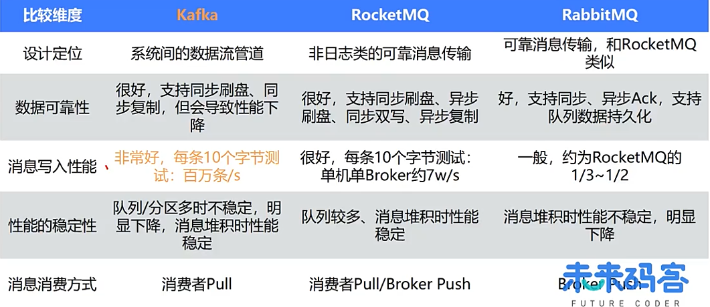

整体架构：

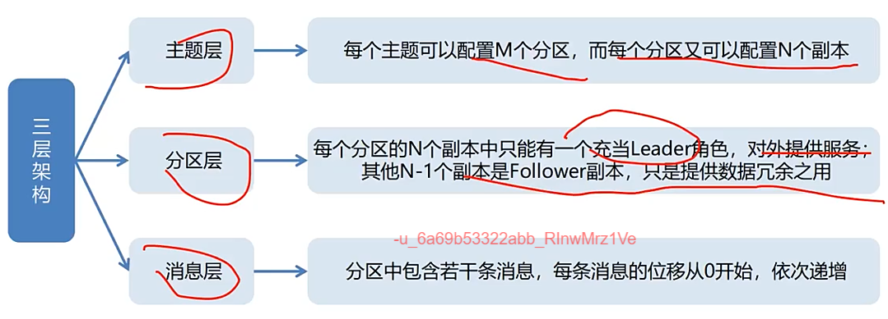

主题（Topic）表示一类消息的集合，每个主题包含若干条消息，每条消息只能属于一个主题，是Kafka进行消息订阅的基本单位；一个生产者可以同时发送多种Topic的消息；而一个消费者只对某种特定的Topic感兴趣，即只可以订阅和消费一种Topic的消息。

分区（Partition），分区是Kafka存储消息的物理实体，一个主题中可以包含多个分区，每个分区中存放的就是该主题的消息。生产者生产的每条消息只会被发送到一个分区中。

副本（Replica），实现高可用的常用手段就是备份机制（Replication），而这些相同的数据拷贝在Kafka中被称为副本（Replica）。Kafka定义了两类副本：领导者（Leader）副本和追随者（Follower）副本。前者对外提供服务，这里的对外指的是与客户端程序进行交互，而后者只是被动地追随领导者副本而已，不能与外界进行交互。

副本是在分区这个层级定义的。每个分区下可以配置若干个副本，其中只能有1个领导者副本和N-1个追随者副本。生产者向分区写入消息，每条消息在分区中的位置信息由一个叫位移（Offset）的数据来表征。

Broker充当着**消息中转角色**，负责存储消息、转发消息，Broker在RokectMQ系统中负责接收并存储从生产者发送来的消息，同时为消费者的拉取请求作准备，Broker同时存储着消息相关的各种元数据。

消费者组（Consumer Group）:一个消息消费者会从Broker服务器中获取到消息，并对消息进行相关业务处理，RocketMQ中的消息消费者都是以消费者组的形式出现，消费者组是同一类消费者的集合，这类Consumer消费的是同一个Topic类型的消息。如果组中的消费者不可用，则会自动对消费者进行“重平衡”（Rebalance）。

**为什么要引入消费者组？**

多个消费者实例同时消费，加速整个消费端的吞吐量（TPS）。

**概念概览：**

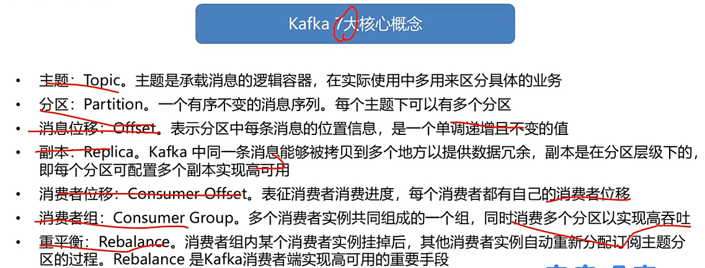

# Kafka使用方法和最佳实践

## 功能特性

生产者：消费分区、消息压缩、幂等性

消费者：消费者组、消费者位移、重平衡、多线程开发、进度监控

通用机制：消息可靠性、消息拦截器

## 生产者

**消息压缩**

生产者程序中配置compression.type参数即表示启用指定类型的压缩算法

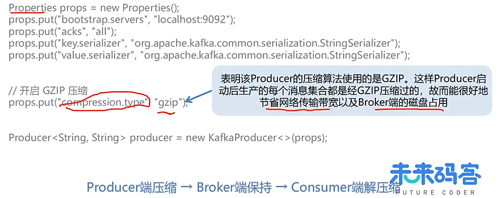

**什么场景下Broker端也可能进行消息压缩？**

Broker端制定了和Producer端不同的压缩算法。

示例：Producer使用GZIP进行压缩，而Broker必须使用Snappy算法进行压缩。

注意点：可能会发生预料之外的压缩/解压缩操作，通常表现为Broker端CPU使用率飙升。

Broker端发生了消息格式转换。

示例：为了兼容老版本的格式，Broker端会对新版本消息执行向老版本格式的转换。

注意点：一般情况下这种消息格式转换对性能影响很大，还让Kafka失去Zero Copy特性。

**什么时候是启动压缩的合理时机？**

Producer程序运行机器上的CPU资源比较充足；环境中带宽资源相对有限

**幂等性**

幂等性生产者：幂等操作的特点是其任意多次执行所产生的影响均与一次执行的影响相同，在kafka中，生产者默认不是幂等性的，但我们可以创建幂等性生产者，但只能保证**单分区**和**单会话**上的幂等性。

**事务性**

事务型生产者能够保证将消息原子性地写入到多个分区中，这批消息要么全部写入成功，要么全部失败。另外，事务型生产者也不惧进程的重启，生产者重启回来后，Kafka依然保证它们发送消息的精确一次处理。

消费者端isolation.level参数设置：read_uncommitted这是默认值，表明消费者能够读取到Kafka写入的任何消息，不论事务型生产者提交事务还是终止事务，其写入的消息都可以读取。

read_committed表明消费者只会读取事务型生产者成功提交事务写入的消息，当然它也能看到非事务型生产者写入的所有消息。

## 消费者

### **消费者组**

Kafka使用Consumer Group这一机制同时实现了传统消息引擎系统的两大模型：

如果消费者所有实例都属于同一个Group，那么它实现的就是消息队列模型

如果消费者所有实例分别属于不同的Group，那么它实现的就是发布/订阅模型

理想情况下，Consumer实例的数量应该等于该Group订阅主题的分区总数。。

### **位移**

消费者在消费的过程中需要记录自己消费了多少数据，即消费位置信息。在kafka中，这个位置信息有个专门的属于：位移。

对于Consumer Group而言，Offset是一组KV对，Key是分区，V对应Consumer消费该分区的最新位移。可以把Offset想象成Map<TopicOartition, Long>这样的数据结构，其中TopicPartition表示一个分区，而Long表示位移的类型。

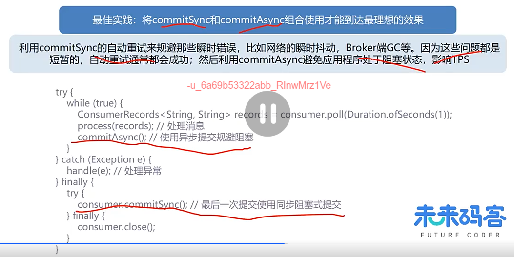

最佳实践：细粒度化地提交位移，这样能够避免大批量的消费重新消费

### 重平衡

Rebalance本质上是一种协议，规定了一个Consumer Group下的所有Consumer如何达成一致，来分配订阅主题的每个分区。比如某个Group下有10个Consumer实例，它订阅了一个具有100个分区的主题。正常情况下，Kafka平均会为每个Consumer分配10个分区，这个分配的过程就叫Rebalance。

**影响：**

重平衡过程对Consumer Group消费过程影响极大，所有Consumer实例都会停止消费。

重平衡的设计是所有Consumer实例共同参与，会导致全部重新分配所有分区。

重平衡非常慢，会导致系统长时间无法正常运作。

**重平衡应该尽量避免，如果避免？**

大部分Rebalance来自消费者组的组员变化，组员变化包括实例新增和实例减少两种情况，更应该关注实例减少的场景。

session.timout.ms，决定Consumer存活性的时间间隔，要保证Consumer实例在判定为无效之前，能够发送至少3轮的心跳请求，即session.timout.ms>=3*heartbeat.interval.ms

heartbeat.interval.ms，控制发送心跳请求频率的参数

max.poll.interval.ms，限定Consumer端应用程序两次调用poll方法的最大时间间隔，参数值设置得大一点，比Kafka下游最大处理时间稍长一点，关注Consumer端的GC表现，比如是否出现了频繁的Full GC导致的长时间停顿是否引发了Rebalance

## 多线程开发

1.消费者程序启动多个线程，每个线程维护专属的KafkaConsumer实例，负责完整的消息获取、消息处理流程。

优点：方便实现；速度快，无线程间交互开销；易于维护分区内的消费顺序。

缺点：占用更多系统资源；线程数受限于主题分区数，扩展性差；线程自己处理消息容易超时，从而引发重平衡。

2.单线程+单消费者实例+消息处理线程池

消费者程序使用单或多线程获取消息，同时创建多个消费线程执行消息处理逻辑

优点：可独立扩展消费获取线程数和工作线程数；伸缩性好

缺点：实现难度高；难以维护分区内的消息消费顺序；处理链路拉长，不易于位移提交管理

### 进度监控

**消费者的消费速度跟不上消息生成的速度怎么办？**

监控消费者进度

使用Kafka自带kafka-consumer-groups脚本；使用Kafka自带的JMX监控指标；使用Kafka Java Consumer API

获取给定消费者组的最新消费消息的位移，获取订阅分区的最新消息位移，执行相应的减法操作从而获取Lag（滞后）值

## 通用机制

### 消息可靠性

生产者方面：

Kafka只对“已提交”的消息做“有限度的”持久化保证

当Kafka的若干个Broker成功地接收到一条消息并写入到日志文件后，它们会告诉生产者程序这条消息已成功提交

N个Broker中至少有1个存活，只要这个条件成立，Kafka就能保证你的这条消息永远不会丢失

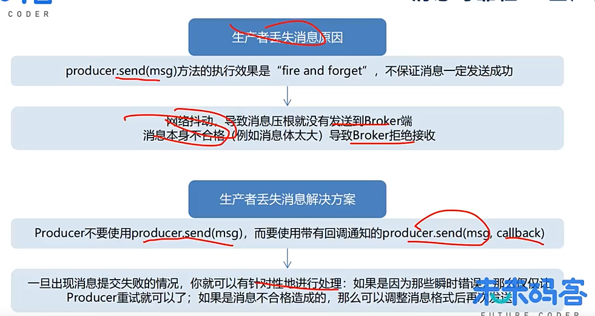

消费者方面：

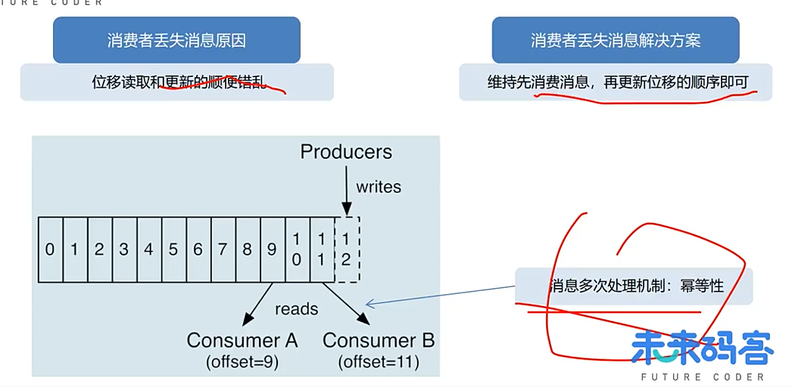

**总结**（8条）

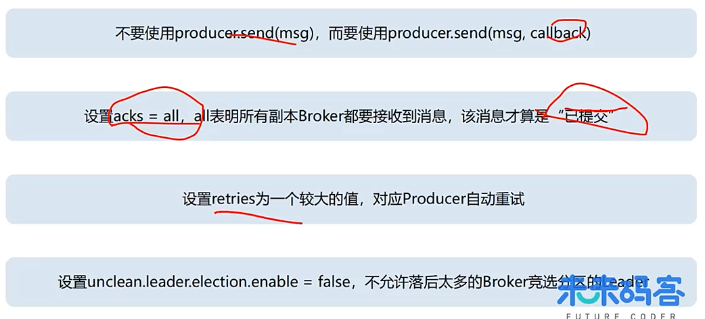

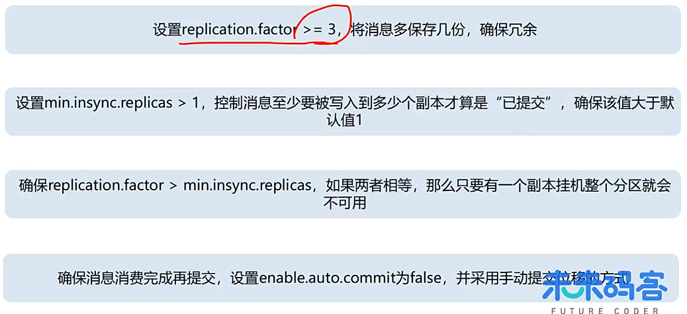

### 拦截器

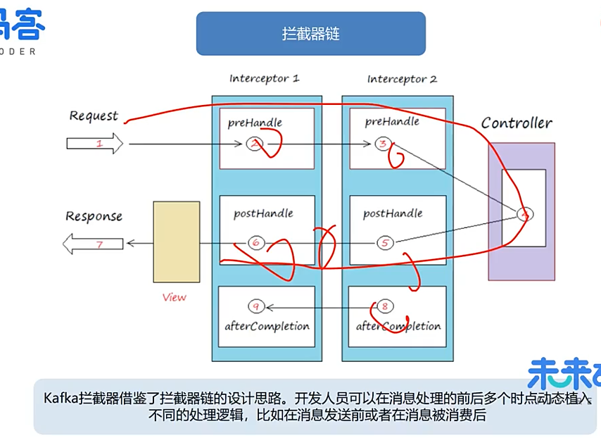

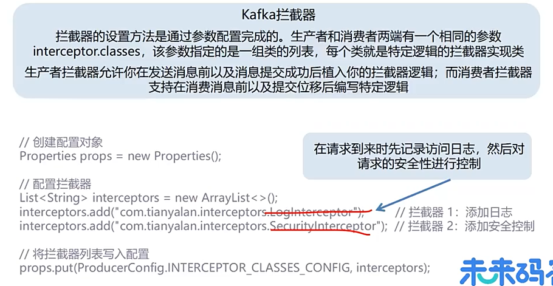

