# MySQL

## SQL查询执行过程

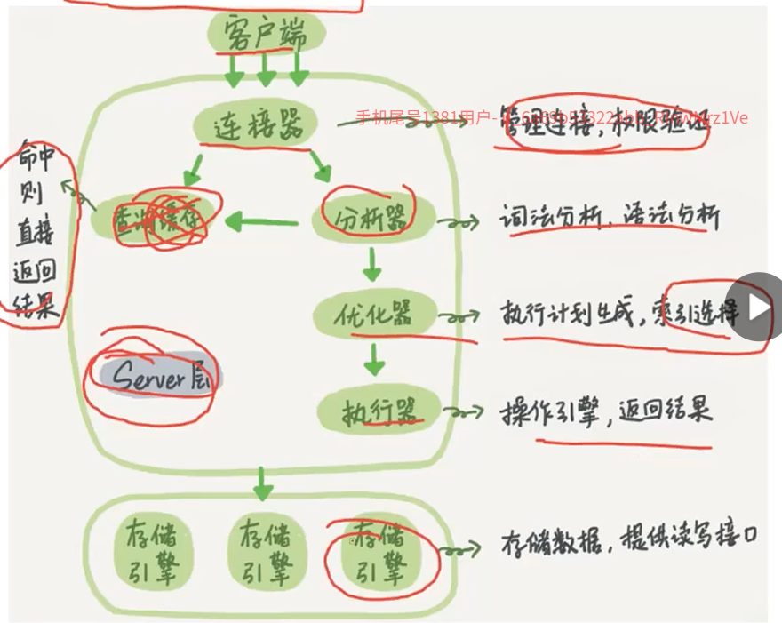

存储引擎：InnoDB,myisam

### 连接器

负责跟客户端建立连接

连接分为长连接和短连接。长连接会有内存占用问题：1.定期断开长连接 2.参数mysql_reset_connection可以重新初始化连接资源

### 查询缓存

不建议使用，对于更新比较频繁的数据库来说，会经常删除缓存，查询缓存的命中率非常低，mysql已经放弃使用

query_cache_type=DEMAND

### 分析器

会进行词法分析，分析输入的sql语句，字符串和空格是什么意思，识别完成之后，再进行语法分析

如果不对会报错“You have an error in your SQL syntax”

### 优化器

进行索引选择

join连接顺序，连接的两个表的执行顺序会决定语句的执行效率

### 执行器

执行sql语句，首先会判断表是否有查询的权限


## 索引

### 常见模型

哈希表：等值查询，不适合范围查询

有序数组：适合静态存储场景，不适合表更新

二叉搜索树：会形成一个极端的链表；如果数据量过大，还会造成树的高度过高，因为索引是会存到磁盘里的，磁盘IO的效率比较低，过高的层数会导致检索效率下降

### InnoDB索引模型

 每个索引都是一个B+树

#### 主键索引和非主键索引

根据叶子节点的内容分为主键索引和非主键索引，因为主键索引存储的是完整的行数据，所以主键索引又叫聚簇索引；非主键索引里面存的是主键的值，所以非主键索引又叫二级索引，常说的回表就是查到主键的值，再从主键索引里查

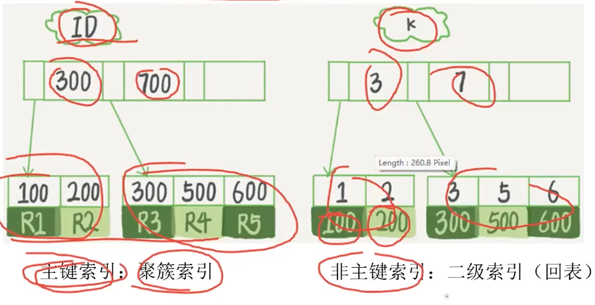

页分裂与页合并：元素的插入和删除导致

如果直接查询主键，会减少回表次数，因为会覆盖查询请求，所以叫覆盖索引

如果有需要，可以创建联合索引，将唯一值和结果列创建联合索引（例如身份证号和名字 ），形成覆盖索引，减少回表次数

#### 最左前缀原则

可以匹配联合索引第一个字段的前n个字符，直到不满足条件为止

**在建立联合索引的时候，如何安排索引内的字段顺序？**

如果通过调整顺序，可以少维护一个索引，那这个顺序往往就是需要优先考虑采用的

空间

#### 索引下推

可以在索引遍历的过程中对索引里包含的字段先判断，直接过滤掉不满足条件的记录，减少回表次数

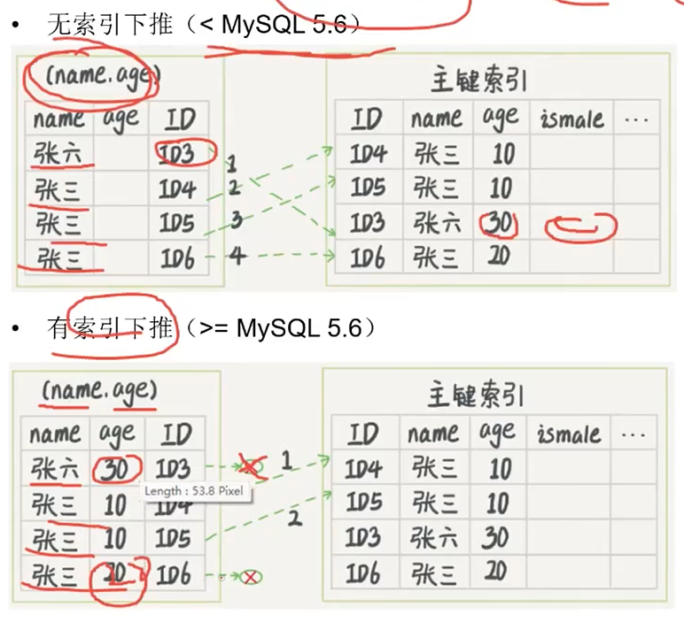

**案例**

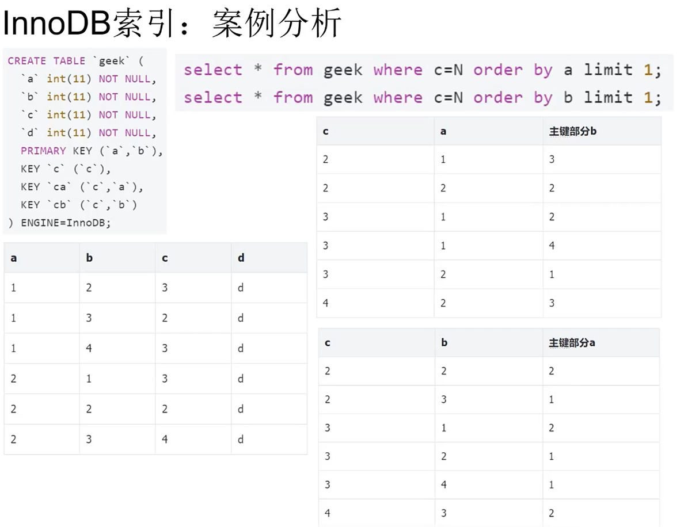

ca可以去除，因为索引c和ca组织方式是相同的

#### 唯一索引、普通索引

查询过程性能的差距微乎其微，因为把数据页读到内存里（16kb）做操作造成的性能影响不大

把更新操作记录到change buffer，能减少读磁盘操作，避免占用内存，显著提高内存利用率

唯一索引的更新不会用到change buffer，因为更新时会先将数据页读取到内存里，判断插入的值是否已经存在，如果存在，这时候直接操作内存会更快一点；只有普通索引的更新会用到，并且在写多读少的业务场景里效率是最高的，但是如果是写少读多的时候，会频繁进行merge操作，反而会降低执行效率

#### 索引选择

**优化器**通过采样统计估算索引基数，根据基数来判断使用的索引

在选择索引时，优化器会把回表的代价也算进去

**如果选错？**

1. 可以通过analyze table t;重新统计下索引基数
2. force index(a)

3. 修改sql语句，引导mysql，例如order by b，优化器会认为查出来的b就是有序的，直接就会用索引b

#### 前缀索引

用前缀索引容易导致查询语句读数据的次数变多

```
alter table user add index index2(email(6));
```

用了前缀索引就用不了覆盖索引对查询的性能优化了

提高数据区分度的手段：倒叙存储(reverse)、hash字段(crc32)

## MySQL事务和锁

sql更新执行过程和查询差不多

### redolog、binlog

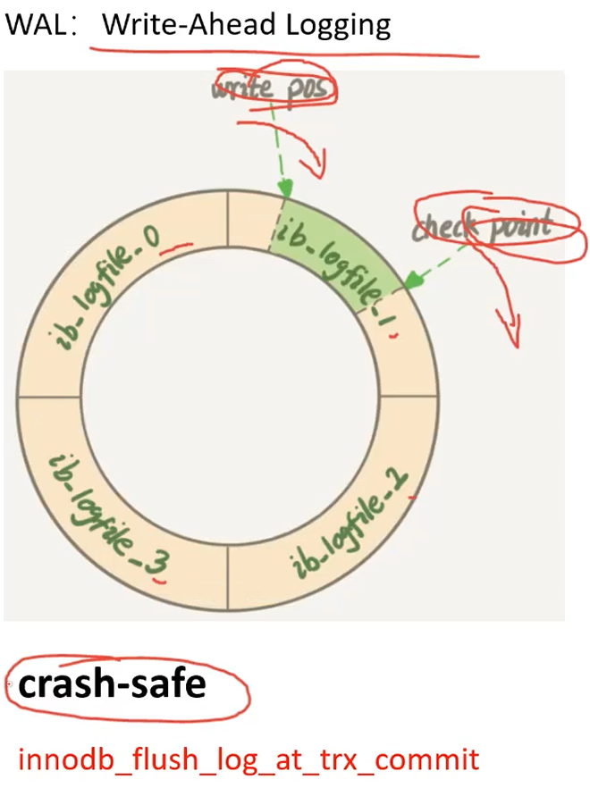


**要查询的那条数据，内存里没有，而磁盘上的页还是旧数据，后台还没来得及刷怎么办？**

当查询需要从磁盘读一个旧数据页到内存时，InnoDB会顺带检查Redo Log的LSN号。如果发现磁盘页比日志旧，它会在读入内存的那一瞬间，把Redo Log里最新的变更应用到这个页上，然后再返回结果集


数据更新的流程

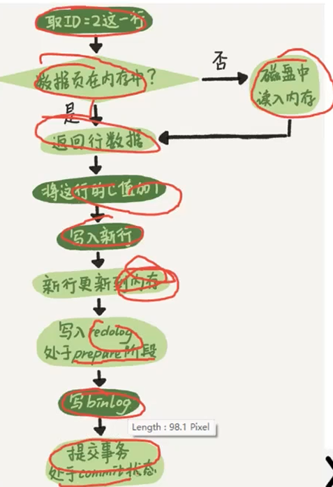

**两阶段提交**

让redolog 和binlog保持逻辑上的一致

**change buffer和redolog**

redolog减少了随机写磁盘的io消耗，因为它是顺序写日志的；change buffer是减少了随机读磁盘的io消耗，并且针对的是非唯一二级索引页的更新

### 事务

myisam是不支持事务的

事务的特性ACID，原子性，一致性，隔离性，持久性

**事务的隔离级别**

读未提交：一个事务还没提交时，它做的变更就能被别的事务看到

读已提交：一个事务提交之后，它做的变更才会被其他事务看到

可重复度：一个事务执行过程中看到的数据，总是跟这个事务在启动时看到的数据是一致的

串行化：对于同一行记录，“写”会加“写锁”，“读”会加“读锁“

读已提交和可重复读都会创建一个readview，但是创建的时机不一样

#### MVCC（多版本并发控制）

**为什么尽量不要使用长事务？**

如果表有大量更新，Undo Log会疯狂累积，导致`ibdata`或独立Undo表空间文件持续增大，直到打满磁盘。即使后来把这个长事务回滚了，物理文件空间也可能无法立即释放（取决于配置），造成“磁盘写满，数据库只读”的严重事故

MDL元数据锁、行锁长期被持有，无法释放，还可能会出现死锁问题

主从复制延迟，写入binlog内容过多，导致从库无法短时间内消化

Redolog无法推进检查点，空间无法被循环覆盖利用

**事务的启动方式**

set autocommit=1  // 启动事务自动提交，设置后，只有用begin显式开启事务，才需要手动commit提交

如果事务开启比较频繁的话，可以使用commit WORK and CHAIN提交当前事务并开启新事务。

```sql
information_schema.innodb_trx   TIME_TO_SEC(timediff(now(),trx_started))>60; // 判断长事务
```

### 锁

#### 全局锁

1.对整个数据库进行加锁，建表、更新等语句会被阻塞

```
// 加锁语句，让整个库处于只读状态下，可以在客户端断开的时候自动释放锁
Flush tables with read lock(FTWRL);
```

2.官方提供mysqldump工具，使用--single-transaction参数（此参数只有支持事务引擎的库），导数据之前就会启动一个事务，在MVCC的支持下可以保证导出数据的正常进行

3.设置readonly参数

```
set global readonly=true // 不建议使用，因为readonly还会被别的逻辑判断使用，比如经常被用来判断是主库还是从库
```

#### 表级锁

**表锁**

lock tables ... read/write;

read：当前会话和其他会话都只能读

write：当前会话独占读写，其他会话被阻塞

unlock tables;

**元数据锁(meta data lock, MDL)**


MDL锁会等到整个事务结束之后才会释放

**怎么安全地给小表加字段？**

在alter table里面加一个等待时间，能拿到写锁最好，拿不到不要阻塞后面的语句，先放弃，之后可以重试

#### 行锁

两阶段锁：行锁是在需要时加上，等到事务结束才释放。

把最可能造车锁冲突、最可能影响并发度的锁尽量往后放

例如：

如果有另一个顾客要买电影票，这时候操作B的账户余额第2步就需要放到最后面，这样持有锁的时间会最少，减少锁等待

**死锁与死锁检测**

等待超时：innodb_lock_wait_timeout	缺点：时长权衡

死锁检测：innodb_deadlock_detect	缺点：效率低（O(n)）

**热点行更新问题？**

1.临时关闭死锁检测 2.控制并发度（限流）3.一行改多行减少锁冲突


1.数据量太大，持有锁时间过长，3会引发锁冲突

### 事务和锁

MySQL视图：

view：create view

MVCC: consistent read view(一致性读视图)，用来支持读已提交和可重复读

#### MVCC

事务ID（transaction_id）：每个事务在启动时都会由InnoDB的事务系统在事务开始时自动分配一个全局唯一且严格单调递增的数字作为其ID，递增顺序定义了事务在时间线上的逻辑先后顺序，后开始的事务其ID一定大于先开始的事务

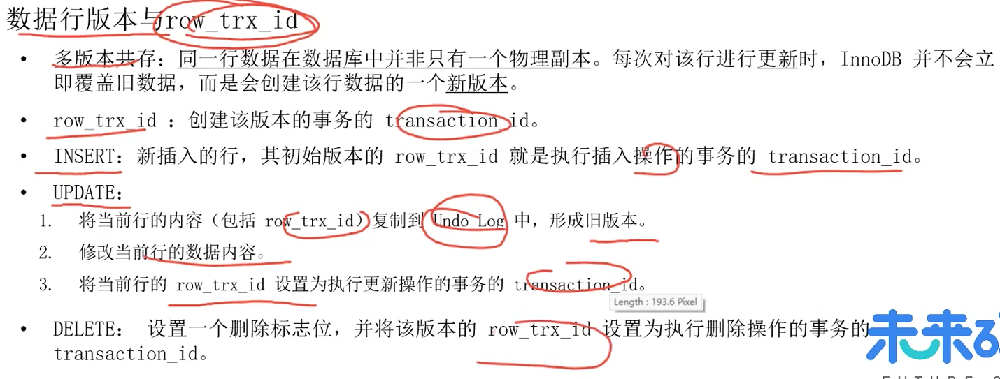

##### **版本链（Version Chain / Rollback Segment）**

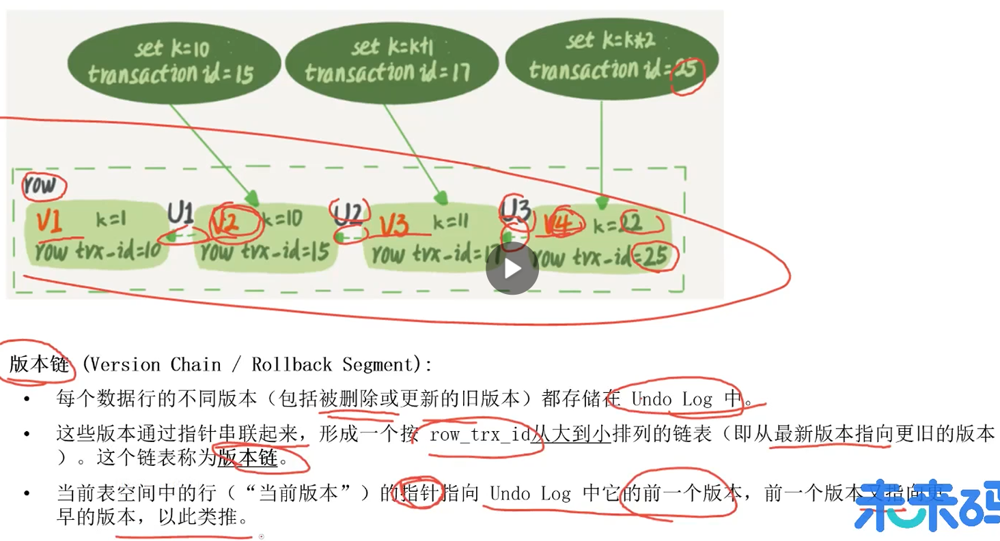

##### **一致性视图**

数组：正在“活跃”的事务ID、低水位、高水位、当前事务ID

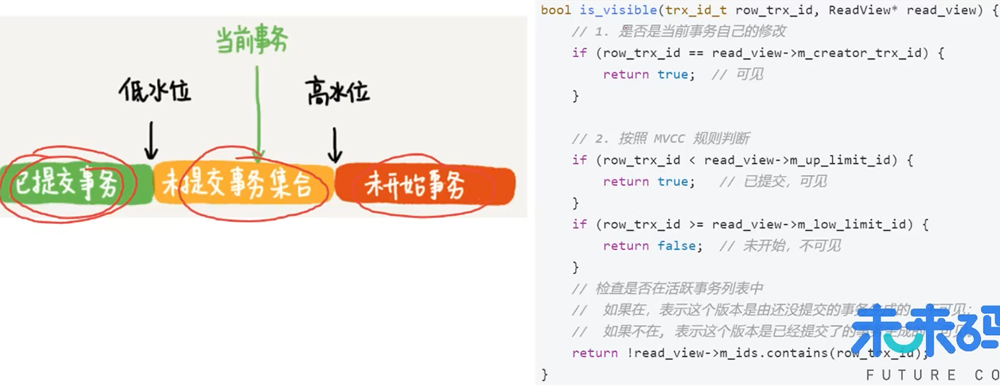

1.版本未提交，不可见；

2.版本已提交，但是是在视图创建之后提交的，不可见；

3.版本已提交，而且是在视图创建前提交的，可见。

##### **当前读**

更新数据都是先读后写的，并且只能读当前的值，保证更新数据不会覆盖其他事务已经提交的版本

```java
select k from t where id=1 lock in share mode;
select k from t where id=1 for update
```

##### 两阶段锁协议

事务c在事务b执行“当前读”之后提交，但是因为事务c持有锁，事务b当前读会被锁住，只有等c提交事务之后，b才会继续执行

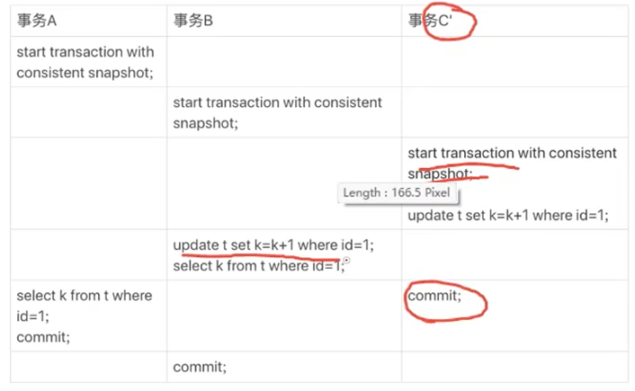

**事务可重复读的能力是怎么实现的？**

一致性读、当前读

**读已提交和可重复读区别**

在可重复读隔离级别下，只需要在事务开始的时候创建一个视图，之后事务里的其他查询都共用这个一致性视图；

在读已提交隔离级别下，每一个语句执行前都会重新算出一个视图。

## B+树和数据页

### B树

**定义**

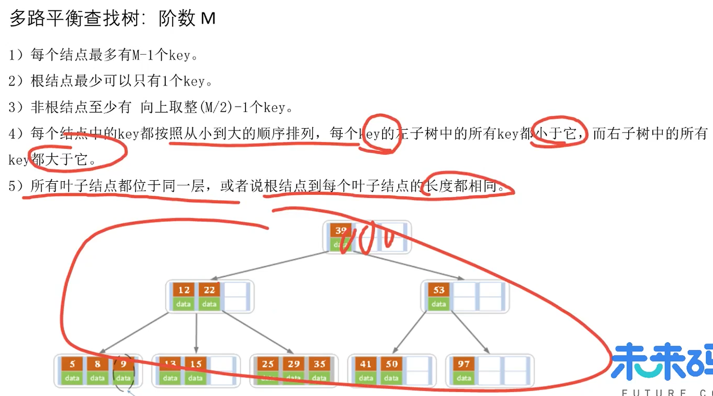

**插入**

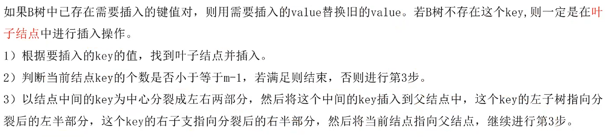

### B+树

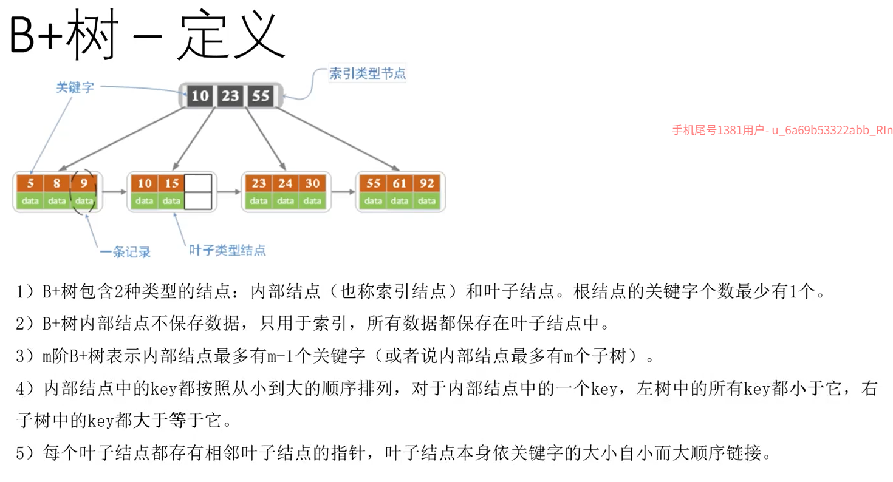

插入节点如果是索引节点超过最大数量，节点上移，分裂后的子节点不会包括上移的节点；如果是叶子节点上移后，分裂则会包括上移的节点。

删除节点，旁边的节点借之后满足至少有的节点数量就借，不够就合并。

### 数据页

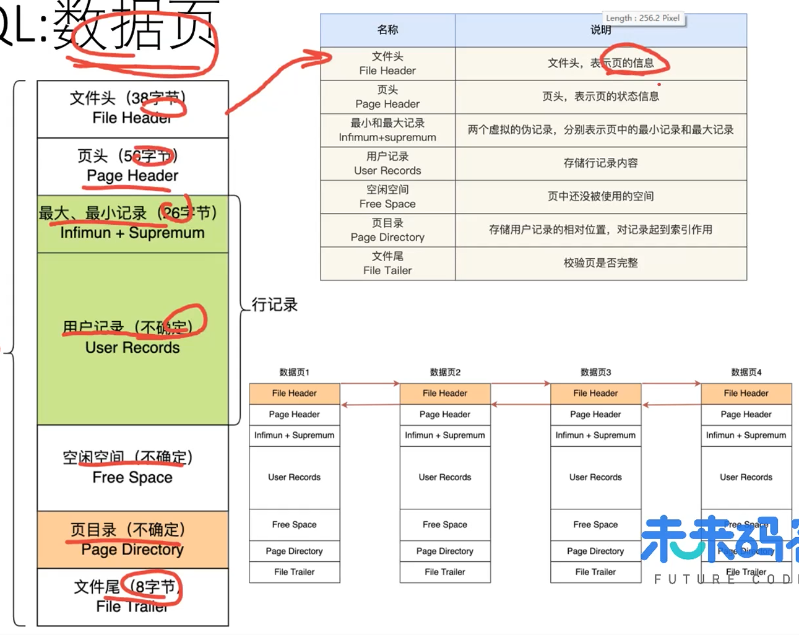

每一组的最后一个记录头信息里面会存当前组一共有多少条记录

- **有序单链表**：页内的所有用户记录（User Records），会**按照主键值从小到大**的顺序，通过记录头信息中的 `next_record` 属性串联成一个**单向链表**。这个链表的头尾就是 Infimum 和 Supremum 这两条虚拟记录。
- **页目录（Page Directory）实现二分查找**：
  1. **分组**：InnoDB会将这个链表中的记录分成若干个小组。
  2. **建“槽”**：每个组的**最后一条记录**的地址偏移量，会被抽取出来，按顺序存放在 Page Directory 中，形成一个**槽（Slot）数组**。
  3. **查找**：当需要根据主键查找一条记录时，会先在 Page Directory 的“槽”数组中进行**二分查找**，快速定位到记录所在的小组。然后，再在小组内部通过 `next_record` 指针进行**顺序遍历**，找到最终的目标记录。

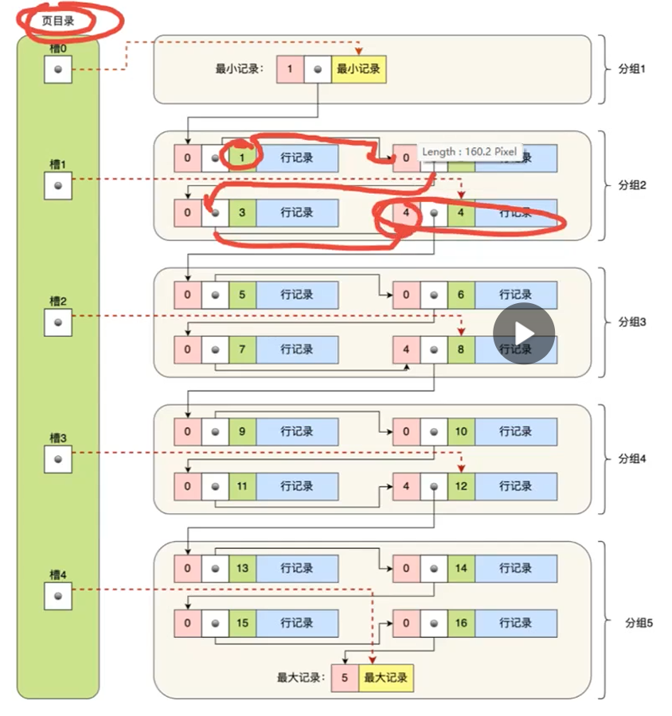


## buffer pool

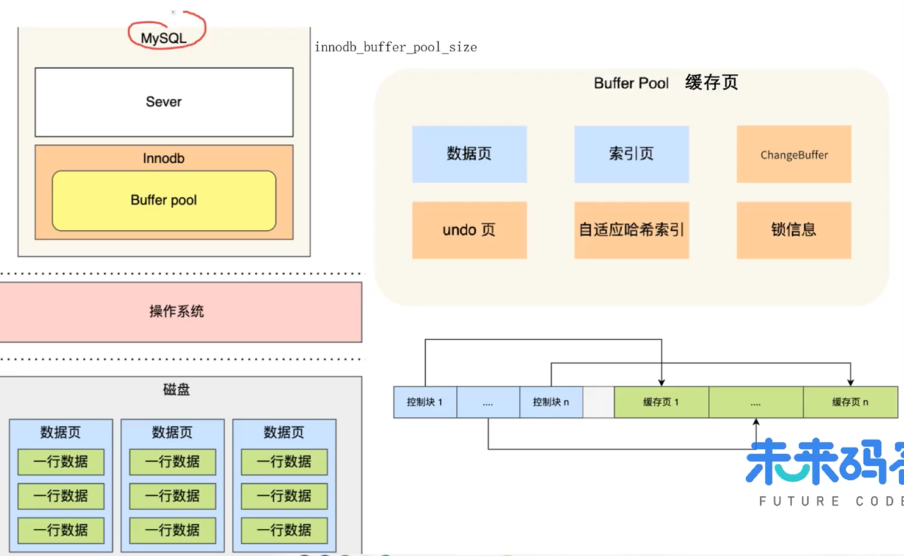

连续的内存空间

innodb_buffer_pool_size设置可用内存

### Undo页

和普通数据页在大小上一致，都是16kb，是存放undolog的直接容器

### ChangeBuffer

是bufferpool里开辟的一个特殊的内存数据结构

可以通过redolog保证数据不丢失

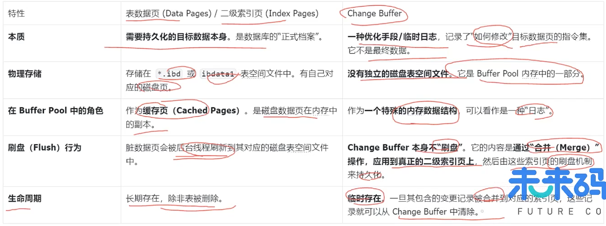

### 自适应Hash索引

自适应哈希索引是Innodb在buffer pool中自动创建和维护的一个内存中的哈希索引结构，不是由用户主动创建的。

可以缓存热点数据的访问路径，提供一个更加快捷的访问方式，仅支持等值查询

有时候AHI会频繁变化，占用资源，可以使用`innodb_adaptive__hash_index=OFF`关闭

### （闩）锁


buffer pool instance锁、页面锁（page latches）、链表锁、hash bucket锁

### BufferPool管理

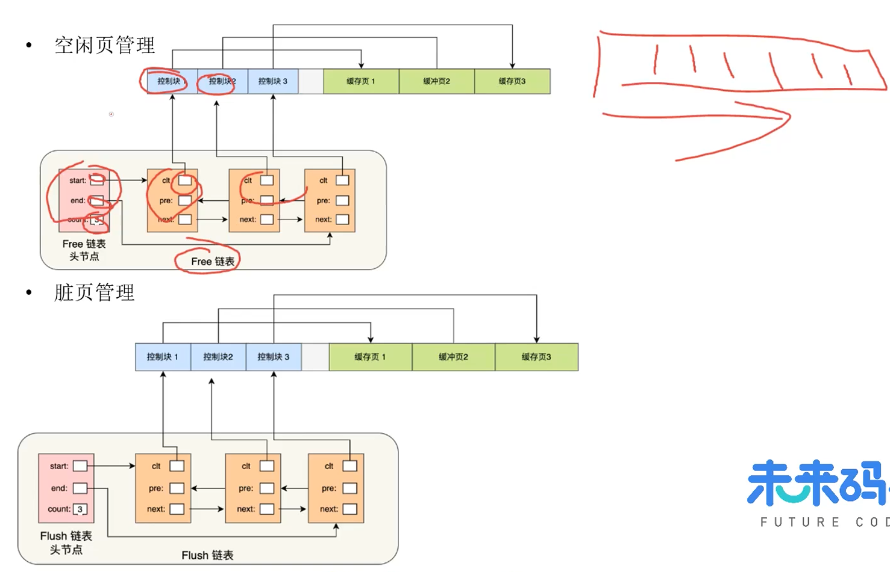


**LRU**（最近最少使用）

提高缓存命中率

当访问的页在buffer pool里，就直接把页对应的LRU链表节点移动到链表的头部。

当访问的页不在buffer pool里，把页放入到LRU链表的头部，并且淘汰LRU链表末尾的节点。

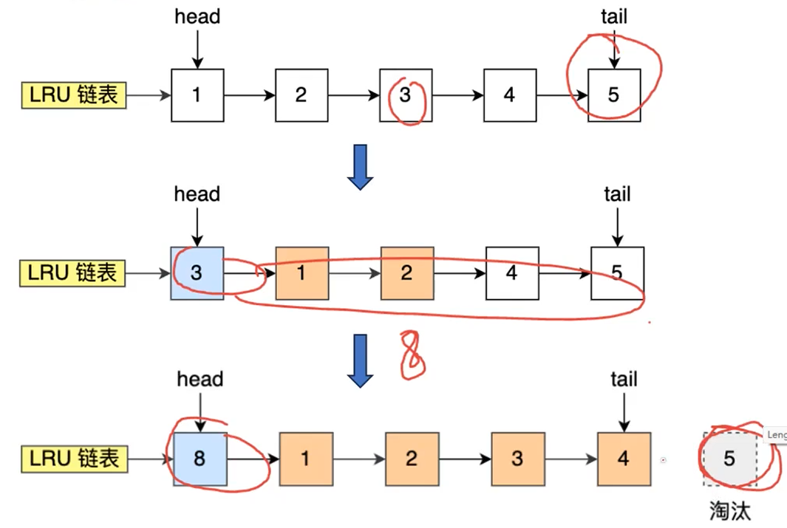

buffer pool的三种空间：clean page（被使用过的空间，但是数据和磁盘是一致的）、dirty page（被使用的空间，但是数据和磁盘不一致）、free page（没有被使用的空间）

预读机制：加载页时，会将“很可能”会被访问的数据页加载到内存缓冲池中，这个机制的核心目的是将多次零散的小规模磁盘读取，合并为少数几次大规模的连续读取，从而显著减少磁盘I/O次数，提升查询性能

**预读失效**：InnoDB将物理上相邻的数据页提前加载到Buffer Pool（缓冲池）后，这些数据页最终却完全没有被后续的查询访问到，白白浪费了宝贵的内存空间，并挤占了热点数据页的现象

将LRU链表分为两个区域，young区域和old区域

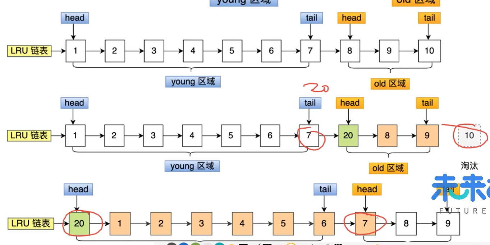

**buffer pool污染**：如果预读进来的**大量数据页**最终没有被任何查询使用，它们会占用宝贵的缓冲池内存，并“挤掉”那些真正热点的、频繁访问的数据页，导致缓冲池的命中率下降，反而损害整体性能

**脏页刷盘时机**

redolog（write ahead log）日志满、buffer pool空间不足、mysql空闲、mysql正常关闭

## 数据更新完整流程

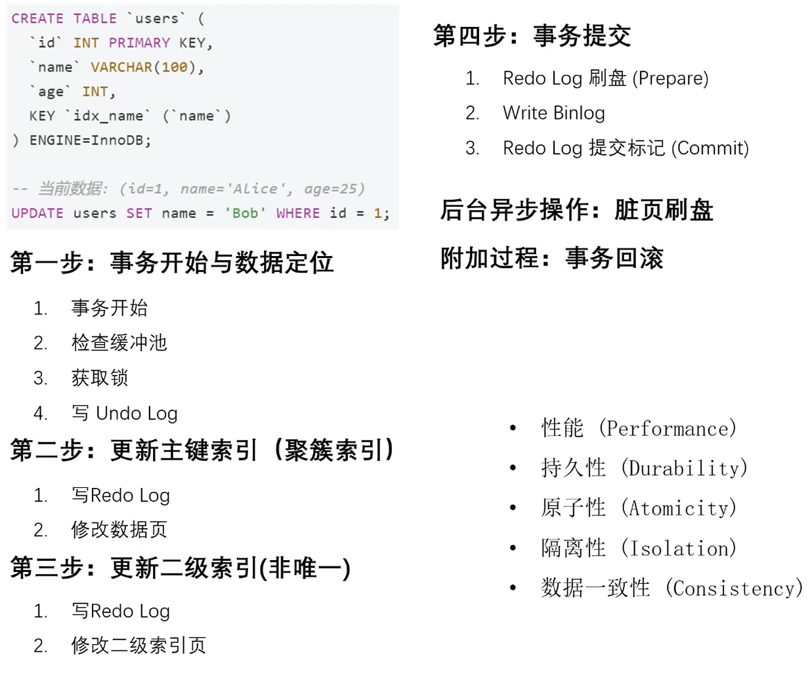