# 数据结构

## **数据类型以及数据结构**

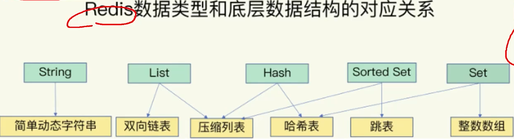

## **键和值之间用什么结构组织？**

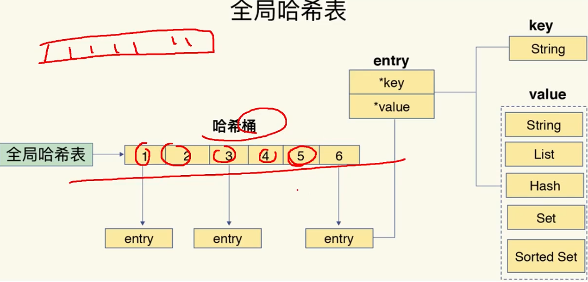

## **哈希表的哈希冲突**

### **链地址法**

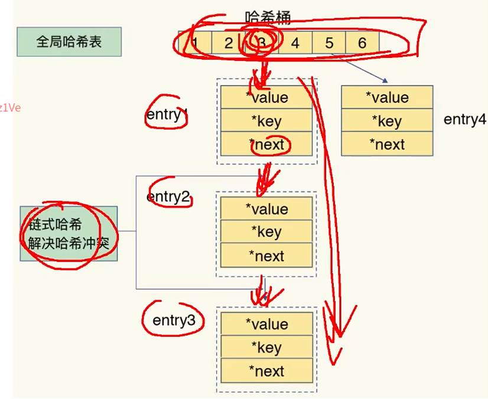

### **rehash**

增加现有的哈希桶数量，让主键增多的entry元素能在更多的桶之间分散保存，减少单个桶中的元素数量，从而减少单个桶中的冲突

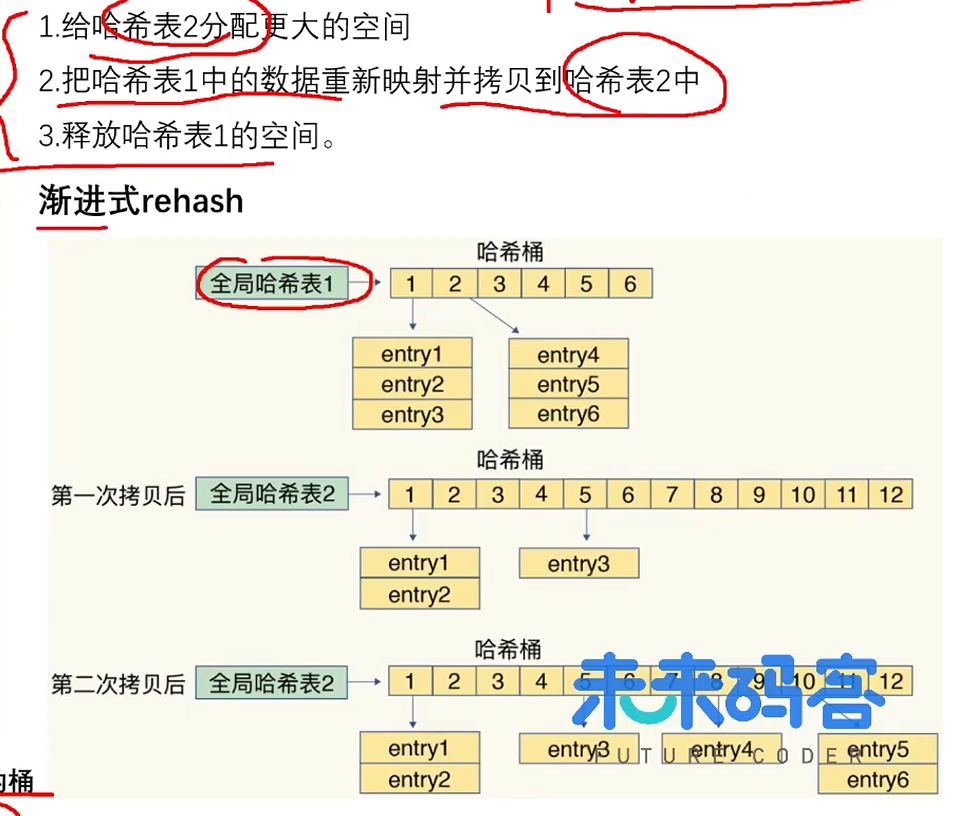

## 集合类型怎么组织数据？

操作效率：集合底层的数据结构；操作本身的执行特点

底层数据结构类型：整数数组、双向链表、哈希表、压缩列表和跳表

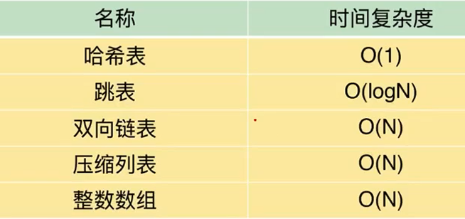


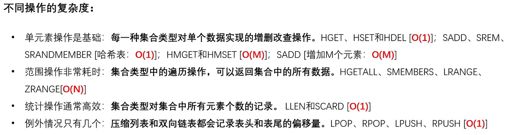

# IO模型

redis的网络io和键值对读写是由一个线程来完成的，这也是redis对外提供键值存储服务的主要流程。

## 基本IO

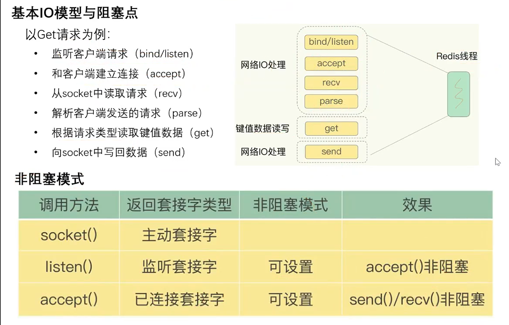

## IO多路复用

linux的多路复用机制（select/epoll机制）：一个线程处理多个io流

在redis只运行单线程的情况下，该机制允许内核中，同时存在多个监听套接字和已连接套接字

基于事件的回调机制：针对不同事件的发生，调用相应的处理函数

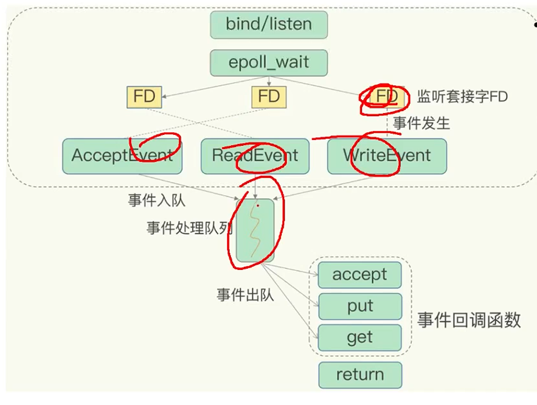

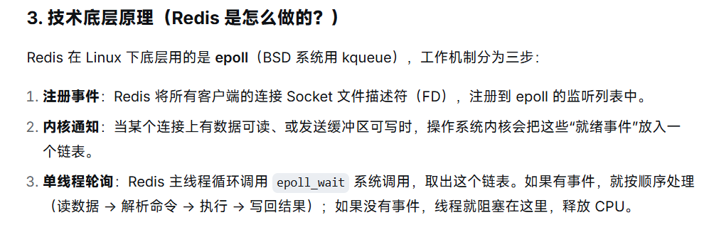


## AOF日志

Append Only File：先执行命令，把数据写入内存，然后才记录日志

优点：避免出现记录错误命令；不会阻塞当前的写操作

风险：数据丢失；给下一个操作带来阻塞

### **日志写回策略**

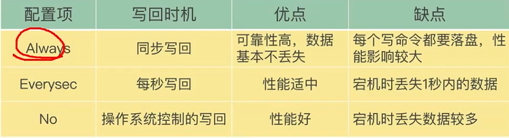

### **AOF重写机制**

**AOF文件过大：**文件系统本身对文件大小的限制；追加命令记录的效率会变低；故障恢复缓慢

**重写机制：**读取所有键值对，对每一个键值对用一条命令记录它的写入

重写不会阻塞主线程，使用后台子进程bgrewriteaof：一个拷贝（内存拷贝），两处日志（AOF日志和AOF重写日志）

## RDB快照

既能避免数据丢失，又能更快地恢复。

**内存快照**：把某一时刻的状态以文件的形式写到磁盘上，全量快照

**两个命令**：save（使用主线程），bgsave（创建一个子进程，专门用于写入RDB文件）

快照时数据修改：**写时复制技术**（Copy-On-Write，COW）

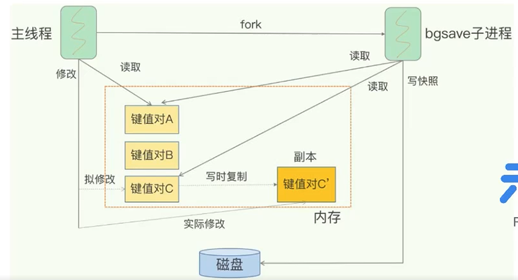

**快照频率过高**：磁盘压力；fork过程会阻塞主线程，主线程的内存越大，阻塞时间越长

**增量快照：**

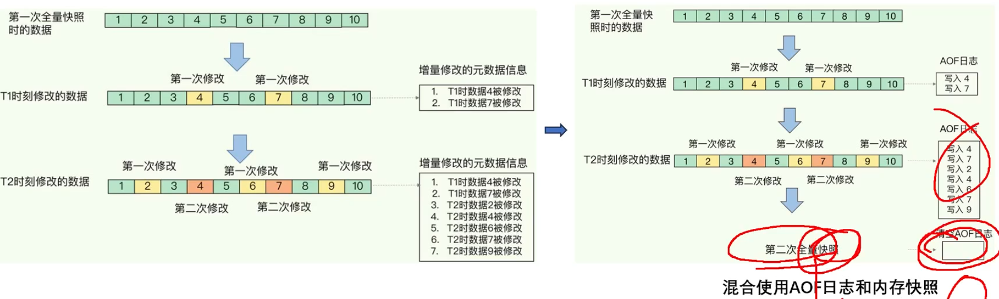

配置建议：

数据不能丢失时，混合使用内存快照和AOF；

如果允许分钟级别的数据丢失，可以只使用RDB；

如果只用AOF，优先使用everysec的配置选项

# 高可靠架构

## 数据同步

**高可靠性**

数据尽量少丢失：AOF+RDB

服务尽量少中断：增加副本冗余量

**主从库模式（读写分离）**

读操作：主库、从库都可以接收

写操作：首先到主库执行，然后主库将写操作同步给从库

主从库间第一次数据同步：replicaof/slaveof

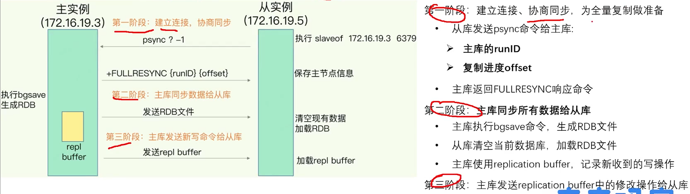

**主从级联模式**：“主-从-从”

**基于长连接的命令传播**：网络断连或阻塞风险

2.8版本以前全量复制，从2.8开始增量复制：repl_backlog_buffer

环形缓冲区，主库会记录自己写到的位置，从库则会记录自己已经读到的位置

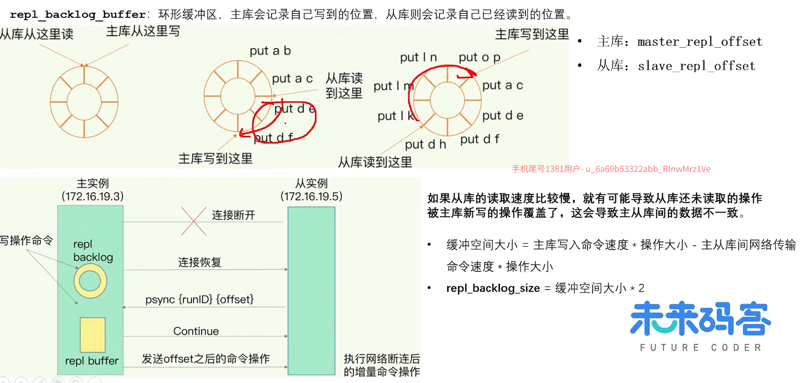

主库挂了怎么办？

## 哨兵机制

**监控**：周期性地给所有地主从库发送PING命令

**选主**（选择主库）：按照特定规则选择一个从库，把它作为新的主库

**通知**：把新主库的连接信息发给其他从库和客户端

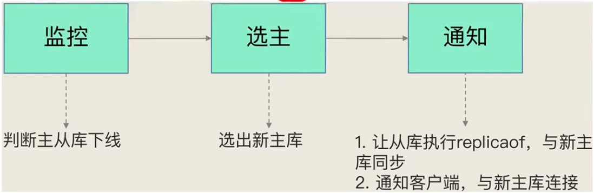

### 监控

“主观下线”：主库或从库对哨兵的PING命令响应超时；主库可能被“误判”

“客观下线”：大多数的哨兵实例，都判断主库已经“主观下线”；少数服从多数

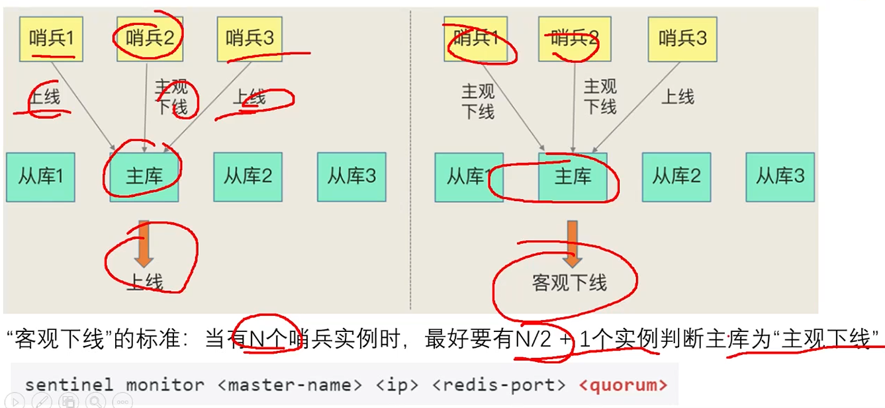

quorum表示至少需要多少个哨兵同意才能判断主库是下线状态

### 选主

**筛选 + 打分：**

按照特定的筛选条件，把不符合条件的从库去掉

按照特定的条件，给剩下的从库逐个打分，将得分最高的从库选为新主库

**筛选条件：**

检查从库当前在线状态；判断之前的网络连接状态（down-after-milliseconds * 10次排除掉）

**打分规则：**

从库优先级：slave-priority

从库复制进度：|master_repl_offset - slave_repl_offset|也就是原先主库写和从库读的进度最接近，值越小得分越高

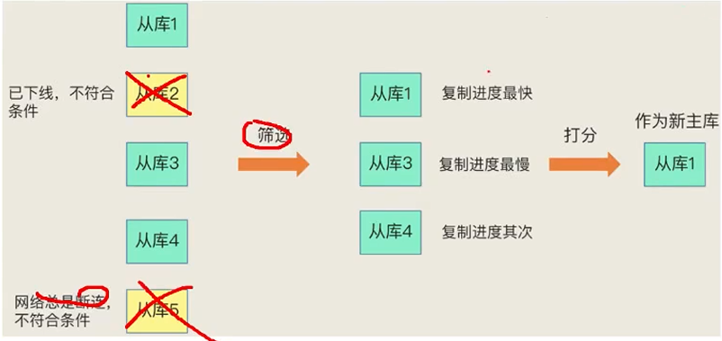

### 哨兵集群

**基于pub/sub机制的哨兵集群**

频道：消息的类别 “_sentinel_:hello”

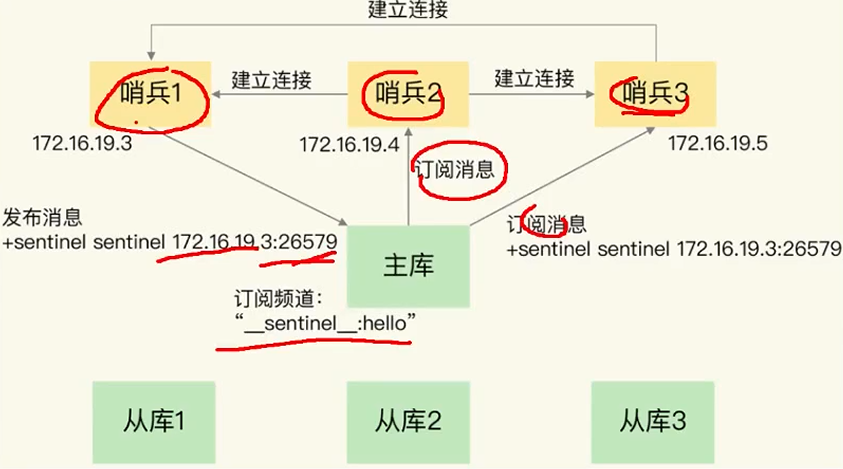

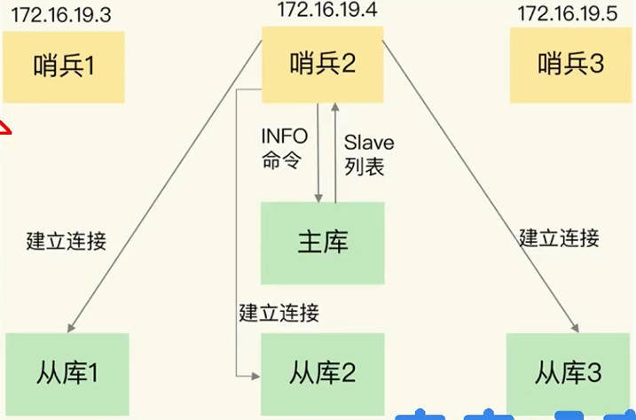

**基于pub/sub机制的客户端事件通知**

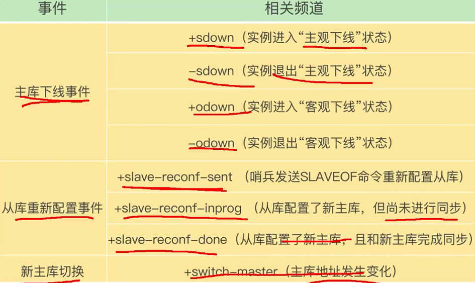

客户端读取哨兵的配置文件后，可以获得哨兵的地址和端口，和哨兵建立网络连接。

在客户端执行订阅命令，来获取不同的事件消息：
例如订阅“所有实例进入客观下线状态的事件” SUBSCRIBE + down,

订阅所有事件PSUBSCRIBE *

```
switch-master <master name> <master name> <oldip> <oldport> <newip> <newport>
```

### 投票仲裁

执行主从切换：”投票仲裁“

”客观下线“的判断过程：

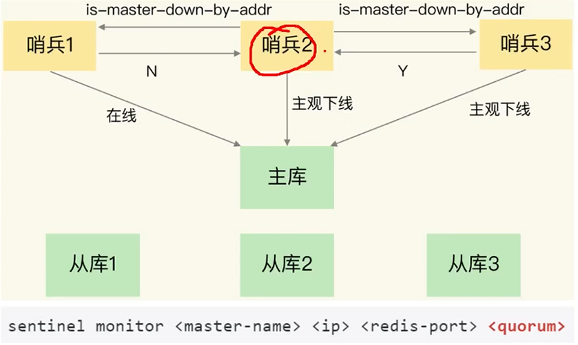

哨兵2进行“**Leader选举**”：拿到半数以上的赞成票；拿到的票数大于等于哨兵配置文件中的quorum值

给自己Y票，给别人N票；先收到谁的给谁投Y票；一个哨兵只有一张Y票

## 切片集群

切片集群：一种保存大量数据的通用机制

数据量越大，RDB的文件体量就越大，fork操作阻塞主线程的时间就越长

切片/分片集群：启动多个Redis实例组成一个集群，按照一定的规则，把收到的数据划分成多份，每一份用一个实例来保存

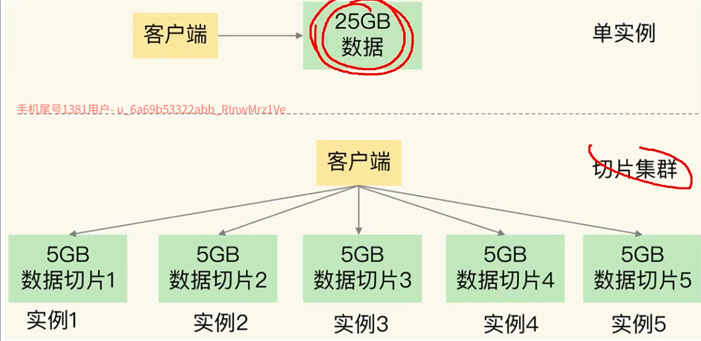

纵向扩展：简单、直接

主线程fork子进程时可能会阻塞

受到硬件和成本的限制


横向扩展：扩展性更好

数据切片后，在多个实例之间如何分布？

客户端怎么确定想要访问的数据在哪个实例上？

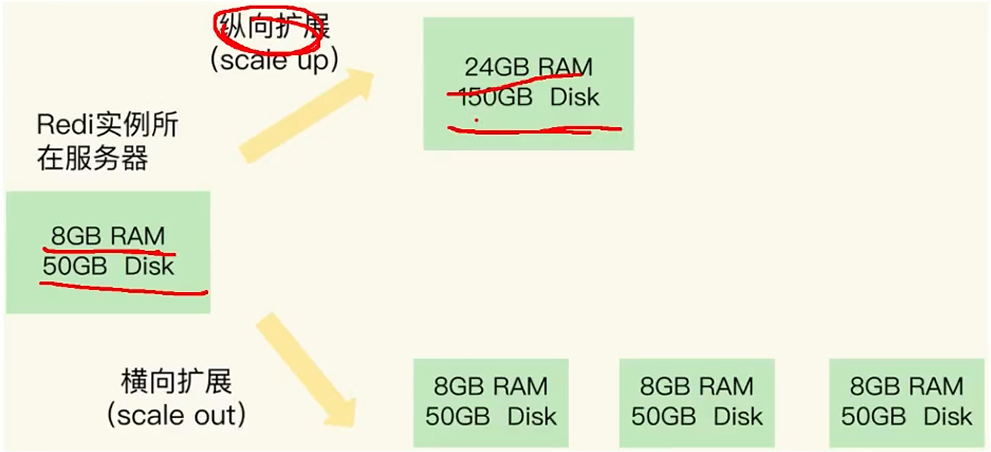

**Redis Cluster**

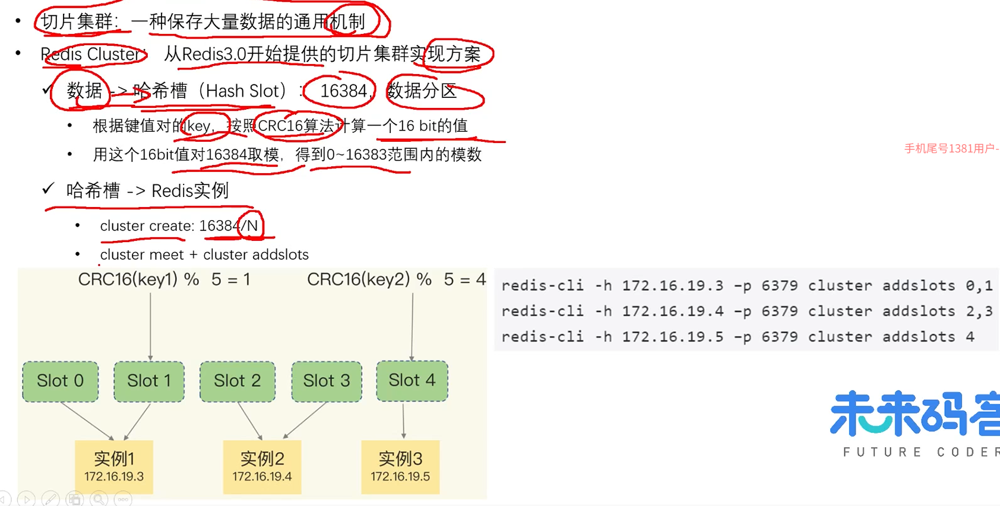

MOVED和ASK的区别是，ASK请求之后不会更新客户端本地的缓存，还是会向旧缓存中的实例发请求

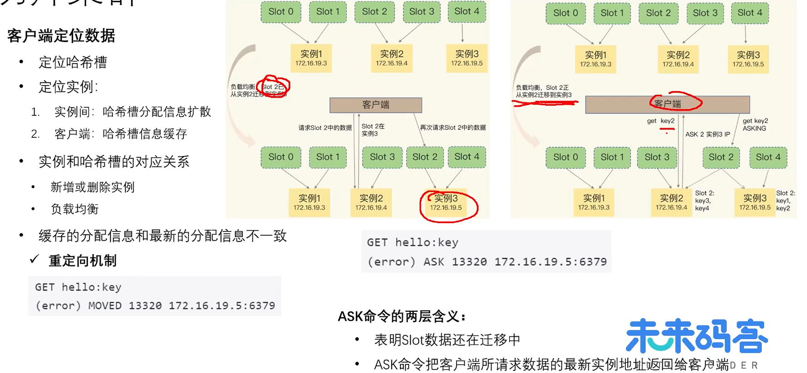

# 旁路缓存

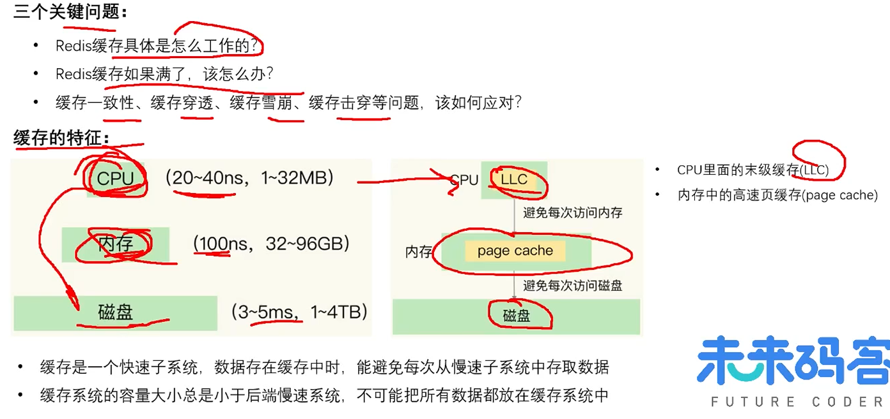

应用读取数据时，需要先读取Redis；

发生缓存缺失时，需要从数据库读取数据；

发生缓存缺失时，还需要更新缓存。


当应用程序需要读取数据时，需要显式调用Redis的GET操作接口

如果缓存缺失，应用程序需要再和数据库连接，从数据库中读取数据

当缓存中的数据需要更新时，需要显式调用SET操作接口，把更新的数据写入缓存

## 缓存类型

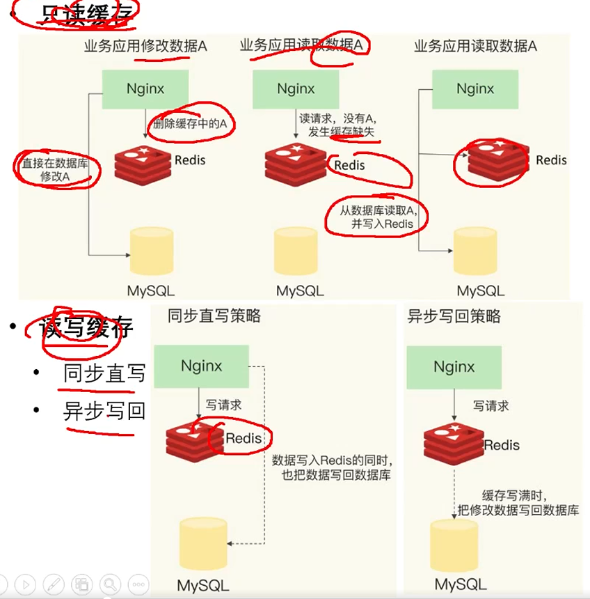

如果需要对写请求进行加速，选择读写缓存；

如果写请求很少，或只需要提升读请求的响应速度，选择只读缓存。

## 替换策略

缓存容量设置的依据和方法：

二八原理，但要结合应用数据实际访问特征和成本开销

CONFIG SET maxmemory 4gb

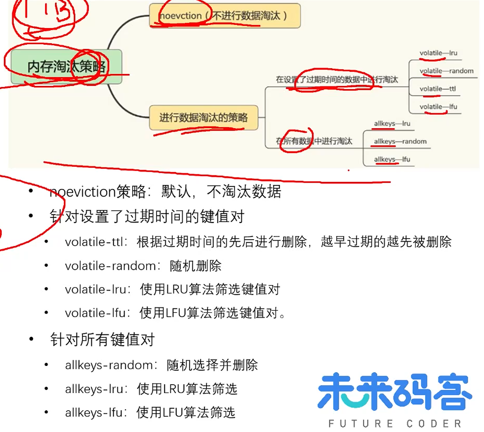


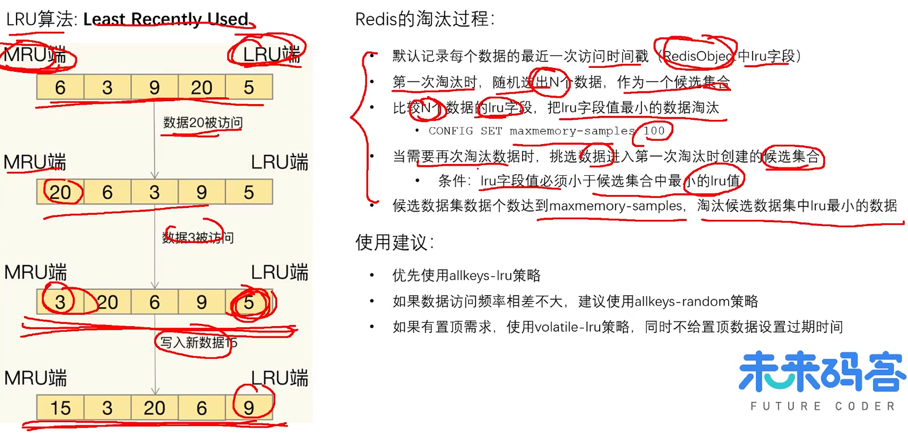

处理淘汰数据：干净数据删除、脏数据写回数据库

## 缓存异常

### 数据的一致性

缓存中有数据：缓存的数据值需要和数据库中的值相同

缓存中没有数据：数据库中的值必须是最新值

**读写缓存**

同步直写策略：同步更新缓存和数据库，事务机制；

异步写回策略：数据不一致风险

**只读缓存**

数据新增，会直接写入数据库

数据删改时，就需要把只读缓存中的数据标记为无效

### 只读缓存下的数据不一致问题

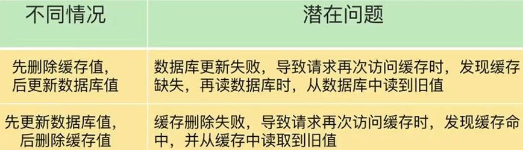

**重试机制**

把要删除的缓存值或者是要更新的数据库值暂存到消息队列

删除或更新失败：从消息队列重新读取值，再次进行删除或更新

删除或更新成功：从消息队列中取出对应值，以免重复操作

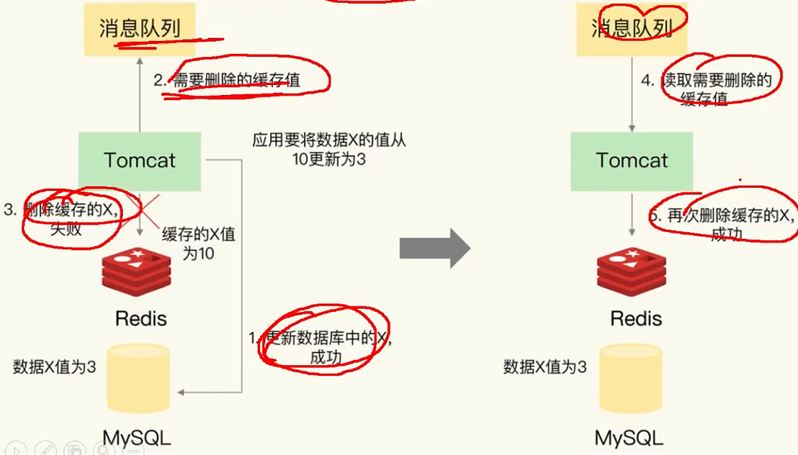

### 数据不一致问题（高并发）

**先删除缓存，再更新数据库**

场景：线程A删除缓存值后，还没来得及更新数据库，线程B就开始读取数据

线程B读取到了旧值；线程B把旧值写入缓存

**解决方案**：在线程A更新数据库值后，让它先sleep一小段时间，再进行一次缓存删除操作（延迟双删）

**先更新数据库值，再删除缓存值**

场景：线程A删除数据库值后，还没来得及删除缓存，线程B就开始读取数据

线程B读到了缓存中的旧值

**总结**

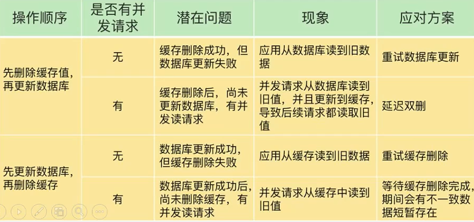

### 缓存雪崩、缓存击穿、缓存穿透

#### 缓存雪崩

大量的应用请求无法在Redis缓存中进行处理，应用将大量请求发送到数据库层，导致数据库层的压力激增

1.缓存中有大量数据同时过期，导致大量请求无法得到处理

解决方案：

​	避免给大量的数据设置相同的过期时间

​	服务降级：

​		非核心数据：暂停从缓存中查询，直接返回预定义信息、空值或是错误信息

​		核心数据：允许查询缓存，如果缓存缺失，通过数据库读取

2.Redis缓存实例发生故障宕机

解决方案：

​	在业务系统中实现服务熔断或请求限流机制

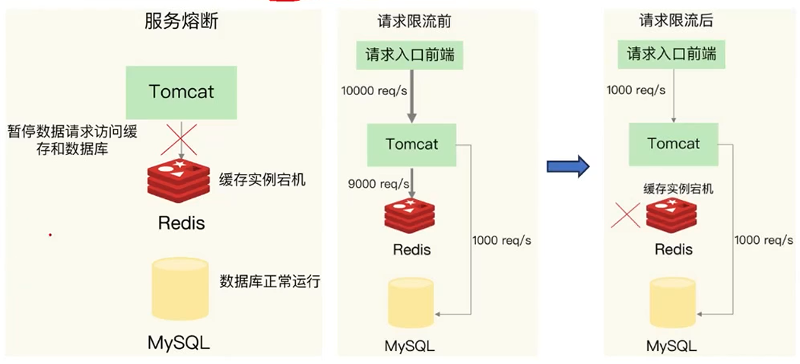

​	事前预防：通过主从节点构建Redis缓存高可靠集群

#### 缓存击穿

针对热点数据的请求，无法在缓存中处理（热点数据失效），访问该数据的大量请求，一下子都发送到了后端数据库，导致数据库压力激增

解决方案：对于访问特别频繁的热点数据，不设置过期时间

#### 缓存穿透

要访问的数据不在Redis缓存和数据库中，导致在访问缓存时发生缓存缺失，再访问数据库时，发现数据库也没有要访问的数据

比如业务层误操作、恶意攻击

解决方案：

​	缓存空值或缺省值

​	使用布隆过滤器，在查缓存前快速地判断数据存不存在

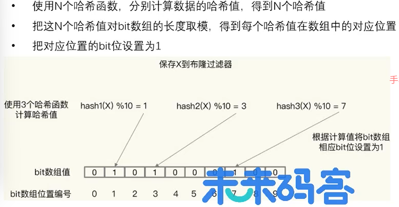

​	在请求入口的前端进行请求检测，比如请求参数的合法性

#### 总结

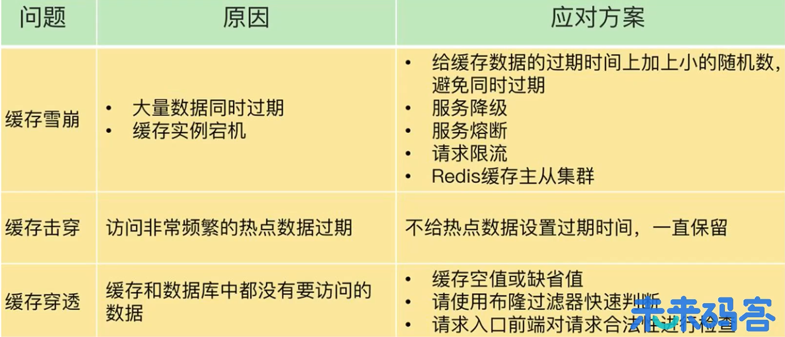

### 缓存污染

访问频次很低的数据在服务完访问请求后，还继续留存在缓存中，白白占用缓存空间

解决方案：选择合适的缓存淘汰策略

LFU算法：如果一个数据在过去被访问的次数越多，那么它在未来被再次访问的可能性就越高

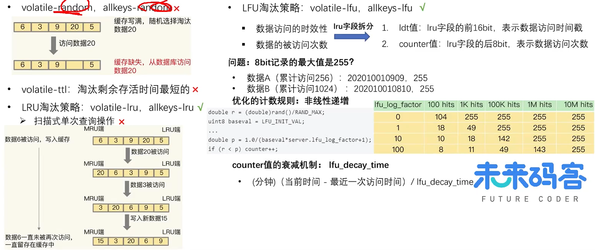


