# 消息通信机制及实现框架

但凡在业务需求中出现如“当...发生...时、一旦出现...”等描述时，就应该考虑是否需要在这些场景中引入事件。

事件和事件驱动架构

所谓事件，就是将系统中所发生的业务状态变更抽取出来形成一系列独立的对象。而关于如何在系统中生成、发布以及消费事件，业界也存在一个非常重要的设计模式，即事件驱动架构（Event-Driven Architecture, EDA）模式。

四大核心优势：分布式解耦、系统扩展、流量削峰、数据最终一致性

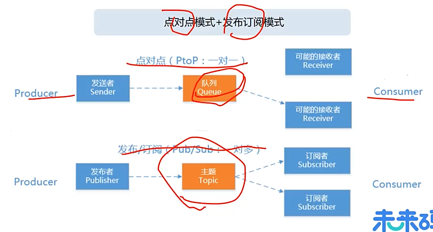

消息发布：普通消息、顺序消息、延迟消息、事务消息、单向消息、批量消息

消息消费：拉（pull）模式消费、推（push）模式消费、消息过滤（Filter）

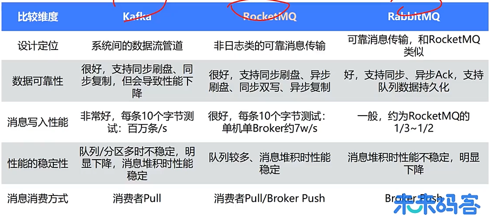

延迟消息、事务消息、消息过滤、消息查询等功能只有RocketMQ支持。

# RocketMQ基本概念和架构

消息是RocketMQ生产和消费数据的最小单位，每条消息必须属于一个主题。

```java
public class Message implements Serializable {
	private String topic;
	private int flag;
	private Map<String, String> properties; // 包含Keys、Tags、UserProperty、DelayTimeLevel等
	private byte[] body;
	private String transactionId;
}
```

主题（Topic）表示一类消息的集合，每个主题包含若干条消息，每条消息只能属于一个主题，是RocketMQ进行消息订阅的基本单位；一个生产者可以同时发送多种Topic的消息；而一个消费者只对某种特定的Topic感兴趣，即只可以订阅和消费一种Topic的消息。

队列（Queue）是存储消息的物理实体，一个Topic中可以包含多个queue，每个queue中存放的就是该Topic的消息，也被称为一个Topic中消息的分区（Partition），一个Topic的queue中的消息只能被一个消费者组中的一个消费者消费，一个queue中的消息不允许同一个消费者组中的多个消费者同时消费。

标签（Tag）是为消息设置的标签，用于同一主题下区分不同类型的消息，来自同一业务单元的消息，可以根据不同业务目的在同一主题下设置不同标签。标签能够有效地保持代码的清晰度和连贯性，并优化RocketMQ提供的查询系统。消费者可以根据Tag实现对不同子主题的不同消费逻辑，实现更好的扩展性。Topic是消息的一级分类，Tag是消息的二级分类。

生产者组（Producer Group）：消息生产者都是以生产者组的形式出现的，生产者组是同一类生产者的集合，这类Producer发送相同Topic类型的消息，一个生产者组可以同时发送多个主题的消息，发送过程中支持快速失败并且低延迟。

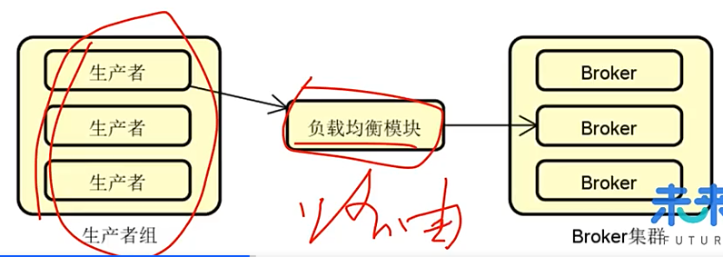

消费者组（Consumer Group）:一个消息消费者会从Broker服务器中获取到消息，并对消息进行相关业务处理，RocketMQ中的消息消费者都是以消费者组的形式出现，消费者组是同一类消费者的集合，这类Consumer消费的是同一个Topic类型的消息。

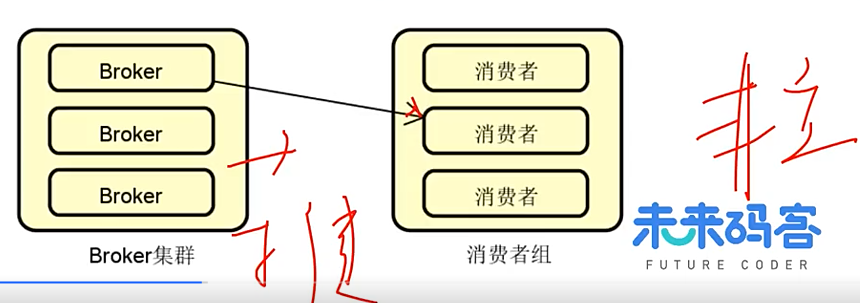

Broker充当着**消息中转角色**，负责存储消息、转发消息，Broker在RokectMQ系统中负责接收并存储从生产者发送来的消息，同时为消费者的拉取请求作准备，Broker同时存储着消息相关的各种元数据。

Name Server：类比注册中心的概念，Broker管理，管理Broker实例的注册，提供心跳检测机制检查Broker是否存活；路由信息管理，保存Broker集群的整个路由信息和用于客户端查询的队列信息。Producer和Consumer通过NameServer可以获取整个Broker集群的路由信息，从而进行消息的投递和消费。

**执行流程**

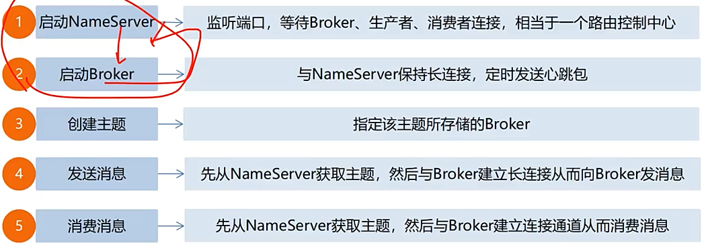

## 零拷贝技术

减少CPU参与的数据拷贝次数和上下文切换次数，核心是让数据在内核空间完成搬运，避免用户态和内核态之间反复拷贝。

**传统IO**

1. 用户调用 `read`，DMA 把磁盘数据拷到内核页缓存；
2. CPU 把内核页缓存拷贝到用户缓冲区；
3. 用户调用 `write`，CPU 把用户缓冲区拷贝到 Socket 发送缓冲区；
4. DMA 把 Socket 缓冲区数据拷到网卡。

4 次上下文切换：read 进入/返回，write 进入/返回；4 次拷贝：2 次 DMA + 2 次 CPU 拷贝。

**零拷贝**

sendfile：优点大块文件传输效率高；缺点小块文件效率较低、BIO而不是NIO

mmap+write：优点使用小块文件传输时效率高；缺点：比sendfile多消耗CPU、内存安全控制复杂

**RocketMQ中的应用**

**存储层：**

- 所有消息顺序写入 **CommitLog**，每个文件默认 1GB；
- CommitLog、ConsumeQueue 都通过 `MappedByteBuffer` 映射到虚拟内存；
- Broker 写入消息时，直接写映射内存，即写 PageCache，由 OS 异步刷盘；
- 消费者拉取消息时，Broker 从映射内存读取，避免传统 `read` 的内核→用户拷贝。

Rocket的写入和读取都不经过用户缓冲区，减少了一次CPU拷贝。

**网络层：**

- 从 CommitLog 映射内存中定位消息；
- 通过 Netty 发送；
- 部分场景使用 `FileRegion` / `transferTo`，底层可能走 `sendfile`，进一步减少拷贝。

Kafka 消费时大量使用 `sendfile`，所以在大吞吐日志场景更有优势；RocketMQ 用 mmap 兼顾写入和读取，更适合业务消息。

## 持久化架构

CommitLog：存储消息的元数据、消息顺序写入

ConsumerQueue：存储消息在CommitLog的索引

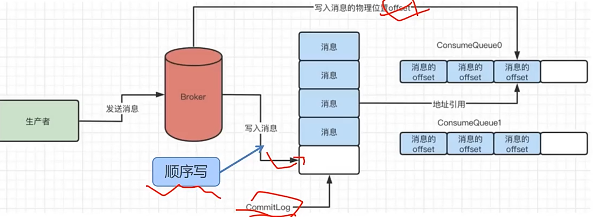

## **高可用架构**

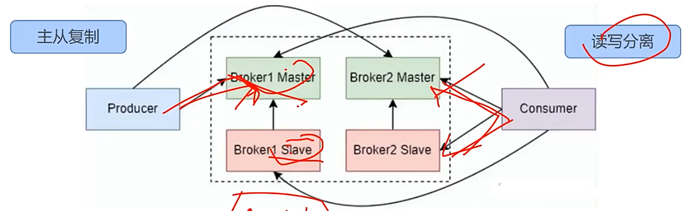

如果Master节点发生故障，RocketMQ会使用基于Raft协议的DLedger算法来进行主从切换

# RocketMQ消息发送方式

消息发布：普通消息、顺序消息、延迟消息、事务消息、单向消息、批量消息

**单向消息**主要用在不特别关心发送结果的场景，例如日志发送，sendOneway

同步、可靠地发送方式使用地比较广泛，比如：重要的消息通知，SendResult需要等待返回值

**异步消息**基于回调（Callback）机制实现对发送结果的异步通知，send参数里面SendCallback回调信息

| 发送方式 | 发送性能 | 发送反馈性 | 发送可靠性 |
| -------- | -------- | ---------- | ---------- |
| 单向发布 | 最快     | 无         | 可能丢失   |
| 同步发布 | 快       | 有         | 不会丢失   |
| 异步发布 | 快       | 有         | 不会丢失   |

**批量**发送消息同样支持同步和异步两种发送方式

全局有序：全局顺序时使用一个队列

分区有序：局部顺序时多个队列并行消费

RocketMQ使用局部顺序一致性机制，实现单个队列中消息的顺序性

**Spring家族的消息通信解决方案**

Spring Cloud Stream(扩展层)  Spring Integration（应用层） Spring Messaging（内核层）

# RocketMQ消息消费方式

PUSH：实时性高，但会增加服务端负载；对消费端能力有要求，如果PUSH的速度过快，消费端可能会出现限流问题。

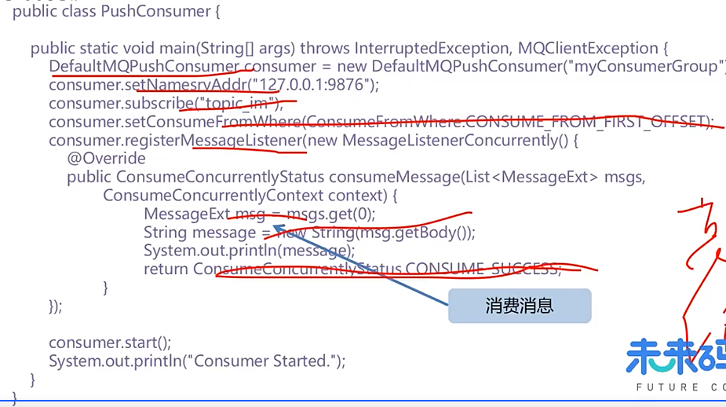

PULL：消费者从服务端拉消息，主动权在消费端，可控性好；PULL的时机很重要，间隔果断则空请求会多浪费资源，间隔太长则消息不能及时处理。

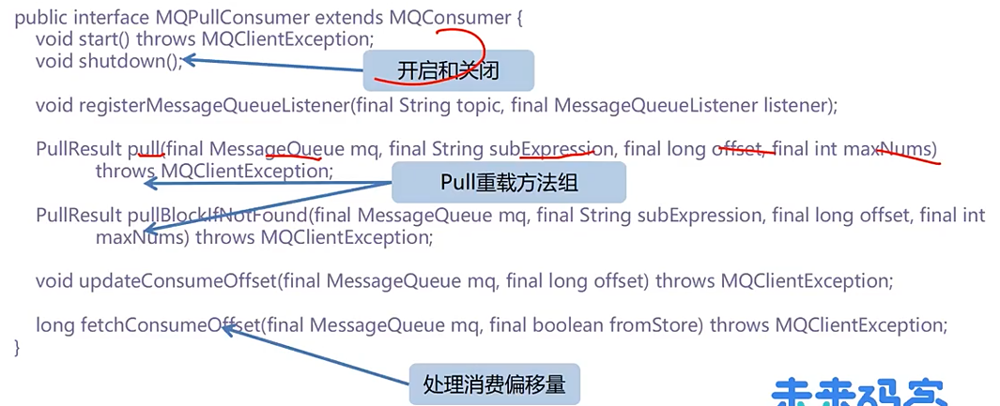

**Spring集成方式**

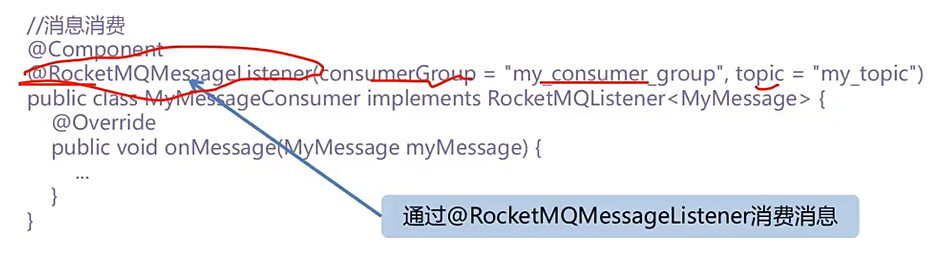

# 思维导图 1

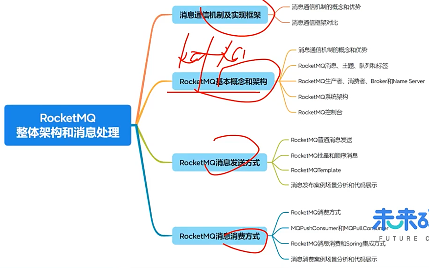


# RocketMQ消息可靠性

 **消息什么时候会丢失？**

任何一个环节都可能会丢：**生产者发送消息到Broker时、Broker内部存储消息到磁盘以及主从复制同步时、Broker把消息推送给消费者或者消费者主动拉取消息时**。

**同步发送**，发送完消息后同步检查Broker返回的状态来判断消息是否持久化成功；如果同步模式发送失败，则轮转到下一个Broker进行重试，注意幂等性。

**异步发送**，消息发送结果会回传给相应的回调函数，可以根据发送的结果来判断是否需要重试；如果异步模式发送失败，则只会在当前Broker进行重试，注意幂等性。

## **重试机制**

如果发送消息成功，则最多再重试两次，如果生产者本身向Broker发送消息产生超时异常，就不会再重试，对于这种情况，业务系统可以增加定制化的重试逻辑，如把消息存储下来定时发送到Broker。

## **刷盘操作**

**同步刷盘**，消息写入内存后立刻通知刷盘线程刷盘，然后等待刷盘完成，刷盘线程执行完成后唤醒等待的线程，返回消息写成功的状态。优势：数据绝对安全，劣势：吞吐量不大。

**异步刷盘（默认）**，消息写入到内存就立刻给客户端返回写操作成功，当内存中的消息积累到一定的量或定时触发一次写磁盘操作。优势：吞吐量大，性能高，劣势：数据可能丢失。

## **复制操作**

**同步复制（推荐）**，Master和Slave均写成功才反馈给客户端写成功状态；如果Master出故障，Slave上有全部的备份数据可供恢复，但是同步复制会增大数据写入延迟，降低系统吞吐量。

**异步复制**，只要Master写成功即反馈给客户端写成功状态；系统拥有较低的延迟和较高的吞吐量，但如果Master出故障，有些数据因为没有被写入Slave有可能会丢。

## 消息消费延迟重试策略

返回CONSUME_LATER状态时会按照不同的延迟消息messageDelayLevel进行再次消费，如果消费满**16次**之后还是未能消费成功则不再重试，会将消息发送到**死信队列**，**通过RocketMQ提供的相关接口从死信队列获取到相应的消息**。

## 总结

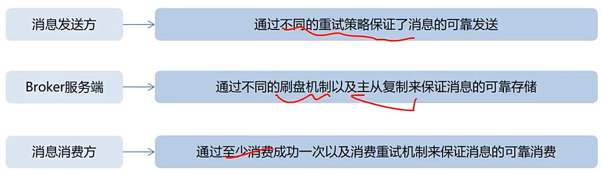

# RocketMQ事务消息

**如何在创建订单时，成功创建一条支付记录？**

可靠事件模式：当我们尝试将订单和支付两个微服务的数据进行分别管理的时候，需要找到一种媒介用于在这两个服务之间进行数据传递，这种数据传递方式就是事件，消息中间件适合扮演事件处理的角色。

首先：一方面订单服务需要对所产生的订单数据进行持久化操作，另一方面也需要同时发送一条创建订单的消息到消息中间件。

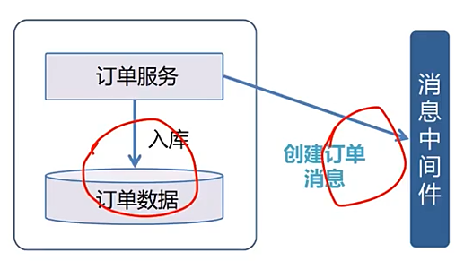

其次：一方面支付服务对消息进行业务处理并持久化，另一方面也需要向消息中间件发送一条支付成功消息

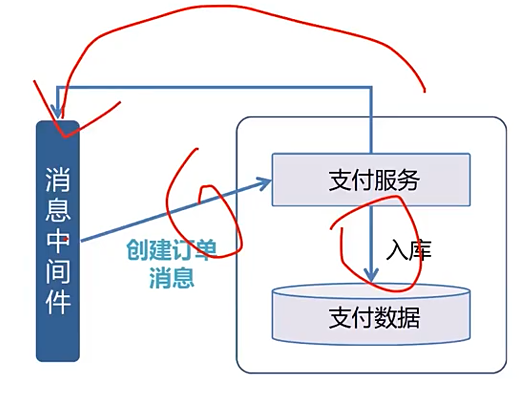

最后：订单服务根据支付的结果处理后续业务流程

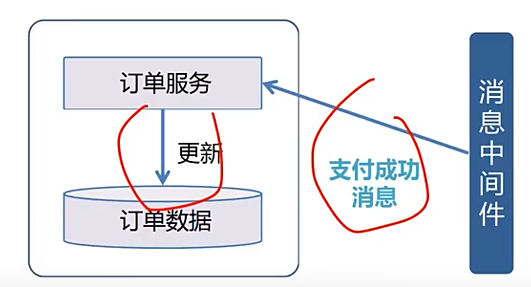

但是如果出现网络及其他问题，可能会影响本地事务和消息发送的一致性，所以需要用到事务消息

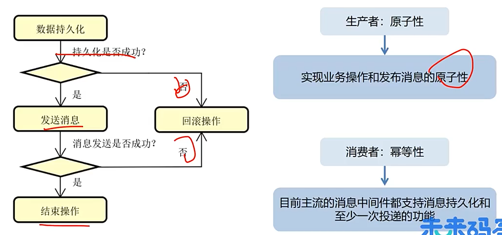


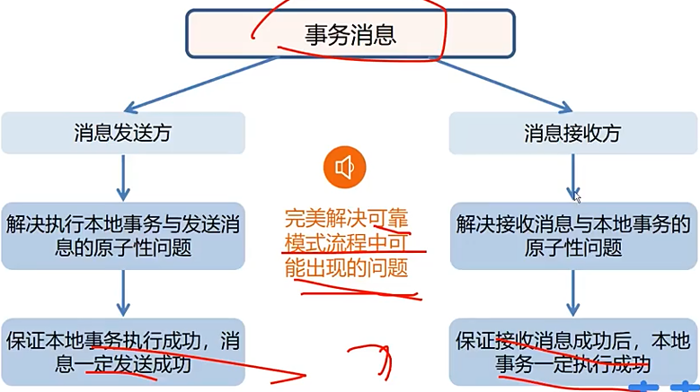


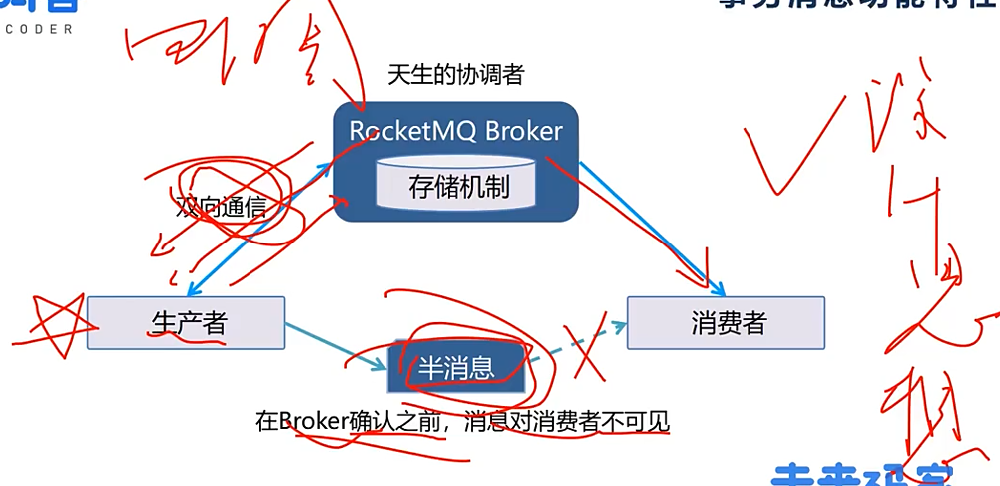


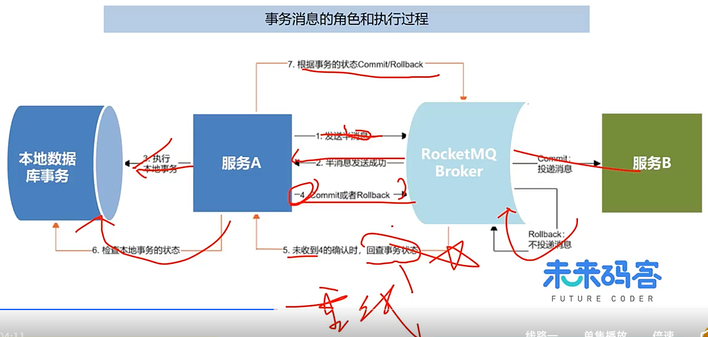

事务回查记录表：1.实现事务回查 2.业务层幂等控制

```sql
CREATE TABLE `tx_record` (
	`tx_no` varchar(64) NOT NULL COMMENT '事务ID',
	`create_time` datetime NOT NULL DEFAULT CURRENT_TIMESTAMP COMMENT '创建时间',
	PRIMARY KEY (`tx_no`)
) ENGINE=InnoDB DEFAULT CHARSET=utf8 COMMENT='事务记录表'
```


# RocketMQ延迟消息

使用场景例如：

订单超时未支付：支付超时时延时消息被消费，自动执行取消订单等逻辑

各类活动场景：活动结束时延时消息被消费，灵活实现活动结束触发的逻辑处理

信息提醒类场景：异步发送各种定制化时间的消息通知

**定义**

当消息写入到Broker后，不能立刻被消费者消费，需要等待指定的时长后才可被消费处理的消息。

**实现过程**

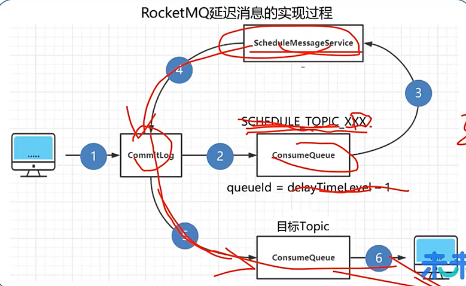


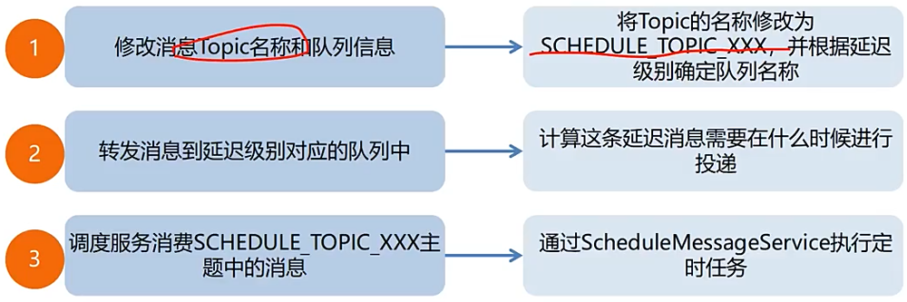


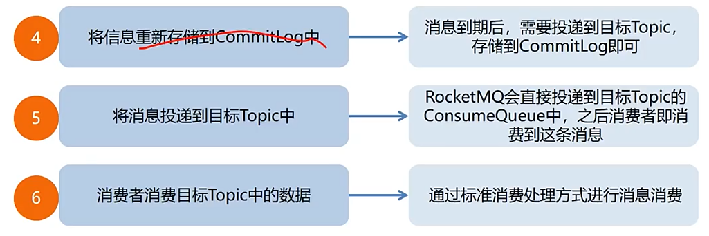


# RocketMQ消息过滤

只需要消费指定类型的消息，其他消息都是无效消息

**表达式过滤：Tag过滤**

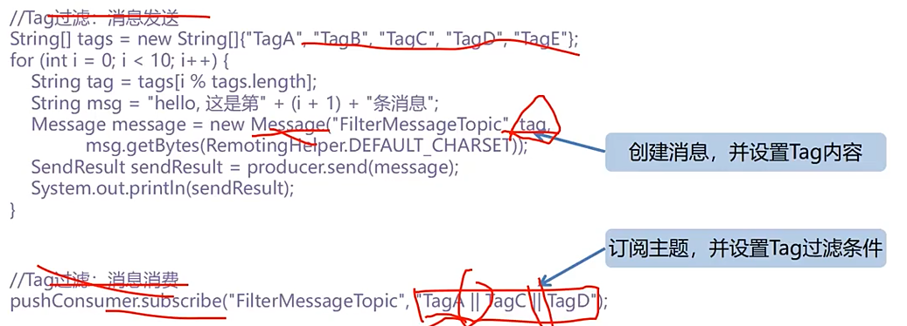

```java
// Spring下的语法
String tagOther = "OTHER";
event.setType(tagOther);
String destination = String.format("%s:%s", TOPIC_ACCOUNT, tagOther);
this.rocketMQTemplate.convertAndSend(destination, event);
// 消费者接收，添加selectorExpression = "tagName"
```


**SQL过滤**，只有使用Push推送模式的消费者才能用使用SQL92标准的SQL语句

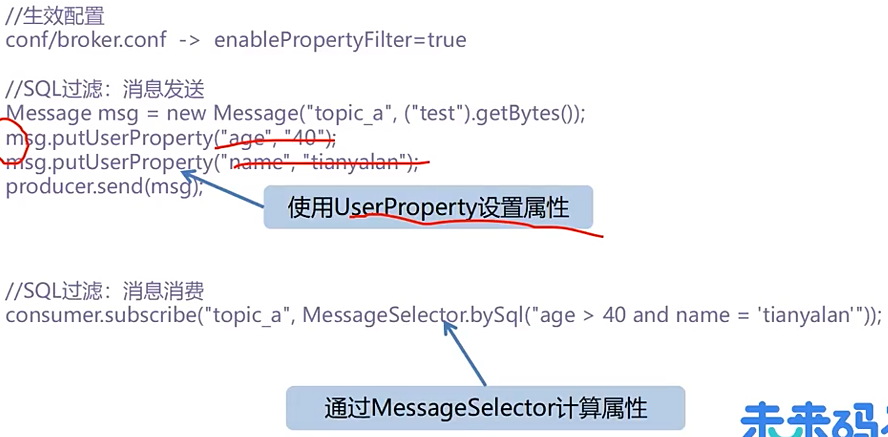


**类过滤：Filter Server 过滤**

Filter Server过滤是指在Broker端运行1个或多个消息过滤服务器(Filter Server)，RocketMQ允许消息消费者自定义消息过滤实现类并将其代码上传到Filter Server上。

消息消费者向Filter Server拉取消息，FilterServer将消息消费者的拉取命令转发到Broker，然后对返回的消息执行消息过滤逻辑，最终将消息返回给消费端。

由于Filter Server与Broker运行在同一台机器上，消息的传输是通过本地回环通信，不会浪费Broker端的网络资源。

Filter Server过滤机制带来了服务器端的安全风险，这就需要应用来保证过滤代码安全——例如在过滤程序里尽可能不做申请大内存，创建线程等操作，避免Broker服务器资源泄漏。


# **思维导图 2**

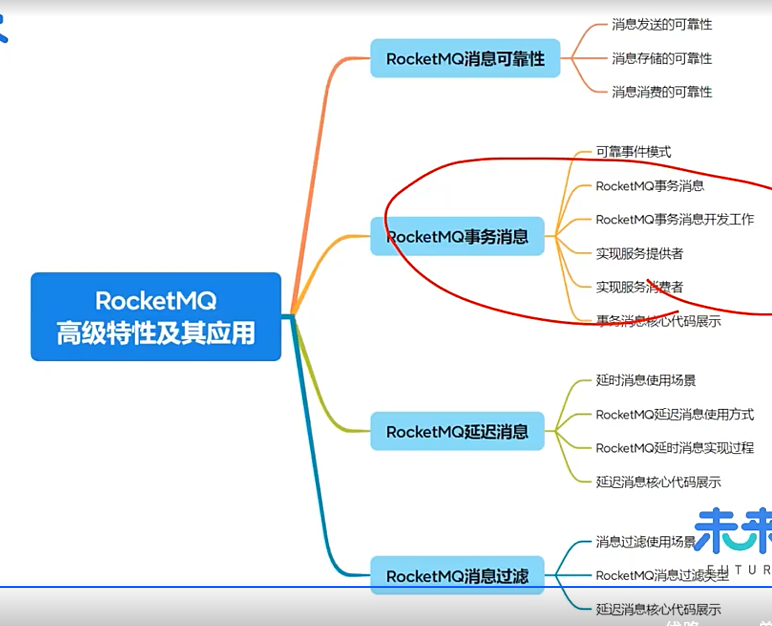


